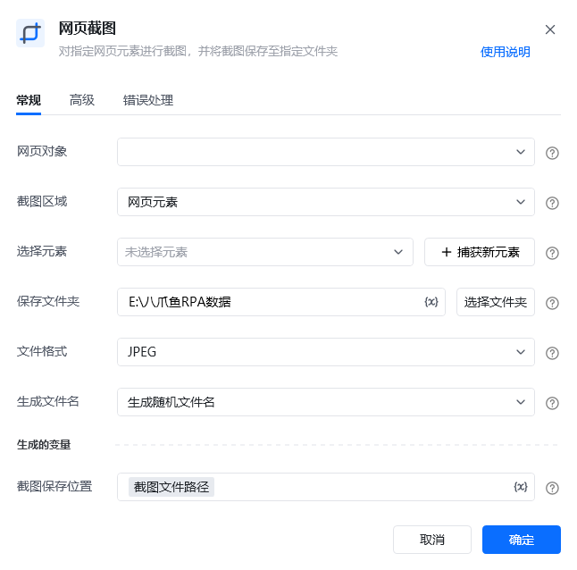
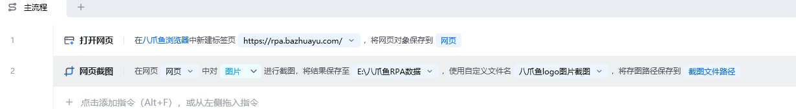
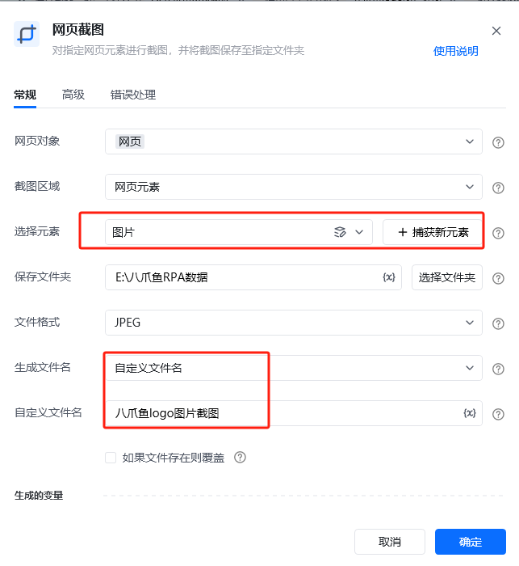
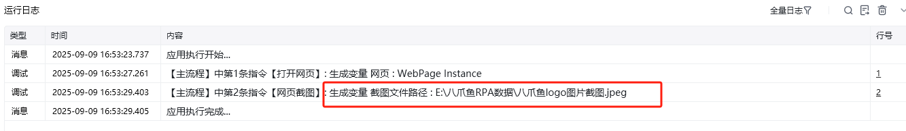
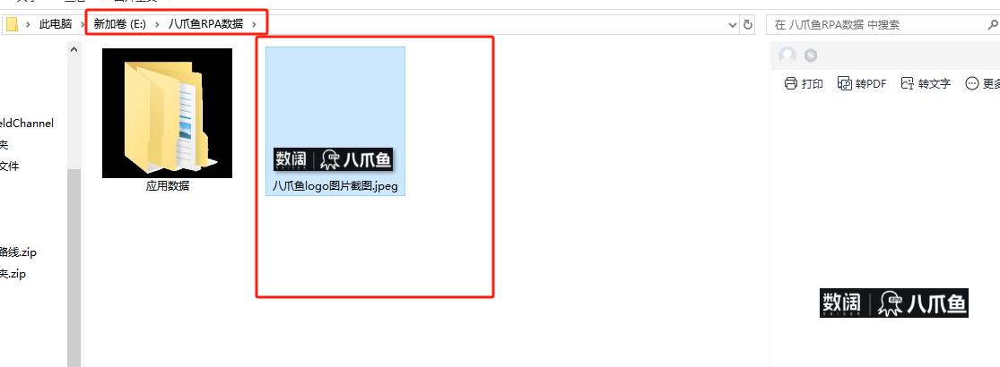

## 指令说明

**描述：** 对指定网页元素进行截图，并将截图保存至指定文件夹。

## 参数说明

<Tabs>
<Tab title="常规">
    

    | 参数 | 说明 |
    | --- | --- |
    | **网页对象** | 选择要截图的网页对象 |
    | **截图范围** | 下拉选择：整个网页、指定元素、当前可视区域 |
    | **选择元素** | 当截图范围为"指定元素"时，选择要截图的元素 |
    | **保存路径** | 设置截图文件的保存路径和文件名 |
  </Tab>
  <Tab title="高级">
    | 参数 | 说明 |
    | --- | --- |
    | **图片格式** | 选择截图文件格式：PNG、JPEG |
    | **图片质量（%）** | 当格式为JPEG时，设置图片质量，范围1-100 |
  </Tab>
</Tabs>

## 使用示例

**该流程执行逻辑：**

使用【打开网页】指令打开目标网页

使用【网页截图】指令选择截图范围

截图保存至指定文件夹

### 运行结果

网页/元素截图成功保存到指定路径。

<Info>
  使用指令过程中遇到问题？前往 [八爪鱼RPA 开发者社区问答板块](https://rpa.bazhuayu.com/community/questions) 提问，获取官方与社区帮助。
</Info>
