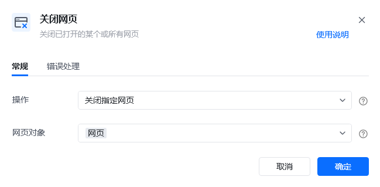
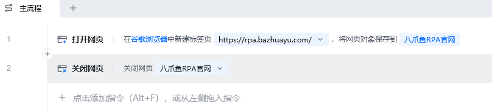
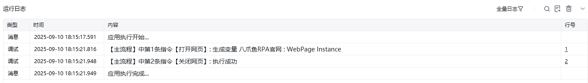

## 指令说明

**描述：** 关闭已打开的某个或所有网页。

## 参数说明

<Tabs>
<Tab title="常规">
    

    | 参数 | 说明 |
    | --- | --- |
    | **操作** | 选择关闭一个指定的网页还是关闭所有网页。关闭指定网页：仅关闭当前指定的网页对象；关闭所有网页：关闭当前浏览器的所有网页标签页 |
    | **网页对象** | 输入一个获取到的或者通过"打开网页"创建的网页对象 |
  </Tab>
  <Tab title="高级">
    本指令暂无高级参数。
  </Tab>
</Tabs>

## 使用示例

**该流程执行逻辑：**

使用【打开网页】指令打开目标网页，并保存网页对象

使用【关闭网页】指令关闭指定的网页标签页

### 效果展示

指定的网页标签页被成功关闭。RPA应用主流程运行结束后，建议养成【关闭网页】的习惯，释放网页资源消耗。

<Info>
  使用指令过程中遇到问题？前往 [八爪鱼RPA 开发者社区问答板块](https://rpa.bazhuayu.com/community/questions) 提问，获取官方与社区帮助。
</Info>
