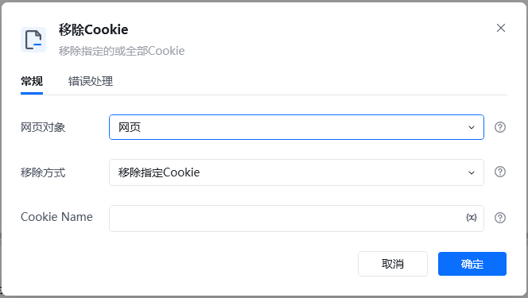
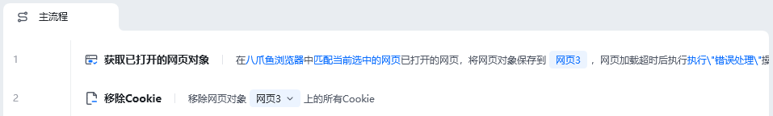
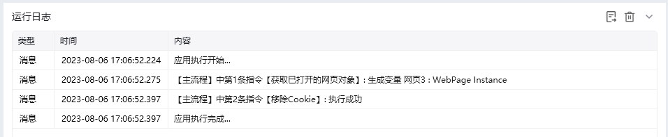

## 指令说明

**描述：** 移除指定的或全部Cookie。

## 参数说明

<Tabs>
<Tab title="常规">
    

    | 参数 | 说明 |
    | --- | --- |
    | **网页对象** | 选择要移除Cookie的网页对象 |
    | **移除方式** | 下拉选择：移除指定名称Cookie、移除全部Cookie |
    | **Cookie名称** | 当移除方式为"移除指定名称Cookie"时，输入要移除的Cookie名称 |
  </Tab>
  <Tab title="高级">
    本指令暂无高级参数。
  </Tab>
</Tabs>

## 使用示例

**该流程执行逻辑：**

使用【打开网页】指令打开目标网页

使用【移除Cookie】指令选择移除方式

指定Cookie或全部Cookie被移除

### 效果展示

指定的Cookie或全部Cookie被成功移除。

<Info>
  使用指令过程中遇到问题？前往 [八爪鱼RPA 开发者社区问答板块](https://rpa.bazhuayu.com/community/questions) 提问，获取官方与社区帮助。
</Info>
