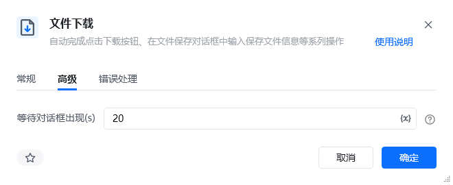
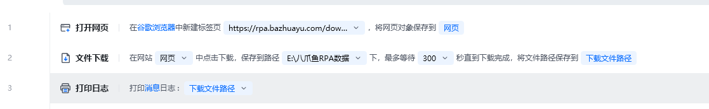
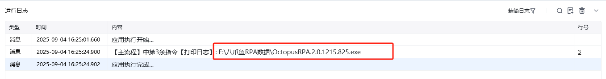
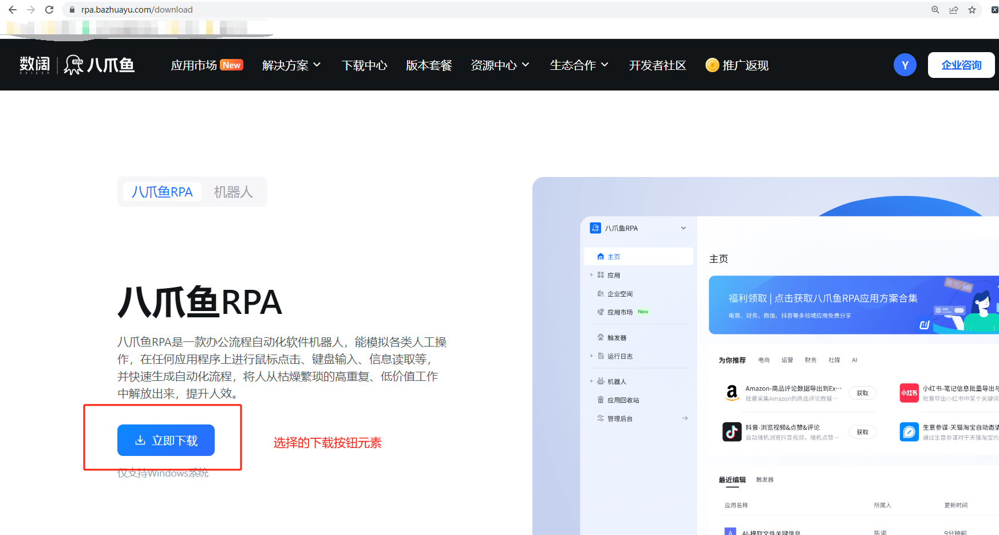
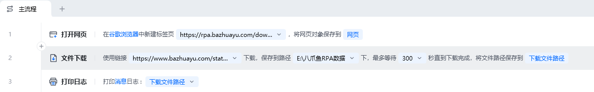
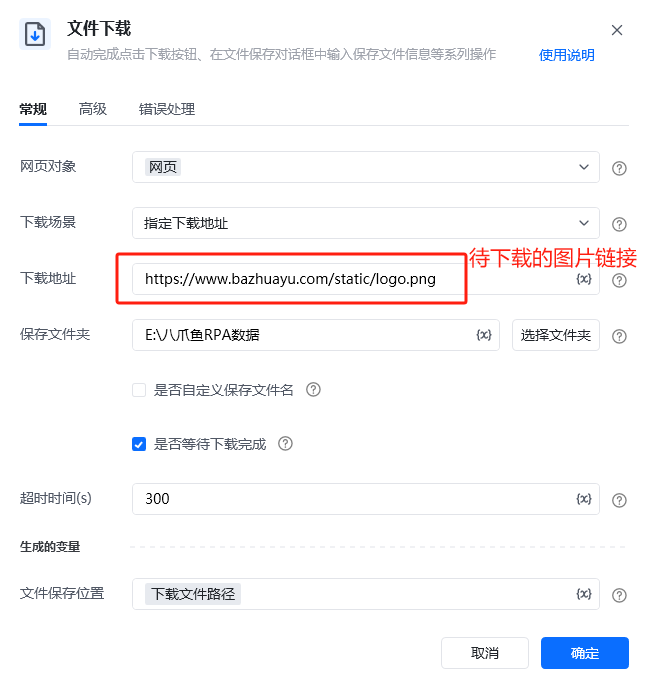

## 指令说明

**描述：** 自动完成点击下载按钮、在文件保存对话框中输入保存文件信息等系列操作。

## 参数说明

<Tabs>
  <Tab title="常规">
    

    | 参数 | 说明 |
    | --- | --- |
    | **网页对象** | 输入一个获取到的或者通过"打开网页"创建的网页对象 |
    | **下载场景** | 选择下载文件的方式 指定下载地址：输入的是一个待下载的文件url链接 点击下载按钮：适用于使用鼠标点击「下载按钮」的文件下载 |
    | **下载地址** | 指定下载地址时出现，输入的是一个待下载的文件url链接 |
    | **选择元素** | 点击下载按钮时出现，选择要操作下载的目标网页元素 |
    | **保存文件夹** | 保存下载文件的文件夹 |
    | **自定义保存文件名** | 是否自定义保存文件名，不勾选则使用默认文件名 |
    | **等待下载完成** | 若是，会在最大超时时间内一直等待直到文件下载完成 |
    | **超时时间（s）** | 最大等待下载超时时间，单位（秒） |
    | **文件保存位置** | 下载文件所在的位置：文件路径+名称，即下载文件的绝对文件路径 |
  </Tab>
  <Tab title="高级">
    | 参数 | 说明 |
    | --- | --- |
    | **等待对话框出现（s）** | 点击下载按钮后，等待下载对话框出现的超时时间，单位（秒） |

    
  </Tab>
</Tabs>

## 使用示例

### 案例一：点击下载按钮

**该流程执行逻辑：**

使用【打开网页】在google浏览器打开八爪鱼RPA下载页https://rpa.bazhuayu.com/download

使用【文件下载】指令，下载方式选择「点击下载按钮」，通过点击网页页面的「下载按钮」将文件下载，选择保存到指定文件夹，并将下载的文件绝对路径打印出来

#### 效果展示

### 案例二：指定下载链接

**该流程执行逻辑：**

使用【打开网页】在google浏览器打开任意网页页面

使用【文件下载】指令，下载方式选择「指定下载地址」，将待下载的文件url填入「下载地址」中，选择保存到指定文件夹，并将下载的文件绝对路径打印出来

#### 效果展示

### 使用小Tips

部分本地浏览器，需要在浏览器设置中进行配置，以免运行过程中出现弹窗影响RPA的正常执行。比如使用360浏览器下载时，会弹出下载保存路径弹窗，建议先手动修改浏览器中的配置，然后再运行RPA

<Info>
  使用指令过程中遇到问题？前往 [八爪鱼RPA 开发者社区问答板块](https://rpa.bazhuayu.com/community/questions) 提问，获取官方与社区帮助。
</Info>
