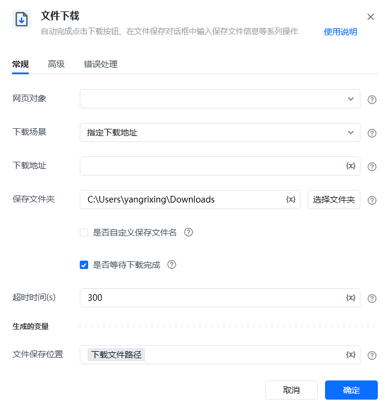
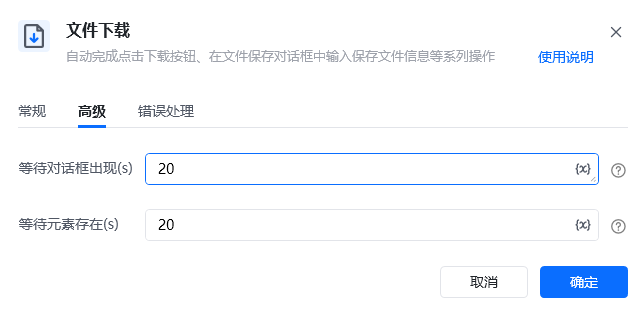
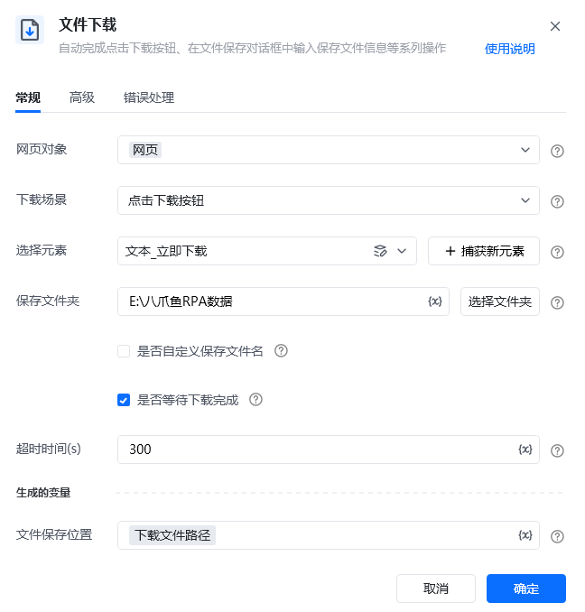
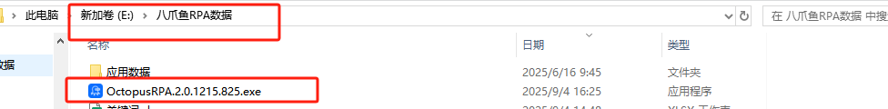
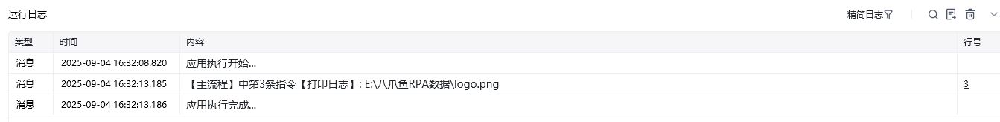
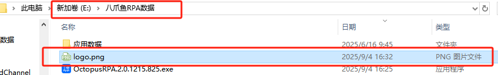
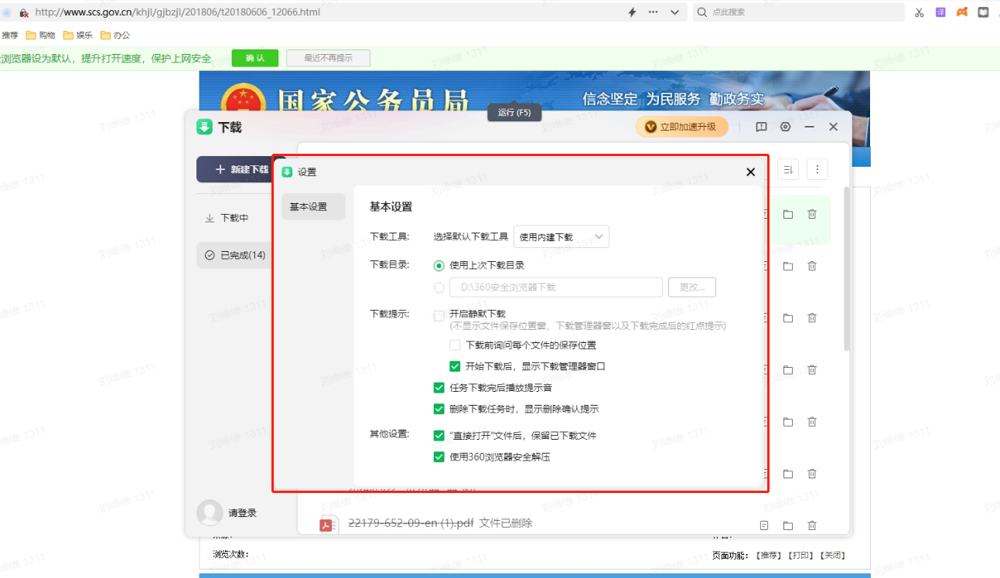

## 指令说明

**描述：** 自动完成点击下载按钮、在文件保存对话框中输入保存文件信息等系列操作。

## 参数说明

<Tabs>
<Tab title="常规">
    

    | 参数 | 说明 |
    | --- | --- |
    | **网页对象** | 选择下载文件所在的网页对象 |
    | **下载方式** | 选择文件下载触发方式：点击元素下载、直接下载指定URL |
    | **下载元素** | 当下载方式为"点击元素下载"时，选择触发下载的按钮或链接元素 |
    | **下载URL** | 当下载方式为"直接下载指定URL"时，输入文件URL |
    | **保存路径** | 设置文件保存的目录路径 |
    | **文件名** | 设置保存的文件名 |
  </Tab>
  <Tab title="高级">
    | 参数 | 说明 |
    | --- | --- |
    | **文件冲突处理** | 当保存路径已存在同名文件时的处理方式：覆盖、自动重命名、跳过 |
  </Tab>
</Tabs>

## 使用示例

**该流程执行逻辑：**

使用【打开网页】指令打开目标网页

使用【文件下载】指令配置下载参数

自动触发文件下载并保存到指定位置

### 运行结果

文件被成功下载并保存到指定目录。

<Info>
  使用指令过程中遇到问题？前往 [八爪鱼RPA 开发者社区问答板块](https://rpa.bazhuayu.com/community/questions) 提问，获取官方与社区帮助。
</Info>
