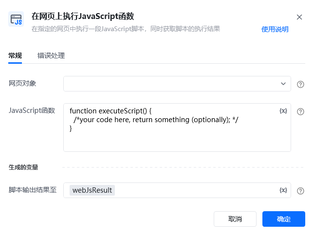
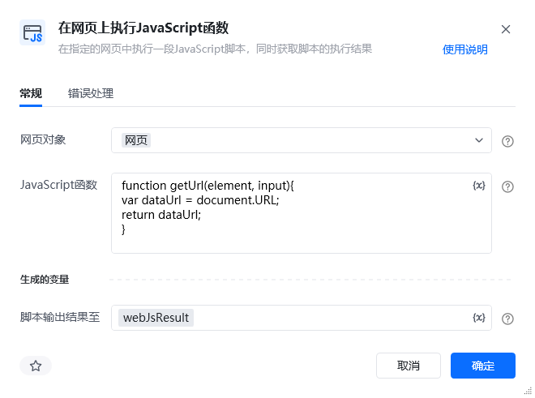
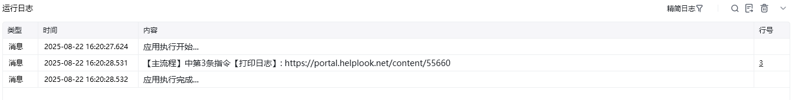

## 指令说明

**描述：** 在指定的网页中执行一段JavaScript脚本，同时获取脚本的执行结果。

## 参数说明

<Tabs>
<Tab title="常规">
    

    | 参数 | 说明 |
    | --- | --- |
    | **网页对象** | 选择要执行JavaScript的网页对象 |
    | **JavaScript代码** | 输入要执行的JavaScript脚本代码 |
    | **返回值** | 保存JavaScript执行结果的变量名称 |
  </Tab>
  <Tab title="高级">
    本指令暂无高级参数。
  </Tab>
</Tabs>

## 使用示例

**该流程执行逻辑：**

使用【打开网页】指令打开目标网页

使用【在网页上执行JavaScript函数】指令输入JavaScript代码

获取JavaScript脚本的执行结果，保存至指定变量

### 效果展示

JavaScript脚本在目标网页上成功执行，并返回执行结果。

<Info>
  使用指令过程中遇到问题？前往 [八爪鱼RPA 开发者社区问答板块](https://rpa.bazhuayu.com/community/questions) 提问，获取官方与社区帮助。
</Info>
