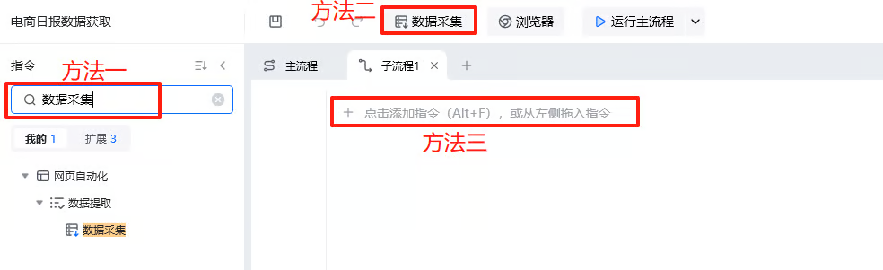
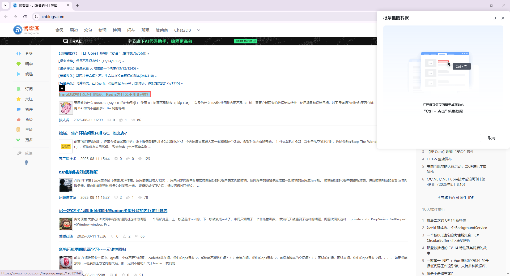
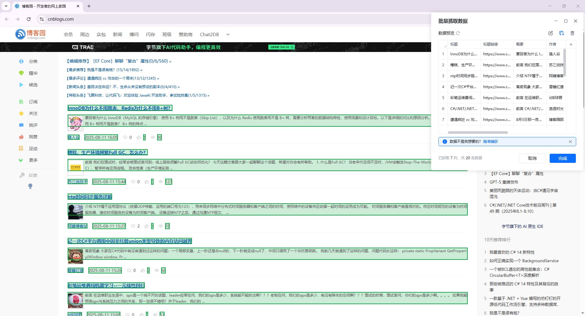
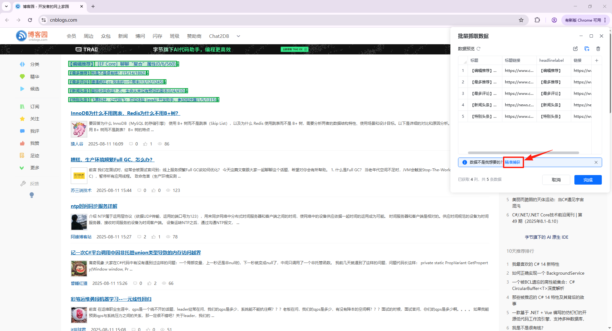
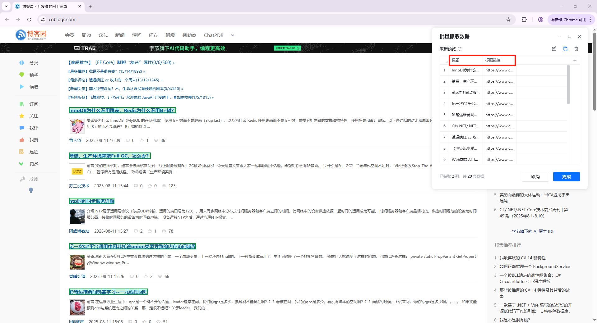

## 指令说明

**描述：** 此指令可批量提取界面中的表格、结构化数据。

## 参数说明

<Tabs>
  <Tab title="常规">
    

    

    | 参数 | 说明 |
    | --- | --- |
    | **网页对象** | 选择一个之前通过【打开网页】或【获取已打开的网页对象】指令创建的网页对象 |
    | **采集目标** | 一种对象，保存采集数据的Xxpath及相关配置，通过Ctrl+点击去选择要采集的内容。对于已经创建好的，可以点击编辑采集目标去修改里面的内容 |
    | **翻页方式** | 当前网页的翻页方式，如果是瀑布流的（懒加载的）软件会自动加载，方式选“无”；其他翻页情况下选“无”，则不再进行翻页。 ①翻页按钮：从元素库中选择一个已捕获的元素或通过「捕获新元素」来捕获新的网页元素作为操作翻页按钮； ②加载更多按钮：从元素库中选择一个已捕获的元素或通过「捕获新元素」来捕获新的网页元素作为操作加载更多的按钮 |
    | **采集范围** | 默认采集全部数据，可以设置采集多少行或多少页的数据 |
    | **采集数据保存至** | ① 数据表格：输出的变量是数据表格的名称 ②Excel：需设置导出到哪个文件中，可选择带表头和sheet页导出，输出的变量是Excel文件的路径 |
    | **追加写入** | 指令多次执行时，当选择写入同一Excel或数据表格时，可以选择覆盖现有数据和追加写入到同一个表格。 使用的场景：处理翻页加载速度不一致的情况、处理有验证码出现的地方 |
  </Tab>
  <Tab title="高级">
    

    | 参数 | 说明 |
    | --- | --- |
    | **滚动区域** | ①整页滚动：滚动整个网页 ②指定区域滚动：滚动网页中指定的区域，如采集社媒平台评论区内容 |
    | **指定区域** | 当滚动区域选择”指定区域滚动“时，需要填写该参数。从元素库中选择一个已捕获的元素或通过「捕获新元素」来捕获新的网页元素作为指定区域 |
    | **滚动方式** | ①直接滚动到底部：适用于网页大部分场景 ②滚动一屏：主要针对部分网站如果滚动过快，中间的数据不会加载的情况 |
    | **翻页间隔时间（s）** | 主要用于解决翻页过快页面加载不完整或翻页过快会触发防采的场景，可等待页面加载完成再进入下一步 |
    | **模拟人工点击翻页按钮** | 模拟人的操作，和元素点击一致 |
  </Tab>
</Tabs>

## 使用示例

**该流程执行逻辑：**

打开博客园网页

使用【数据采集】指令获取博文标题、简介、作者、发布时间等信息，并将采集到的信息写入指定Excel表中

## 使用小Tips

- 该指令可快速采集大量数据，若仅需要数据采集，无需边采集边执行额外步骤（如点击）的话，可优先使用该指令
- 八爪鱼 RPA 中可将采集动作大致分为批量采集和逐条采集，具体可查看[批量采集&逐条采集](https://rpa.bazhuayu.com/helpcenter/docs/gIuxnds3)

## 数据采集指令概览

### 两种采集模式

#### 1. 智能采集

打开八爪鱼RPA，搜索“数据采集”或直接点击软件顶端的“数据采集”即可使用指令，将它加入在流程中。

使用方法：将待采集的网页置于前台，”Ctrl+鼠标左键“即可采集数据。

Ctrl+鼠标左键点击，红色表示预选中区域，需要哪个数据就点击哪个。

#### 2. 精准采集

在数据预览界面点击"精准采集"，进入精准采集模式。

指令会自动清空原始采集数据。按“Ctr+点击”选择目标数据即可，每次新增一列数据。

### 采集数据处理

1. **表头重命名：** 双击指定表头进行重命名，表头名称不允许重复。

2. **编辑列元素：** 编辑当前列元素的Xpath，修改元素定位。此处的列元素Xpath是该列字段相对于外层循环的Xpath。

3. **处理列元素：** 对”xx列“中的每个单元格数据依次按照以下步骤进行处理。处理动作包含：替换、去除空格、添加前缀、添加后缀、智能提取（数字/手机号码/邮箱）、时间格式转换、正则匹配。

4. **复制列：** 复制当前列，插入当前列的右侧。

5. **移动列位置：** 鼠标左键按住指定列名，进行左右拖动。

6. **提取其他属性：** 提取当前元素的其他属性，属性包含：元素文本、元素链接文本、图片地址、InnerHTML、OuterHTML、更多（自动推导，如class、target、position()等）。

7. **删除列：** 删除指定列。

8. **编辑采集区域：** 修改循环列表的Xpath，调整列表的采集区域，即循环项的Xpath。可以通过校验元素来确认当前Xpath指定的网页区域。

9. **去除重复行：** 可指定某字段作为判断重复行的条件。选择按哪些字段进行去重，默认是使用全部字段，即全部字段的内容都相同时才会删除当前行。举例：指定标题、标题链接和概要为判断条件，则当某两行数据的这3个字段相同时，只会保留其中一行。

10. **清空并重新采集：** 清除数据预览中的所有内容。

<Info>
  使用指令过程中遇到问题？前往 [八爪鱼RPA 开发者社区问答板块](https://rpa.bazhuayu.com/community/questions) 提问，获取官方与社区帮助。
</Info>
