## 指令说明

**描述：** 此指令可批量提取界面中的表格、结构化数据，支持多种数据提取模式。

## 参数说明

<Tabs>
<Tab title="常规">
    

    | 参数 | 说明 |
    | --- | --- |
    | **网页对象** | 选择要提取数据的网页对象 |
    | **提取模式** | 选择数据提取模式：表格提取、列表提取、自定义提取 |
    | **数据字段** | 配置需要提取的数据字段及对应的元素定位 |
  </Tab>
  <Tab title="高级">
    | 参数 | 说明 |
    | --- | --- |
    | **翻页设置** | 配置自动翻页参数，支持连续提取多页数据 |
    | **等待时间（s）** | 每次提取之间的等待时间 |
  </Tab>
</Tabs>

## 使用示例

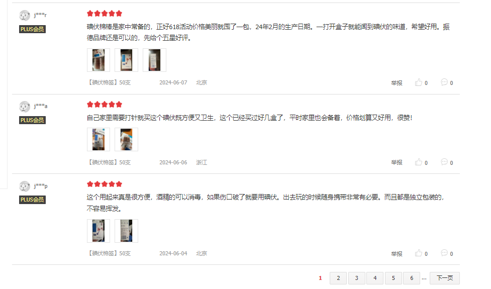

**该流程执行逻辑：**

使用【打开网页】指令打开目标网页

使用【数据采集】指令配置提取字段和元素定位

流程自动提取页面中的结构化数据

提取的数据输出至数据表格或Excel

### 运行结果

页面中的结构化数据被成功批量提取，可用于后续的数据处理和分析。

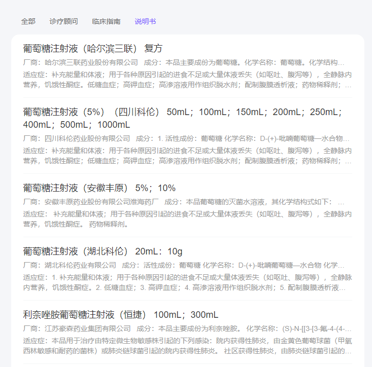

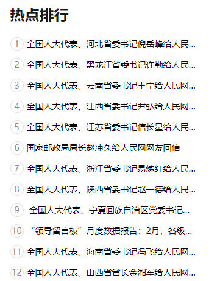

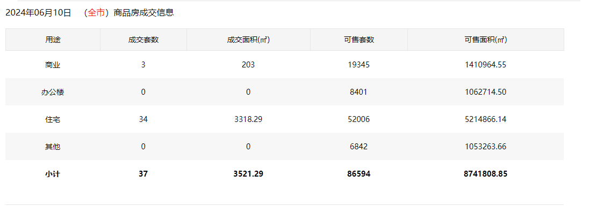

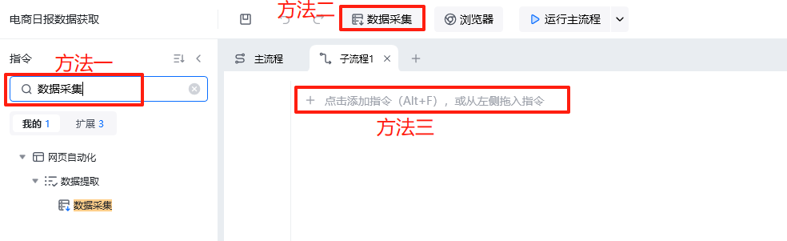

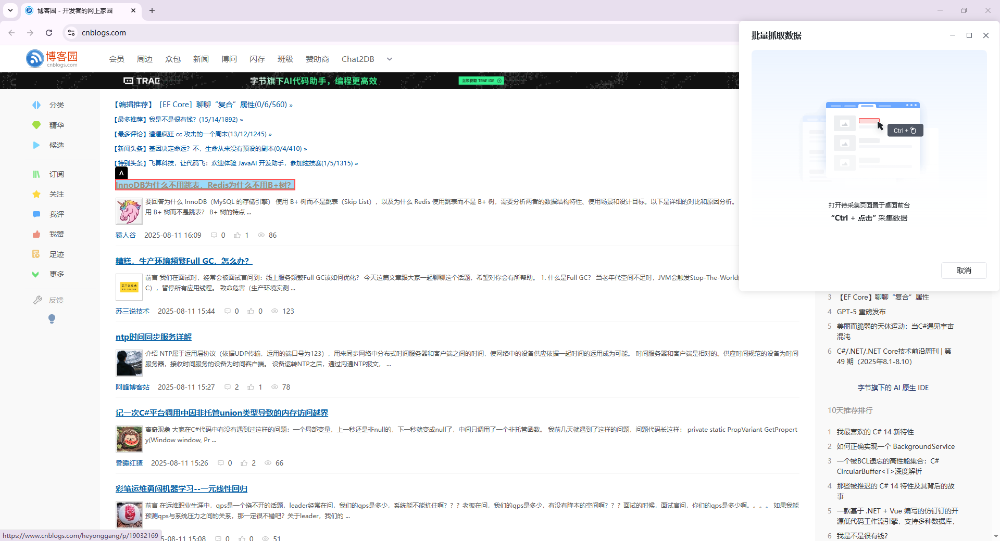

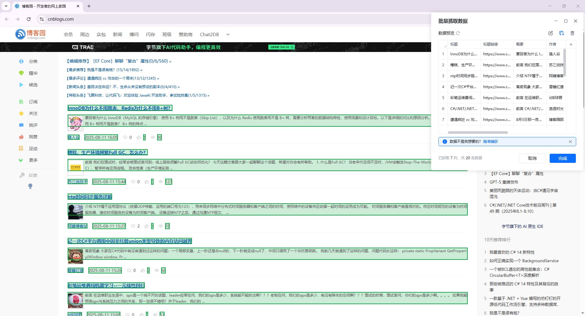

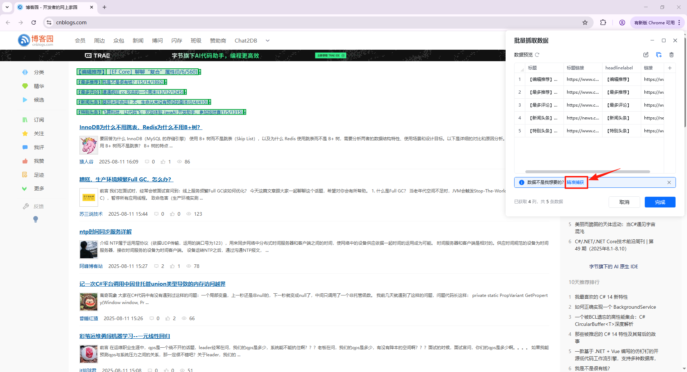

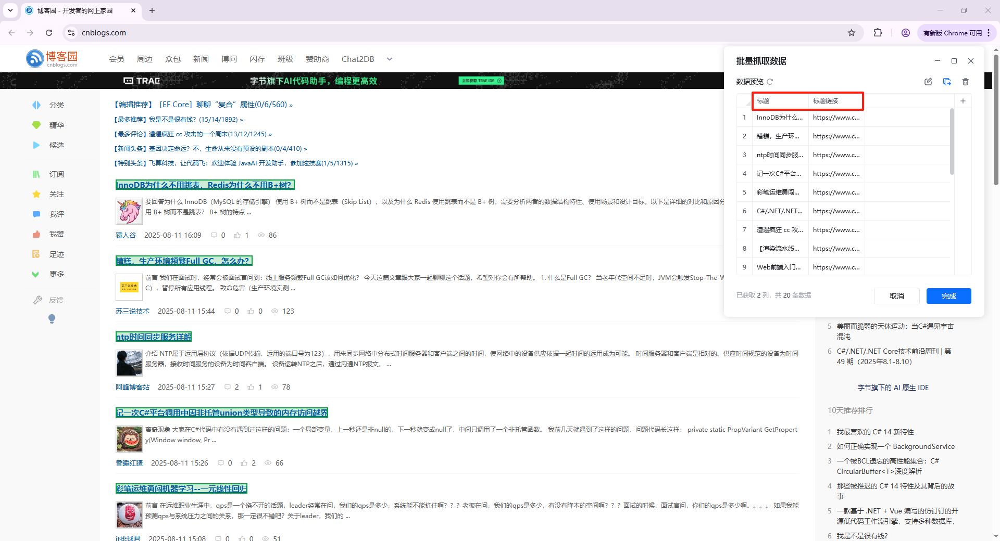

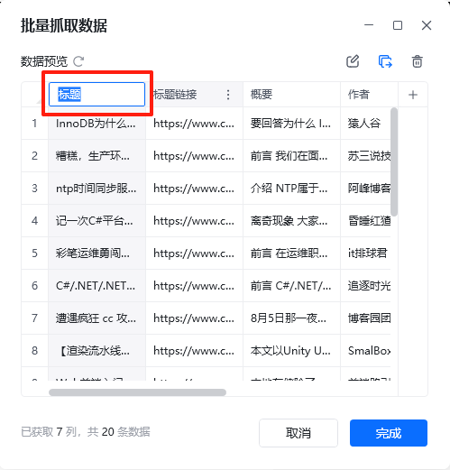

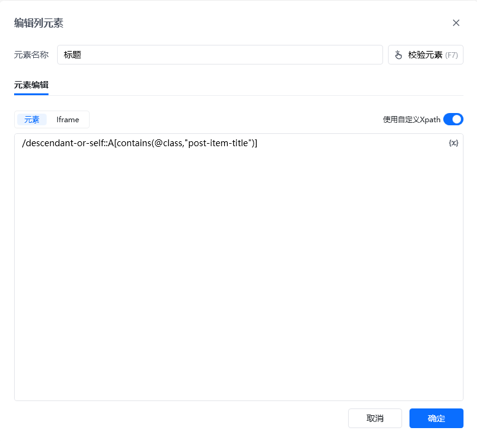

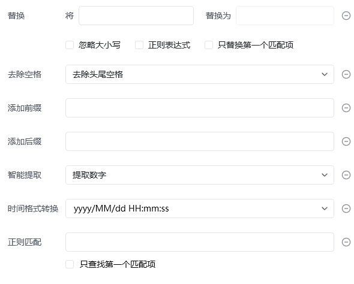

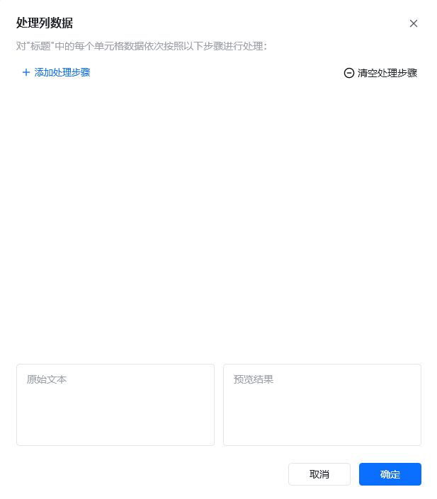

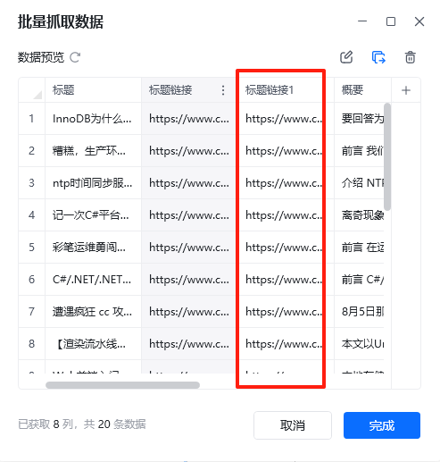

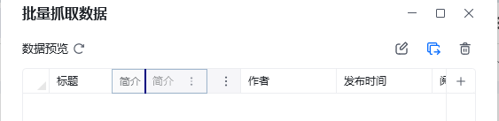

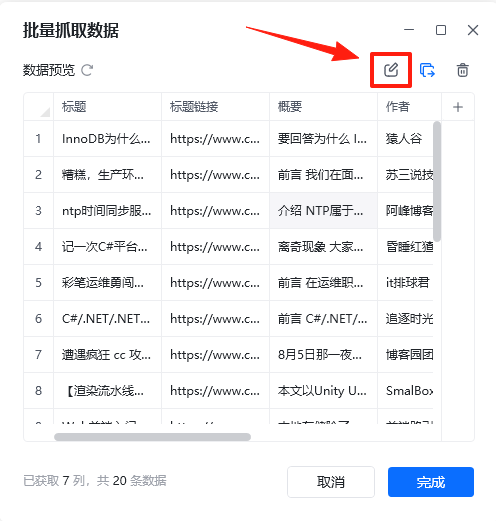

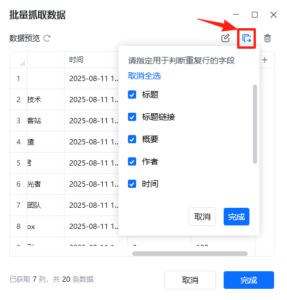

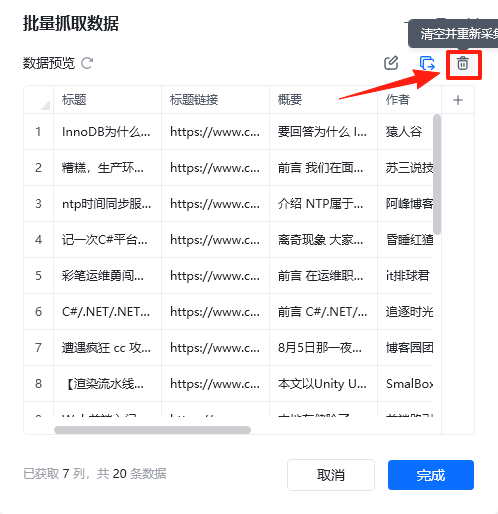

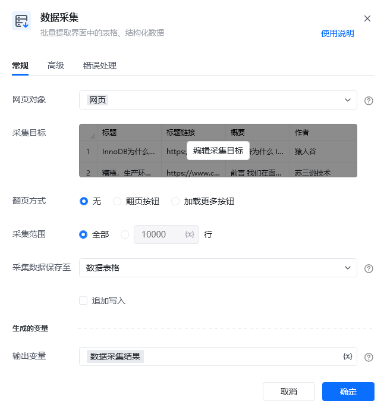

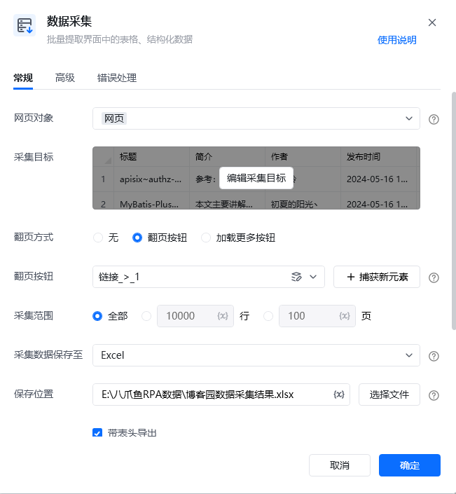

<Info>
  使用指令过程中遇到问题？前往 [八爪鱼RPA 开发者社区问答板块](https://rpa.bazhuayu.com/community/questions) 提问，获取官方与社区帮助。
</Info>
