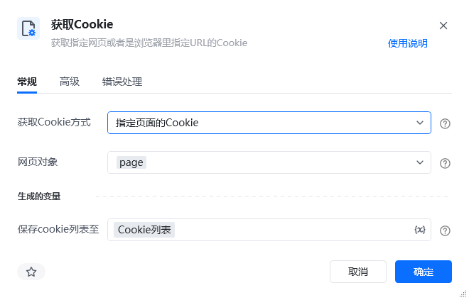
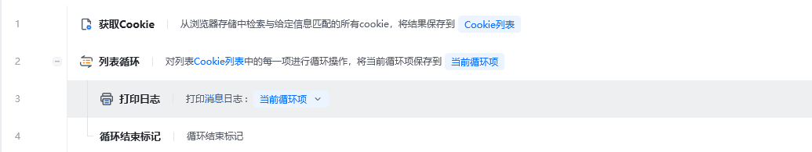
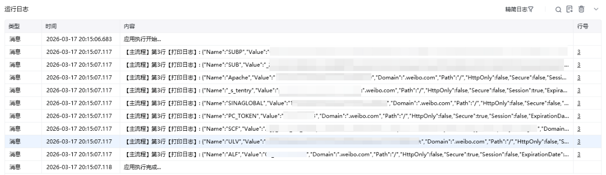

## 指令说明

**描述：** 在指定页面或指定URL获取Cookie信息，比如网页登录Cookie等。

## 参数说明

<Tabs>
<Tab title="常规">
    

    | 参数 | 说明 |
    | --- | --- |
    | **网页对象** | 选择要获取Cookie的网页对象 |
    | **获取方式** | 下拉选择：获取所有Cookie、根据名称获取Cookie |
    | **Cookie名称** | 当获取方式为"根据名称获取Cookie"时，输入Cookie名称 |
  </Tab>
  <Tab title="高级">
    本指令暂无高级参数。
  </Tab>
</Tabs>

## 使用示例

**该流程执行逻辑：**

使用【打开网页】指令打开目标网页

使用【获取Cookies】指令获取Cookie信息

将获取到的Cookie信息保存至变量，供后续流程使用

### 运行结果

成功获取网页/URL的Cookie信息，可保存供后续使用。

<Info>
  使用指令过程中遇到问题？前往 [八爪鱼RPA 开发者社区问答板块](https://rpa.bazhuayu.com/community/questions) 提问，获取官方与社区帮助。
</Info>
