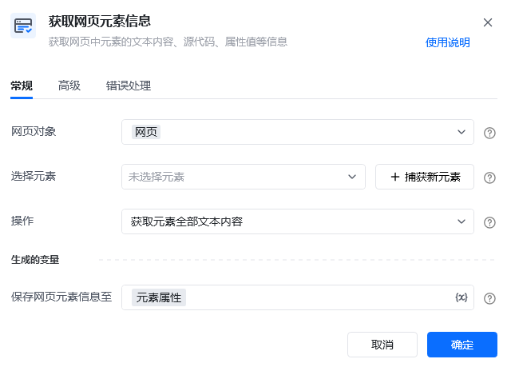
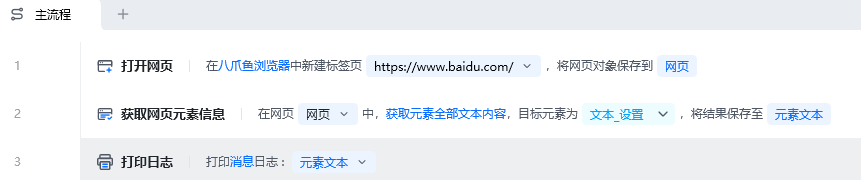
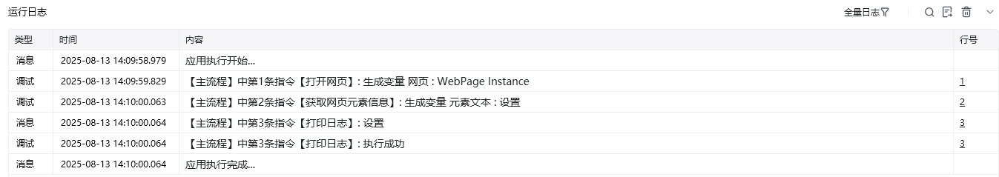

## 指令说明

**描述：** 获取网页元素中的文本内容、元素源代码、元素值、元素链接地址、元素属性、元素位置等信息。

## 参数说明

<Tabs>
<Tab title="常规">
    

    | 参数 | 说明 |
    | --- | --- |
    | **网页对象** | 选择要操作的目标元素所在的网页对象 |
    | **选择元素** | 选择要获取信息的目标元素 |
    | **获取内容** | 下拉选择：文本内容、元素源代码、元素值、元素链接地址、元素属性、元素位置 |
    | **属性名** | 当获取内容为"元素属性"时，输入要获取的属性名称 |
  </Tab>
  <Tab title="高级">
    本指令暂无高级参数。
  </Tab>
</Tabs>

## 使用示例

**该流程执行逻辑：**

使用【打开网页】指令打开目标网页

使用【获取网页元素信息】指令选择目标元素和获取内容类型

将获取到的元素信息保存至变量

### 运行结果

成功获取目标元素的指定信息，保存至变量可供后续使用。

<Info>
  使用指令过程中遇到问题？前往 [八爪鱼RPA 开发者社区问答板块](https://rpa.bazhuayu.com/community/questions) 提问，获取官方与社区帮助。
</Info>
