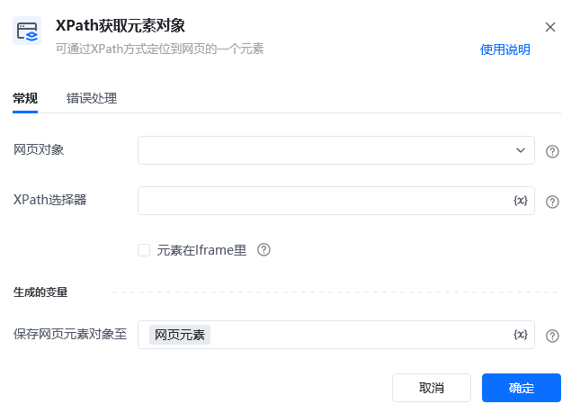
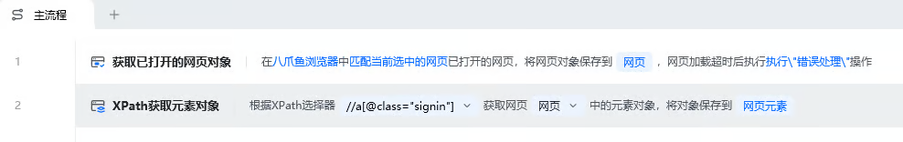
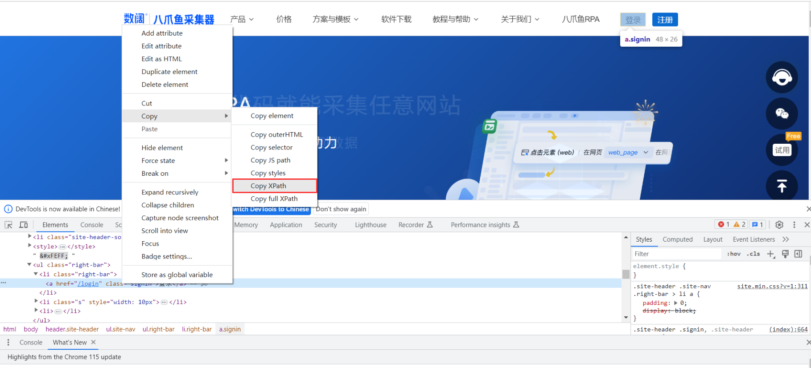
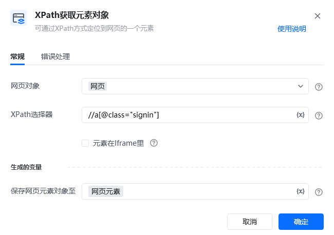

## 指令说明

**描述：** 可通过自定义写入XPath的方式定位到网页中的指定元素。

## 参数说明

<Tabs>
<Tab title="常规">
    

    | 参数 | 说明 |
    | --- | --- |
    | **网页对象** | 选择要操作的网页对象 |
    | **XPath表达式** | 输入XPath表达式来定位元素 |
  </Tab>
  <Tab title="高级">
    | 参数 | 说明 |
    | --- | --- |
    | **等待元素存在（s）** | 等待目标元素存在的超时时间 |
  </Tab>
</Tabs>

## 使用示例

**该流程执行逻辑：**

使用【打开网页】指令打开目标网页

使用【XPath获取元素对象】指令输入XPath表达式

获取XPath定位到的元素对象，供后续操作使用

### 运行结果

成功通过XPath表达式获取元素对象。

<Info>
  使用指令过程中遇到问题？前往 [八爪鱼RPA 开发者社区问答板块](https://rpa.bazhuayu.com/community/questions) 提问，获取官方与社区帮助。
</Info>
