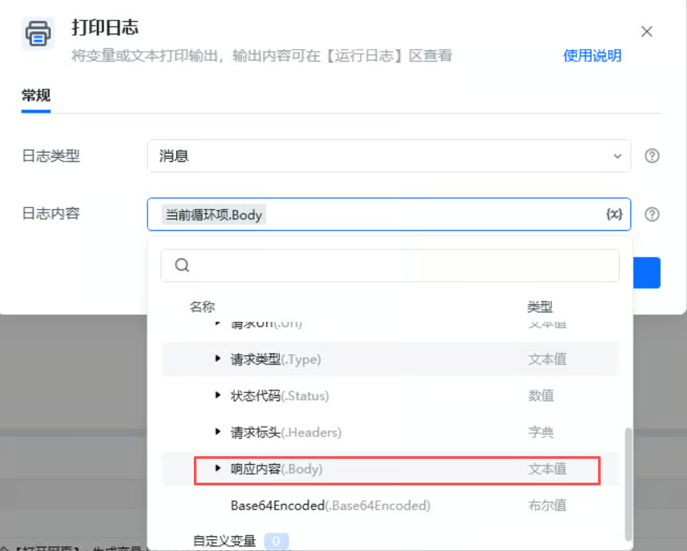

## 指令说明

**描述：** 获取网页监听的结果。

## 参数说明

<Tabs>
<Tab title="常规">
    

    | 参数 | 说明 |
    | --- | --- |
    | **网页对象** | 选择一个之前通过【打开网页】或【获取已打开的网页对象】指令创建的网页对象 |
    | **生成的变量** | 结果保存至：输入一个列表名字,用来保存获取到的监听结果。 将请求结果暂存为列表类型的变量,列表项为对象类型,包含属性请求Url、请求类型、状态代码、请求标头、响应内容等 |
  </Tab>
  <Tab title="高级">
    本指令暂无高级参数。
  </Tab>
</Tabs>

## 使用示例

**该流程执行逻辑：**

1、监听网页：https://q.10jqka.com.cn/#refCountId=www_50a1b74a_693的资源路径Url:https://q.10jqka.com.cn/api.php?t=indexflash&

2、获取的网页监听结果保存的是表里列表数据，获取结果列表需要先用列表循环将结果数据保存到当前循环变量

3、将循环项的文本内容转换为json数据，并进行格式化处理

4、将处理后的数据按行写入数据表格中

### 效果展示

成功获取网页监听期间捕获的网络请求结果。

当前循环项中包含“请求Url、请求类型、状态代码、请求标头、响应内容等”。如果想要获取相应内容，需要选择.Body。

<Info>
  使用指令过程中遇到问题？前往 [八爪鱼RPA 开发者社区问答板块](https://rpa.bazhuayu.com/community/questions) 提问，获取官方与社区帮助。
</Info>
