## 指令说明

**描述：** 获取网页监听的结果。

## 参数说明

<Tabs>
<Tab title="常规">
    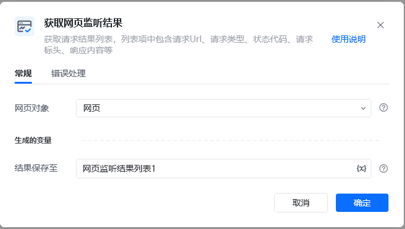

    | 参数 | 说明 |
    | --- | --- |
    | **网页对象** | 选择正在监听的网页对象 |
    | **结果类型** | 选择要获取的结果类型 |
  </Tab>
  <Tab title="高级">
    本指令暂无高级参数。
  </Tab>
</Tabs>

## 使用示例

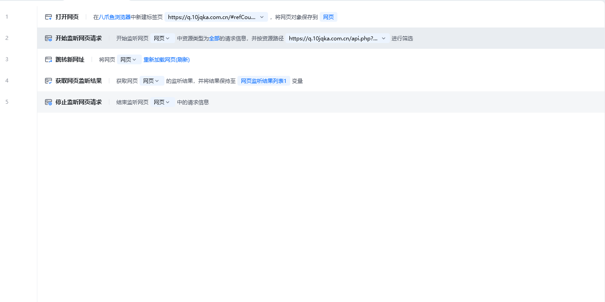

**该流程执行逻辑：**

在【开始监听网页请求】和网络操作之后

使用【获取网页监听结果】指令获取监听到的网络请求数据

将结果保存至变量或输出到数据表格

### 效果展示

成功获取网页监听期间捕获的网络请求结果。

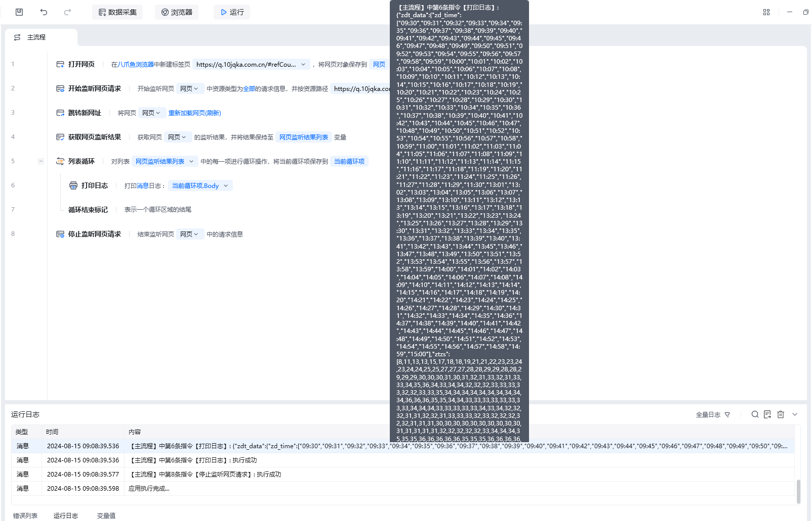

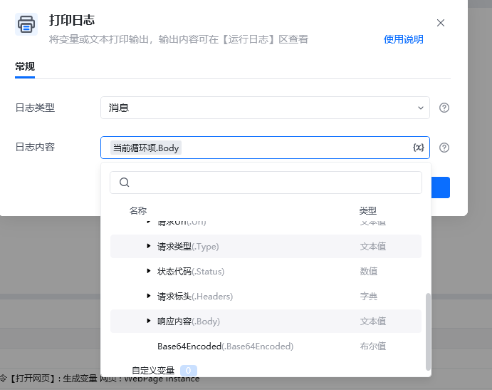

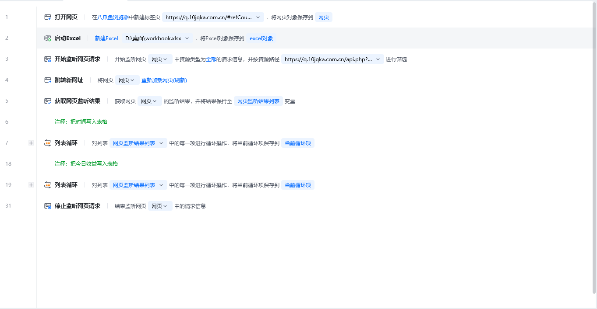

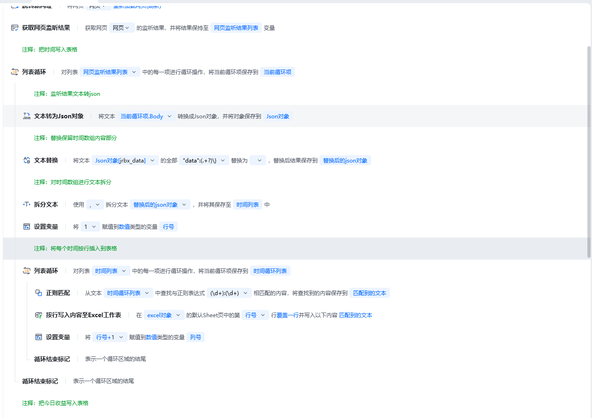

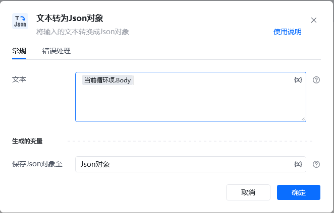

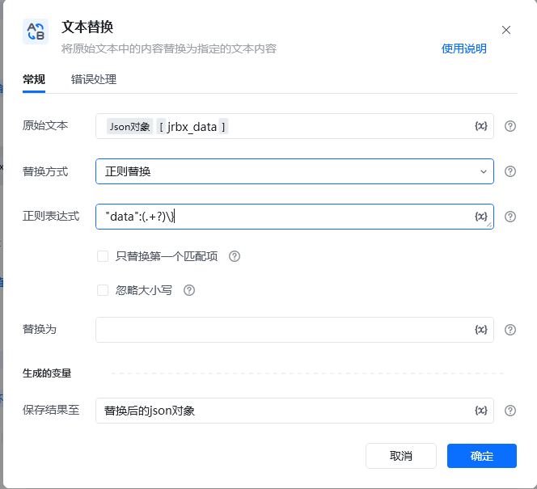

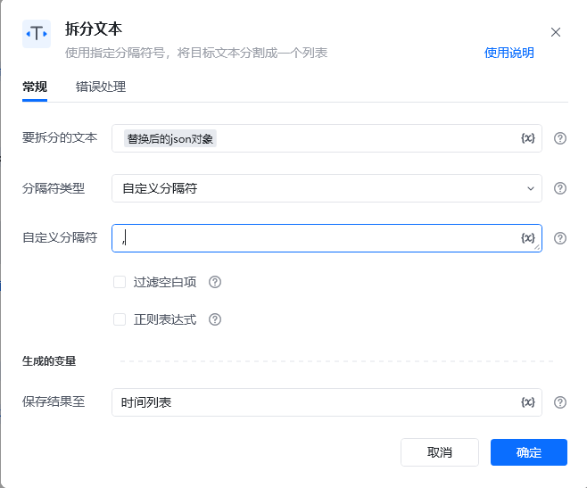

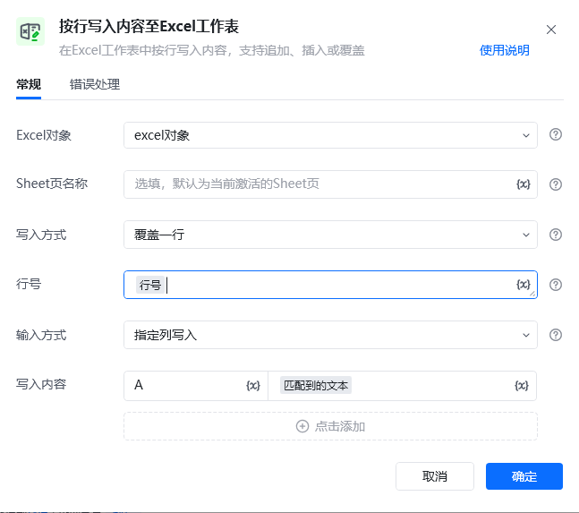

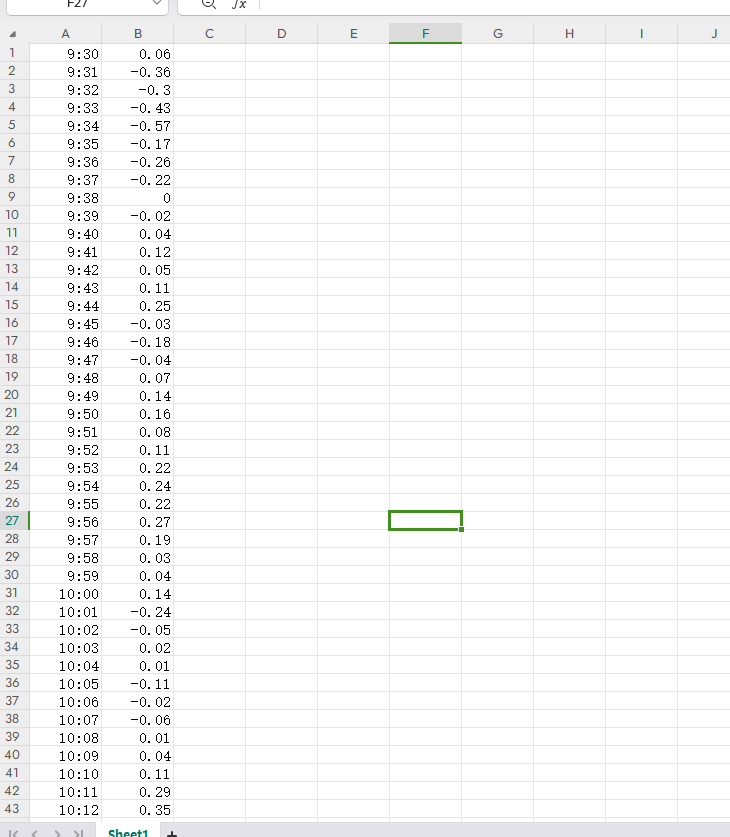

<Info>
  使用指令过程中遇到问题？前往 [八爪鱼RPA 开发者社区问答板块](https://rpa.bazhuayu.com/community/questions) 提问，获取官方与社区帮助。
</Info>
