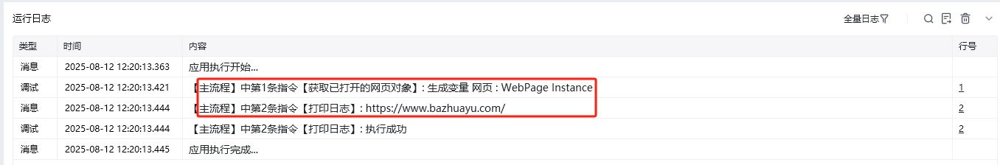

## 指令说明

**描述：** 根据标题或者网站匹配已打开的浏览器页面，供后续流程使用。

## 参数说明

<Tabs>
<Tab title="常规">
    

    | 参数 | 说明 |
    | --- | --- |
    | **浏览器类型** | 下拉选择：八爪鱼浏览器、谷歌浏览器、Edge浏览器、360浏览器等 |
    | **匹配方式** | 下拉选择：根据标题匹配、根据网址匹配、匹配当前选中的网页 |
    | **匹配文本** | 输入要匹配的文本，支持模糊匹配，支持正则表达式匹配 |
  </Tab>
  <Tab title="高级">
    | 参数 | 说明 |
    | --- | --- |
    | **等待网页加载完成** | 是否需要等待网页加载完成后再进行下一步 |
    | **加载超时时间（s）** | 设置网页最大的加载超时时间，单位为秒 |
    | **加载超时后执行** | 最大加载超时后，网页页面仍然无法加载完成，则会执行「错误处理」或「停止加载」 |
    | **匹配失败时打开新网页** | 根据网页标题或网址匹配失败时，打开新的指定网页链接 |
    | **网页链接** | 匹配失败时打开的新网页链接地址 |
  </Tab>
</Tabs>

## 使用示例

**该流程执行逻辑：**

使用【获取已打开的网页对象】指令获取指定浏览器上已打开的网页

根据匹配方式匹配选择已打开的网页

后续流程可对该网页对象进行操作，如执行【打印日志】获取网页的链接

### 运行结果

根据匹配方式，成功获取已打开的网页对象，可供后续流程使用。

<Info>
  使用指令过程中遇到问题？前往 [八爪鱼RPA 开发者社区问答板块](https://rpa.bazhuayu.com/community/questions) 提问，获取官方与社区帮助。
</Info>
