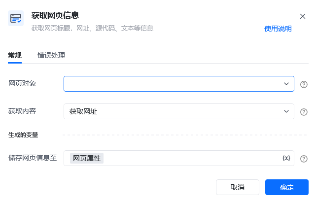
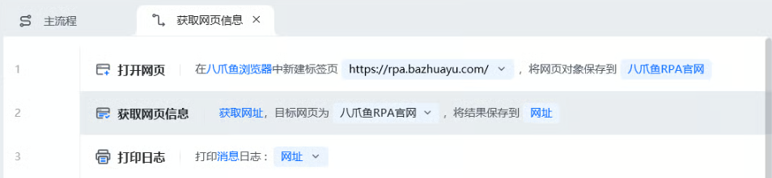

## 指令说明

**描述：** 获取网页标题、网址、源代码、文本等信息。

## 参数说明

<Tabs>
<Tab title="常规">
    

    | 参数 | 说明 |
    | --- | --- |
    | **网页对象** | 选择要获取信息的网页对象 |
    | **获取内容** | 下拉选择：网页标题、网页网址、网页源代码、网页文本内容 |
  </Tab>
  <Tab title="高级">
    本指令暂无高级参数。
  </Tab>
</Tabs>

## 使用示例

**该流程执行逻辑：**

使用【打开网页】指令打开目标网页

使用【获取网页信息】指令选择要获取的信息类型

将获取到的信息保存至变量

### 运行结果

成功获取网页的指定信息（标题/网址/源代码/文本），保存至变量。

<Info>
  使用指令过程中遇到问题？前往 [八爪鱼RPA 开发者社区问答板块](https://rpa.bazhuayu.com/community/questions) 提问，获取官方与社区帮助。
</Info>
