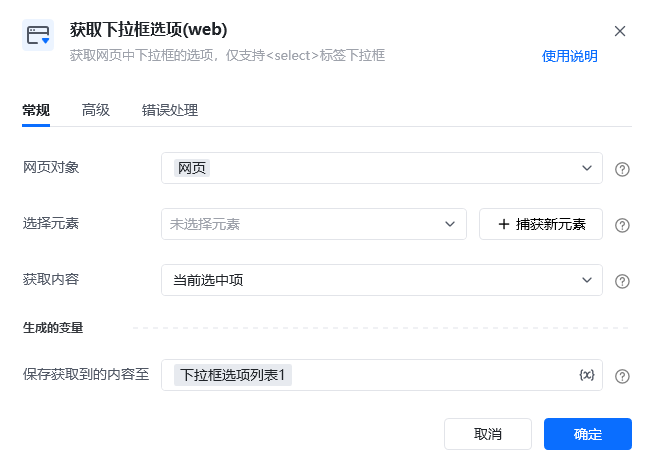
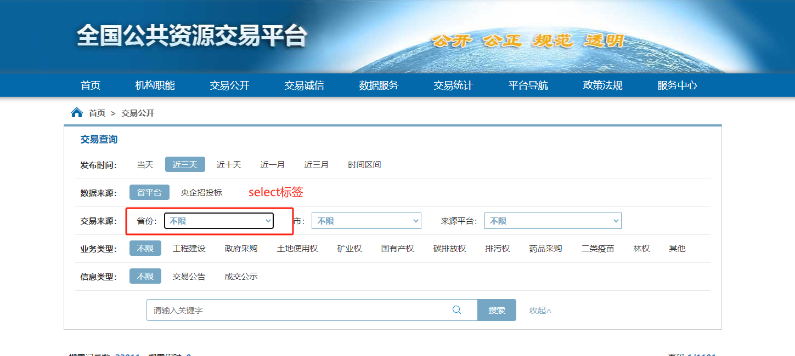
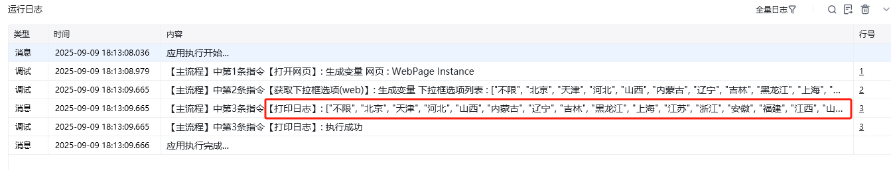
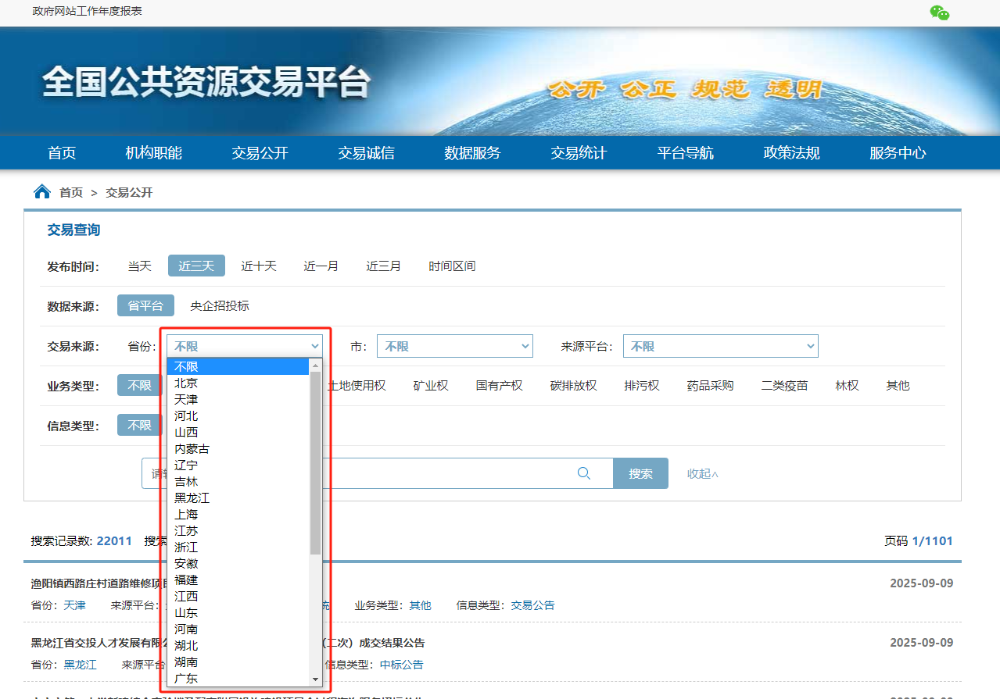
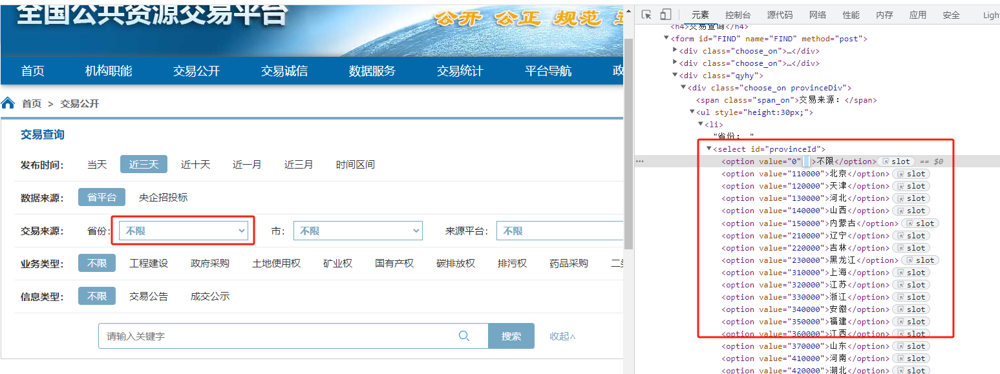

## 指令说明

**描述：** 获取网页中下拉框的选项，仅支持`<select>`标签下拉框

## 参数说明

<Tabs>
  <Tab title="常规">
    

    | 参数 | 说明 |
    | --- | --- |
    | **网页对象** | 选择一个之前通过【打开网页】或【获取已打开的网页对象】指令创建的网页对象 |
    | **选择元素** | 从元素库中选择一个已捕获的元素或通过「捕获新元素」来捕获新的网页元素作为操作目标 |
    | **获取内容** | 选择要获取当前选中项或全部下拉项： 当前选中项：只返回当前选项框已选择的选项值 全部下拉项：返回当前选项框的所有待选项值 |
  </Tab>
  <Tab title="高级">
    | 参数 | 说明 |
    | --- | --- |
    | **等待元素存在（s）** | 等待目标元素存在的最大超时时间，单位秒 |
  </Tab>
</Tabs>

## 使用示例

案例中使用的网站：https://www.ggzy.gov.cn/deal/dealList.html

**此流程执行逻辑：**

使用【获取下拉框选项(web)】指令获取「省份」的所有选项值，返回所有待选项值的列表

### 效果展示

### 使用小 Tips

- 若想获取当前选项已选择的值，在指令【获取下拉框选项(web)】中「获取内容」选择"当前选中项"即可
- 此指令仅适用于 **select** 标签的网页标准式下拉框元素，可以通过观察网页对象的源码 HTML 页面结构来判断是否是"标准式下拉框"；在浏览器网页页面上，鼠标右击"检查"或者按下"F12"按键打开进入到"开发者调试的模式"，观察"下拉框"对应的页面源码是否有 **"select"标签**，"select"标签下的选项是 **"option"标签**，具备这两种标签的才是"标准式下拉框"。如下图

<Info>
  使用指令过程中遇到问题？前往 [八爪鱼RPA 开发者社区问答板块](https://rpa.bazhuayu.com/community/questions) 提问，获取官方与社区帮助。
</Info>
