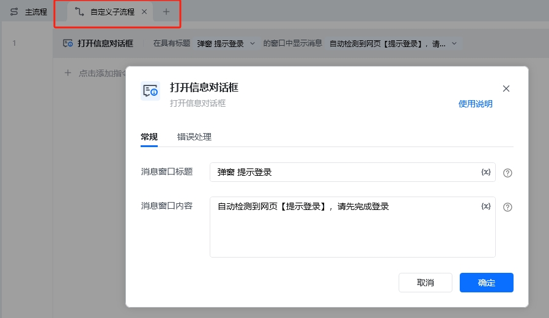
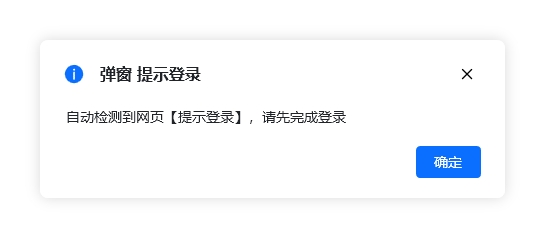

## 指令说明

**描述：** 在网页操作中，对于不定时出现的弹窗，可以自动检测关闭弹窗或者自定义流程处理。

## 参数说明

<Tabs>
<Tab title="常规">
    

    | 参数 | 说明 |
    | --- | --- |
    | **处理方式** | 请选择弹窗的处理方式："发现指定弹窗时-关闭弹窗"：自动关闭指定弹窗；"发现指定弹窗时-执行自定义操作"：检测到指定弹窗元素时，执行自定义操作 |
    | **弹窗关闭按钮（关闭弹窗）** | 关闭指定弹窗的按钮；可通过已捕获的元素或「捕获新元素」来捕获新的网页元素作为按钮目标 |
    | **弹窗元素（执行自定义操作）** | 可通过已捕获的元素或「捕获新元素」来捕获新的网页元素作为弹窗元素的识别 |
    | **处理流程（执行自定义操作）** | 检测到"弹窗元素"时，触发自定义操作，如在自定义操作子流程中做其他网页操作处理 |
  </Tab>
  <Tab title="高级">
    本指令暂无高级参数。
  </Tab>
</Tabs>

## 使用示例

**该流程执行逻辑：**

使用【处理网页弹窗】指令定义弹窗元素和处理方式

选择"发现指定弹窗时-关闭弹窗"，指定弹窗关闭按钮元素

在后续的RPA执行流程中，遇到定义好的弹窗，RPA会自动关闭对应的弹窗

### 运行结果

示例1（关闭弹窗）：RPA自动检测并关闭指定弹窗。

示例2（自定义操作）：检测到弹窗后，自动执行自定义子流程，如弹出信息对话框提示登录。

<Info>
  使用指令过程中遇到问题？前往 [八爪鱼RPA 开发者社区问答板块](https://rpa.bazhuayu.com/community/questions) 提问，获取官方与社区帮助。
</Info>
