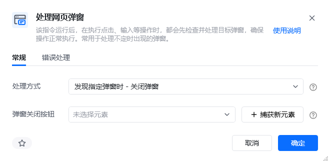
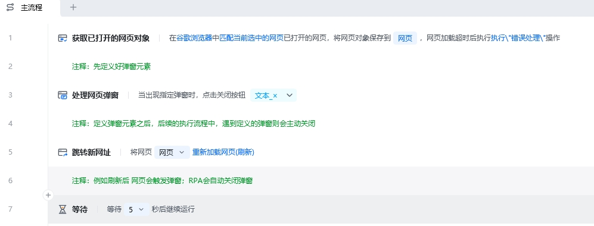
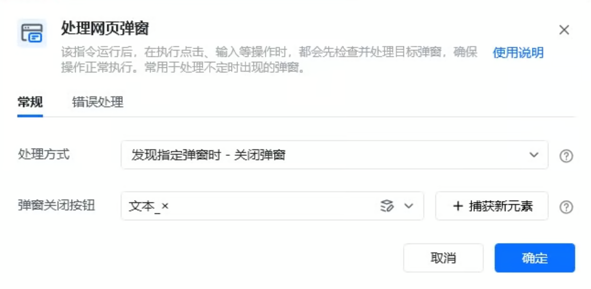
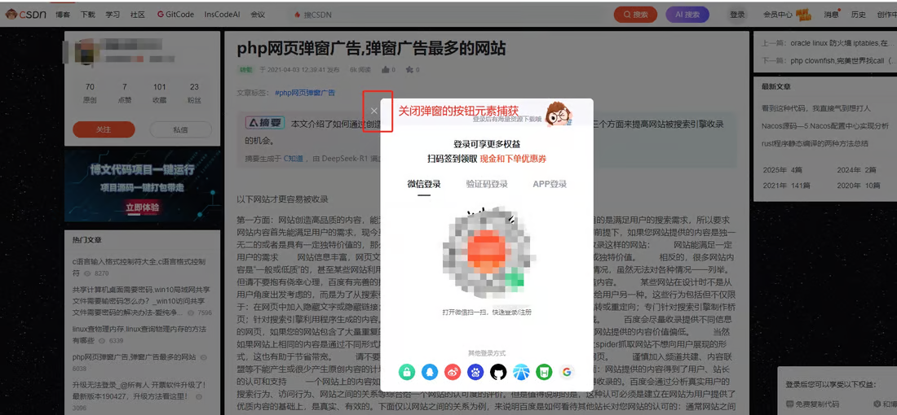
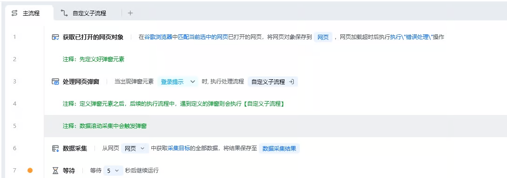
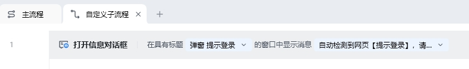
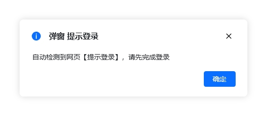

## 指令说明

**描述：** 在网页操作中，对于不定时出现的弹窗，可以自动检测关闭弹窗或者自定义流程处理。

## 参数说明

<Tabs>
  <Tab title="常规">
    

    | 参数 | 说明 |
    | --- | --- |
    | **处理方式** | 发现指定弹窗后，可选择两种处理方式，一是关闭弹窗，二是执行自定义操作 |
    | **弹窗关闭按钮** | 处理方式选择“发现指定弹窗时 - 关闭弹窗”时选取关闭指定弹窗的按钮元素，可通过已捕获的元素或「捕获新元素」来捕获新的网页元素作为按钮目标 |
    | **弹窗元素** | 处理方式选择“发现指定弹窗时 - 执行自定义操作”时，请指定唯一定位该弹窗的元素，该元素将用于判断弹窗是否出现 |
    | **处理流程** | 处理方式选择“发现指定弹窗时 - 执行自定义操作”时填写此参数，即检测到弹窗时要执行的操作，可以理解成发现弹窗的后续处理流程，可选已有的子流程或新增子流程 |
  </Tab>
  <Tab title="高级">
    本指令暂无高级参数。
  </Tab>
</Tabs>

## 使用示例

### 示例1：关闭弹窗

**该流程执行逻辑：**

使用【获取已打开的网页对象】指令获取指定浏览器上已打开的网页

使用【处理网页弹窗】指令定义弹窗元素和处理方式，选择"发现指定弹窗时-关闭弹窗"，指定弹窗关闭按钮元素

在后续的RPA执行流程中，遇到定义好的弹窗，RPA会自动关闭对应的弹窗。

#### 效果展示

### 示例2：执行自定义操作

**该流程执行逻辑：**

使用【获取已打开的网页对象】指令获取指定浏览器上已打开的网页

使用【处理网页弹窗】指令定义弹窗元素和处理方式，选择"发现指定弹窗时-执行自定义操作"，"弹窗元素"是被自动检测的元素，如下方案例中的登录提示弹窗，"处理流程"就是【自定义子流程】，在【自定义子流程】做了提示登录的【打开信息对话框】处理

在后续的RPA执行流程中，遇到定义好的弹窗，RPA会出现提示登录的消息对话框。

#### 效果展示

### 使用小 Tips

- 目前单个【处理网页弹窗】指令只能处理单个弹窗，如有多个弹窗需要处理，可以多次使用【处理网页弹窗】指令来定义多个弹窗
- 【处理网页弹窗】指令一般可以添加到流程开头，后续流程执行过程中如果界面出现该指令中的指定元素，将会执行关闭操作或者触发自定义操作

<Info>
  使用指令过程中遇到问题？前往 [八爪鱼RPA 开发者社区问答板块](https://rpa.bazhuayu.com/community/questions) 提问，获取官方与社区帮助。
</Info>
