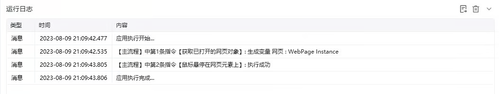

## 指令说明

**描述：** 移动鼠标，将鼠标悬停在网页中指定的某个元素上。

## 参数说明

<Tabs>
<Tab title="常规">
    

    | 参数 | 说明 |
    | --- | --- |
    | **网页对象** | 选择一个之前通过【打开网页】或【获取已打开的网页对象】指令创建的网页对象 |
    | **选择元素** | 在网页中需要选择移动鼠标后悬停到某个元素上 |
    | **模拟人工悬停** | 如果使用模拟人工悬停则通过模拟人工的方式触发悬停事件，否则将根据目标元素的自动化接口触发悬停 |
  </Tab>
  <Tab title="高级">
    | 参数 | 说明 |
    | --- | --- |
    | **执行后延迟（s）** | 指令执行完成后的等待时间 |
    | **等待元素存在（s）** | 等待目标元素存在的超时时间 |
  </Tab>
</Tabs>

## 使用示例

**该流程执行逻辑：**

使用【打开网页】指令打开目标网页

使用【鼠标悬停在元素上(web)】将鼠标悬停在指定元素上

鼠标移动到指定位置后会显示下拉菜单或触发悬浮效果

### 运行结果

鼠标成功移动到指定元素上方，触发悬浮效果（如下拉菜单展示）。

<Info>
  使用指令过程中遇到问题？前往 [八爪鱼RPA 开发者社区问答板块](https://rpa.bazhuayu.com/community/questions) 提问，获取官方与社区帮助。
</Info>
