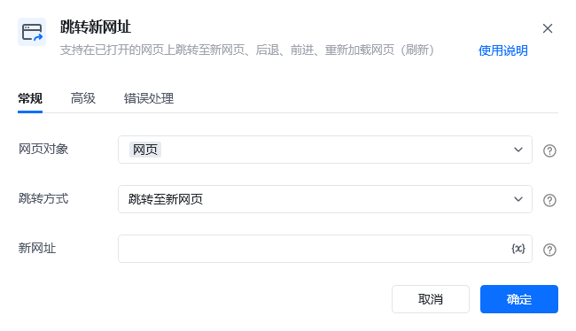
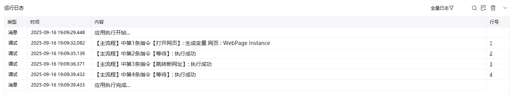

## 指令说明

**描述：** 支持在已打开的网页上跳转至新网页、后退、前进、重新加载网页(刷新)。

## 参数说明

<Tabs>
<Tab title="常规">
    

    | 参数 | 说明 |
    | --- | --- |
    | **网页对象** | 选择要操作的网页对象 |
    | **操作类型** | 下拉选择：跳转至新网址、后退、前进、刷新页面 |
    | **网址** | 当操作类型为"跳转至新网址"时，输入目标网址 |
  </Tab>
  <Tab title="高级">
    | 参数 | 说明 |
    | --- | --- |
    | **等待网页加载完成** | 是否需要等待网页加载完成后再进行下一步 |
    | **加载超时时间（s）** | 设置网页最大的加载超时时间，单位为秒 |
  </Tab>
</Tabs>

## 使用示例

**该流程执行逻辑：**

使用【打开网页】指令打开初始网页

使用【跳转新网址】指令选择操作类型（跳转/后退/前进/刷新）

流程在当前网页对象上执行相应的导航操作

### 运行结果

网页成功执行指定操作（跳转至新网址/后退/前进/刷新）。

<Info>
  使用指令过程中遇到问题？前往 [八爪鱼RPA 开发者社区问答板块](https://rpa.bazhuayu.com/community/questions) 提问，获取官方与社区帮助。
</Info>
