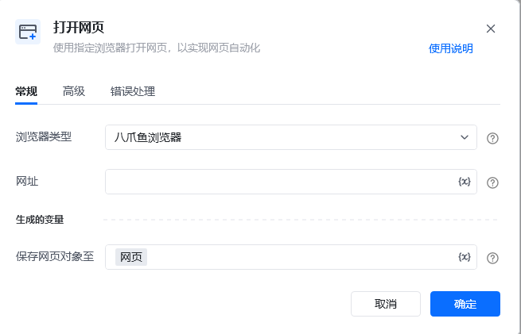

## 指令说明

**描述：** 选择某种浏览器类型，如使用"八爪鱼浏览器"打开网页，以实现网页自动化。

## 参数说明

<Tabs>
  <Tab title="常规">
    

    | 参数 | 说明 |
    | --- | --- |
    | **浏览器类型** | 支持下拉选择：八爪鱼浏览器、谷歌浏览器、Edge浏览器、360浏览器、AdsPower浏览器、比特浏览器、紫鸟浏览器、飞跨浏览器、易得客浏览器、牛卖浏览器、Hubstudio、跨境卫士浏览器、站斧浏览器、紫鸟浏览器V6、云登浏览器 |
    | **网址** | 输入需要打开的网址。如果是打开单个网页，直接输入网址即可，或者传输进去一个网址参数 |
  </Tab>
  <Tab title="高级">
    | 参数 | 说明 |
    | --- | --- |
    | **等待网页加载完成** | 是否需要等待网页加载完成后再进行下一步 |
    | **加载超时时间（s）** | 设置网页最大的加载超时时间，单位为秒 |
    | **加载超时后执行** | 最大加载超时后，网页页面仍然无法加载完成，则会执行「错误处理」或「停止加载」，建议设置为「停止加载」 |
    | **浏览器路径** | 如果为空，将自动查找电脑上安装的浏览器并尝试启动，您也可以自己配置目标浏览器的应用程序路径 |
    | **浏览器启动参数** | 启动浏览器时，可以向浏览器传递一些参数，以改变浏览器的功能和行为方式，如chrome浏览器输入"-incognito"，可进入无痕模式 |
  </Tab>
</Tabs>

## 使用示例

**该流程执行逻辑：**

使用【打开网页】指令在八爪鱼浏览器打开目标网页

保存网页对象至变量，供后续流程使用

### 效果展示

浏览器自动打开指定网页，并保存网页对象至变量，可继续执行后续操作。

<Info>
  使用指令过程中遇到问题？前往 [八爪鱼RPA 开发者社区问答板块](https://rpa.bazhuayu.com/community/questions) 提问，获取官方与社区帮助。
</Info>
