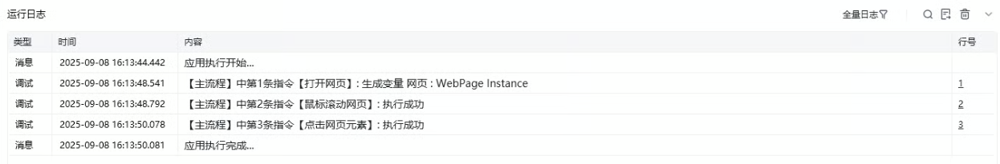

## 指令说明

**描述：** 在指定的网页中滚动鼠标，可以设置为滚动到顶部、底部或者指定位置。

## 参数说明

<Tabs>
<Tab title="常规">
    

    | 参数 | 说明 |
    | --- | --- |
    | **网页对象** | 选择一个之前通过【打开网页】或【获取已打开的网页对象】指令创建的网页对象 |
    | **在指定元素上滚动** | 勾选框，确认是否在指定元素上滚动，如部分社媒平台，需将鼠标移动至指定区域才能滚动页面 |
    | **选择元素** | 从元素库中选择一个已捕获的元素或通过「捕获新元素」来捕获新的网页元素作为操作目标，并且若当前元素中没有滚动条，可勾选下方勾选框，勾选后RPA会自动向上查找有滚动条的元素 |
    | **滚动位置** | 下拉选择：滚动到顶部、滚动到底部、滚动一屏、滚动到指定元素 |
    | **滚动次数** | 滚动位置选择"滚动一屏"时候，需输入目标滚动次数 |
    | **滚动间隔时间(s)** | 滚动位置选择"滚动一屏"时候，需输入目标滚动间隔时间，单位是秒 |
    | **滚动效果** | 下拉选择：平滑滚动、瞬间滚动 |
  </Tab>
  <Tab title="高级">
    本指令暂无高级参数。
  </Tab>
</Tabs>

## 使用示例

**该流程执行逻辑：**

使用【打开网页】指令打开“百度知道”搜索结果页

使用【鼠标滚动网页】指令将当前页面滚动到“下一页”按钮出现

流程执行滚动操作，“下一页”按钮出现后，使用【点击网页元素】指令点击“下一页”按钮

### 效果展示

网页成功滚动到指定位置（顶部/底部/指定像素/指定元素）。

<Info>
  使用指令过程中遇到问题？前往 [八爪鱼RPA 开发者社区问答板块](https://rpa.bazhuayu.com/community/questions) 提问，获取官方与社区帮助。
</Info>
