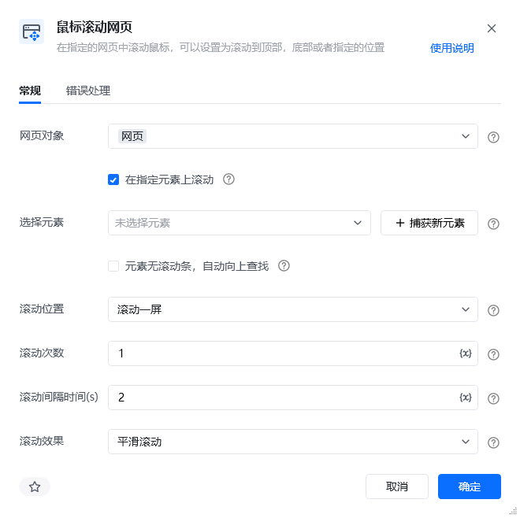
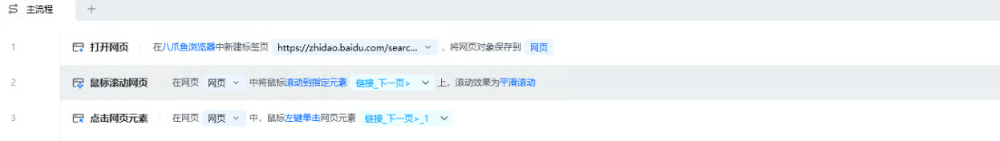
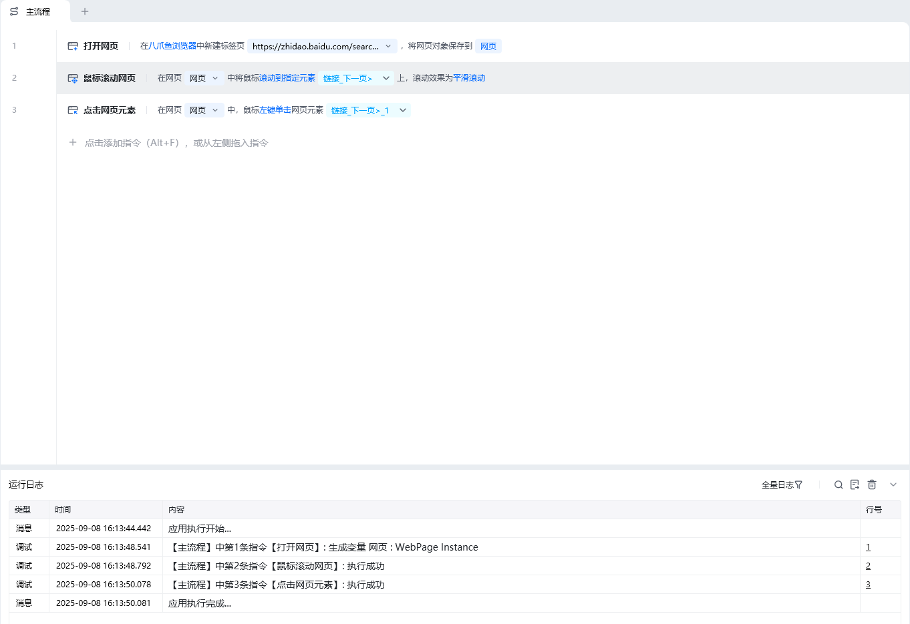

## 指令说明

**描述：** 在指定的网页中滚动鼠标，可以设置为滚动到顶部、底部或者指定位置。

## 参数说明

<Tabs>
<Tab title="常规">
    

    | 参数 | 说明 |
    | --- | --- |
    | **网页对象** | 选择要滚动的网页对象 |
    | **滚动方式** | 下拉选择：滚动到顶部、滚动到底部、滚动指定像素、滚动到指定元素 |
    | **滚动距离（px）** | 当滚动方式为"滚动指定像素"时，输入滚动的像素距离 |
    | **滚动元素** | 当滚动方式为"滚动到指定元素"时，选择目标元素 |
  </Tab>
  <Tab title="高级">
    本指令暂无高级参数。
  </Tab>
</Tabs>

## 使用示例

**该流程执行逻辑：**

使用【打开网页】指令打开目标网页

使用【鼠标滚动网页】指令选择滚动方式

流程执行滚动操作，页面滚动至指定位置

### 效果展示

网页成功滚动到指定位置（顶部/底部/指定像素/指定元素）。

<Info>
  使用指令过程中遇到问题？前往 [八爪鱼RPA 开发者社区问答板块](https://rpa.bazhuayu.com/community/questions) 提问，获取官方与社区帮助。
</Info>
