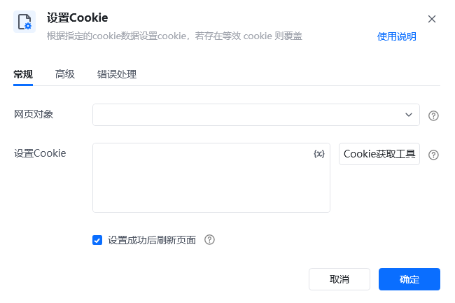
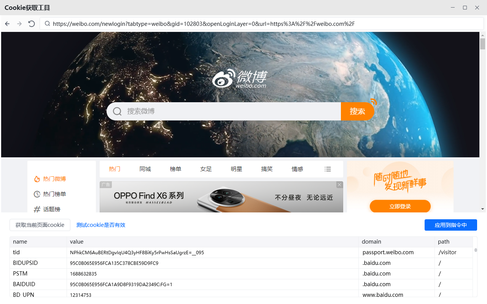
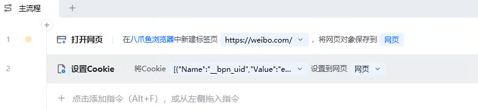
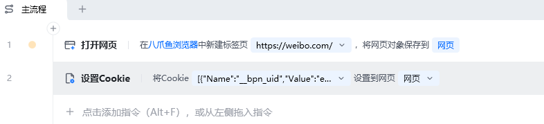
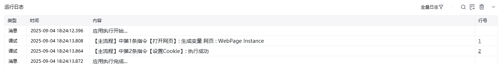

## 指令说明

**描述：** 在指定页面预设Cookie值，比如登录Cookie等，可通过Cookie工具获取Cookie。

## 参数说明

<Tabs>
<Tab title="常规">
    

    | 参数 | 说明 |
    | --- | --- |
    | **网页对象** | 选择要设置Cookie的网页对象 |
    | **Cookie数据** | 输入要设置的Cookie数据，格式为键=值，多个Cookie用换行分隔 |
    | **Cookie域名** | 设置Cookie所属的域名范围 |
  </Tab>
  <Tab title="高级">
    | 参数 | 说明 |
    | --- | --- |
    | **Cookie路径** | 设置Cookie的有效路径 |
    | **是否安全** | 设置Cookie的安全属性 |
    | **是否HttpOnly** | 设置Cookie的HttpOnly属性 |
  </Tab>
</Tabs>

## 使用示例

**该流程执行逻辑：**

使用【打开网页】指令打开目标网页

使用【设置cookie】指令预设Cookie值

后续流程可在已设置Cookie的状态下访问网页

### 运行结果

Cookie设置成功，网页可以携带预设的Cookie信息进行后续操作。

<Info>
  使用指令过程中遇到问题？前往 [八爪鱼RPA 开发者社区问答板块](https://rpa.bazhuayu.com/community/questions) 提问，获取官方与社区帮助。
</Info>
