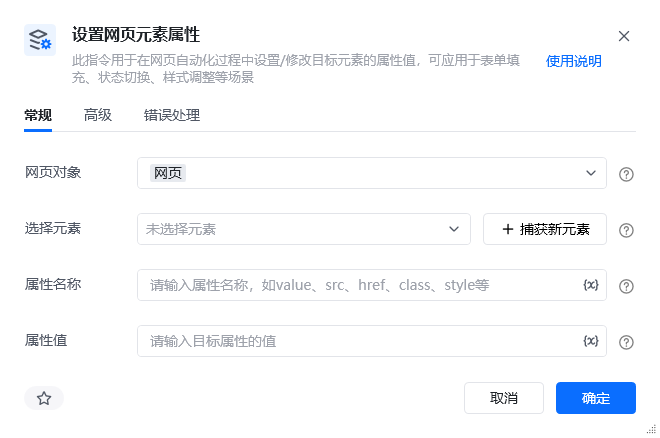
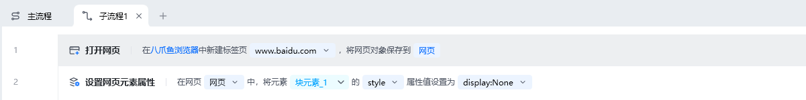
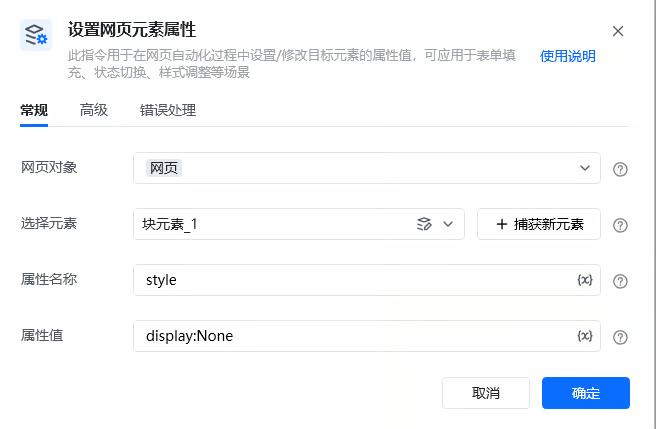
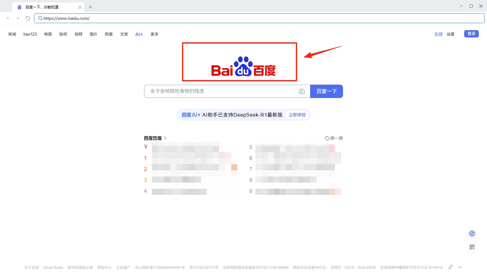
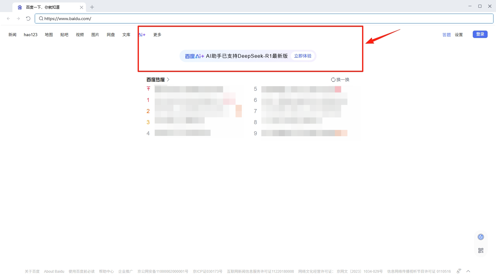

## 指令说明

**描述：** 用于在网页自动化过程中设置/修改目标元素的属性值，可用于表单填充、状态切换、样式调整等场景。

## 参数说明

<Tabs>
<Tab title="常规">
    

    | 参数 | 说明 |
    | --- | --- |
    | **网页对象** | 选择一个之前通过【打开网页】或【获取已打开的网页对象】指令创建的网页对象 |
    | **选择元素** | 从元素库中选择一个已捕获的元素或通过「捕获新元素」来捕获新的网页元素作为操作目标 |
    | **属性名称** | 请输入属性名称，如value、src、href、class、style等。（style属性可用于确定元素在网页上的样式） |
    | **属性值** | 请输入目标属性的值（如用style = "display:None"可将元素隐藏） |
  </Tab>
  <Tab title="高级">
    本指令暂无高级参数。
  </Tab>
</Tabs>

## 使用示例

**该流程执行逻辑：**

打开百度网页

使用【设置网页元素属性】指令设置指定元素的style属性值为"display:None"，即隐藏该元素

### 效果展示

目标元素的属性值被成功修改。

### 使用小Tips

该指令可处理部分广告弹窗，将弹窗的style属性值改为"display:None"，即可避免部分弹窗应用流程运行。

<Info>
  使用指令过程中遇到问题？前往 [八爪鱼RPA 开发者社区问答板块](https://rpa.bazhuayu.com/community/questions) 提问，获取官方与社区帮助。
</Info>
