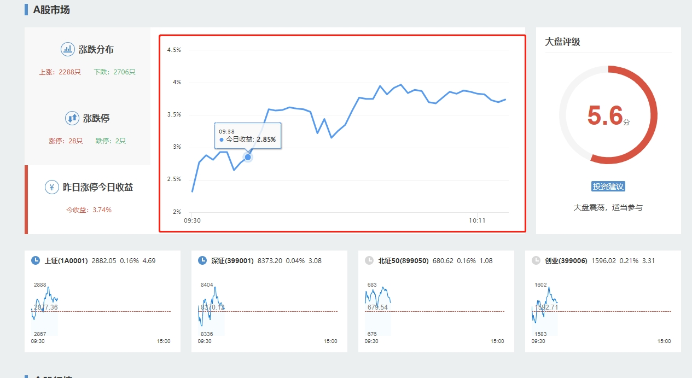

## 指令说明

**描述：** 开始监听，后续可使用【获取网页请求结果】指令获取监听到的数据。

## 参数说明

<Tabs>
  <Tab title="常规">
    

    | 参数 | 说明 |
    | --- | --- |
    | **网页对象** | 选择一个之前通过【打开网页】或【获取已打开的网页对象】指令创建的网页对象 |
    | **资源路径Url** | 请输入需要监听资源路径Url，筛选网页监听结果（值为空则忽略Url筛选条件，即监听所有）。支持同时监听多个网址，格式：api1\|api2，需要勾选"根据正则匹配"。若勾选"根据正则匹配"，需注意特殊符号，例如若要使用问号，需要加上反斜杠，即 \\? |
    | **根据正则匹配** | 根据正则表达式筛选需要监听资源路径Url |
    | **筛选资源类型** | 选择要获取的网页监听结果类型：全部 / Fetch/XHR（常用）/ CSS / 图片（常用）/ 媒体 / 字体 / 文档（常用）/ WebSocket / 其他 |
  </Tab>
  <Tab title="高级">
    本指令暂无高级参数。
  </Tab>
</Tabs>

## 使用示例

### 需求分析

对于网页源码中不显示的数据获取，如下图案例中所示：图表中数据，可以通过获取网站返回的接口信息，从接口中获取数据。

### 资源路径URL分析（抓包分析）

① 在浏览器里打开想要抓取数据的网页，按键盘F12键进入到开发者管理后台，然后点击Network（网络）

② 按 Ctrl + R 重新加载网页（或者刷新当前网页），筛选资源类型

③ 等待页面数据加载完成，然后查看接口筛选，找到有包含自己需要的数据的接口。如下图所示，需要【昨日涨跌今日收益】手动数据，查看每个接口的【Preview】是否包含需要的数据，如果包含，对应的【Headers】里的请求url就是需要监控的资源路径url

### 应用搭建

示例监听网页：https://q.10jqka.com.cn/

示例资源路径Url筛选：https://q.10jqka.com.cn/api.php?t=indexflash&

### 运行结果

**该流程执行逻辑：**

打开网页，【开始监听网页请求】，并设置好监听的"资源路径Url"

使用【跳转新网址】进行当前网页的刷新，加载出来网页的新资源

根据实际需求，【获取网页监听结果】

### 使用小 Tips

- 【开始监听网页请求】一般与【跳转新网站】、【获取网页监听结果】、【停止监听网页请求】一起使用
- 【开始监听网页请求】之后**必须要【跳转新网站】或者进行网页的刷新**，才可以触发到网页url资源的新加载，才可以获取到网页的监听结果

<Info>
  使用指令过程中遇到问题？前往 [八爪鱼RPA 开发者社区问答板块](https://rpa.bazhuayu.com/community/questions) 提问，获取官方与社区帮助。
</Info>
