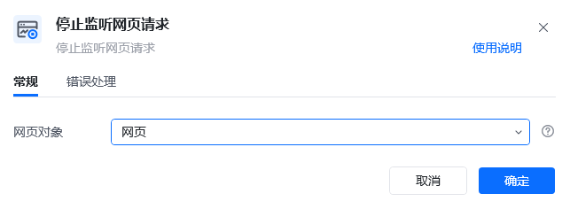
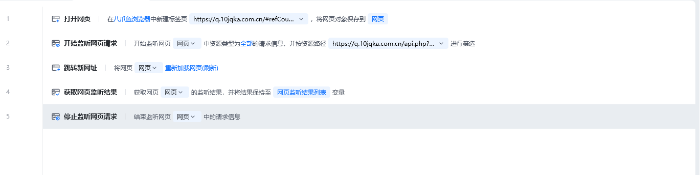

## 指令说明

**描述：** 必须和开始监听网页请求指令配合使用，不能单独使用，表示停止对网页监听。

## 参数说明

<Tabs>
<Tab title="常规">
    

    | 参数 | 说明 |
    | --- | --- |
    | **网页对象** | 选择要停止监听的网页对象 |
  </Tab>
  <Tab title="高级">
    本指令暂无高级参数。
  </Tab>
</Tabs>

## 使用示例

**该流程执行逻辑：**

在【开始监听网页请求】和【获取网页监听结果】之后

使用【停止监听网页请求】指令停止网络监听

### 效果展示

网络监听成功停止，释放监听资源。

<Info>
  使用指令过程中遇到问题？前往 [八爪鱼RPA 开发者社区问答板块](https://rpa.bazhuayu.com/community/questions) 提问，获取官方与社区帮助。
</Info>
