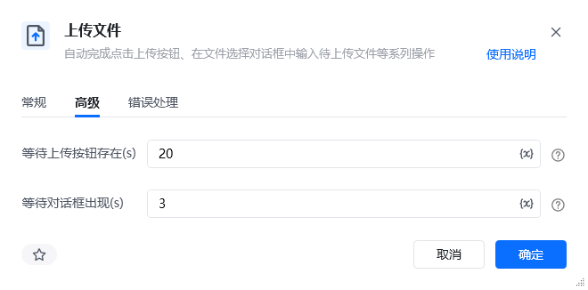
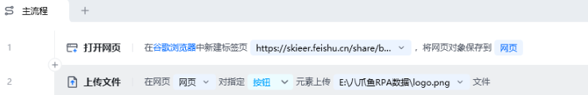
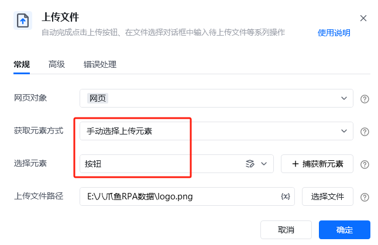
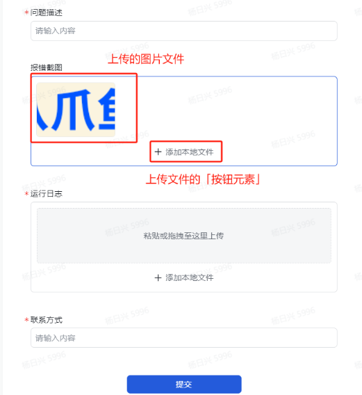

## 指令说明

**描述：** 自动完成点击上传按钮、在文件选择对话框中输入待上传文件等系列操作。

## 参数说明

<Tabs>
  <Tab title="常规">
    

    | 参数 | 说明 |
    | --- | --- |
    | **网页对象** | 输入一个获取到的或者通过"打开网页"创建的网页对象 |
    | **获取元素的方式** | （选择上传元素的方式 自动匹配上传元素：RPA根据网页页面结构自动匹配上传元素 手动选择上传元素：需手动「选择元素」（更加精准）） |
    | **选择元素** | 选择要操作的网页目标元素（即页面上点击上传文件的网页元素） |
    | **上传文件路径** | 待上传文件的完整路径 |
  </Tab>
  <Tab title="高级">
    

    | 参数 | 说明 |
    | --- | --- |
    | **等待上传按钮存在（s）** | 最大等待上传按钮存在，单位(秒) |
    | **等待对话框出现（s）** | 点击上传按钮后，等待上传对话框出现的最大超时时间，单位(秒) |
  </Tab>
</Tabs>

## 使用示例

**该流程执行逻辑：**

打开网页：https://skieer.feishu.cn/share/base/form/shrcnVBHk28GuRlqssOAMXyEwks

使用【上传文件】指令，选择「上传文件元素」，「上传文件路径」填入待上传文件路径

### 效果展示

文件被成功上传到目标网页。

<Info>
  使用指令过程中遇到问题？前往 [八爪鱼RPA 开发者社区问答板块](https://rpa.bazhuayu.com/community/questions) 提问，获取官方与社区帮助。
</Info>
