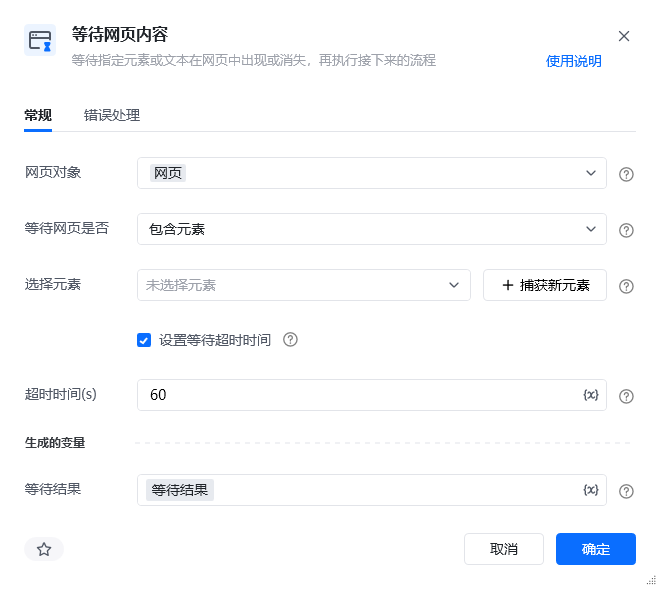
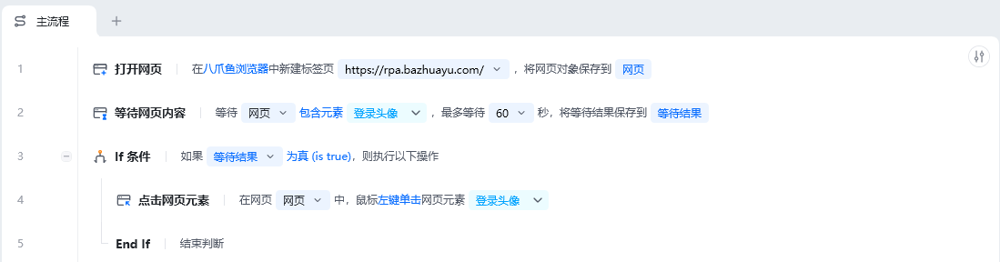
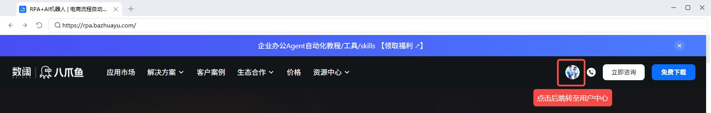

## 指令说明

**描述：** 在指定的时间内，等待网页内容出现。

## 参数说明

<Tabs>
<Tab title="常规">
    

    | 参数 | 说明 |
    | --- | --- |
    | **网页对象** | 选择一个之前通过【打开网页】或【获取已打开的网页对象】指令创建的网页对象 |
    | **等待网页是否** | 下拉选择：包含元素、不包含元素、包含文本、不包含文本 |
    | **选择元素** | 从元素库中选择一个已捕获的元素或通过「捕获新元素」来捕获新的网页元素作为操作目标 |
    | **文本内容** | 输入要判断网页中是否包含的文本内容 |
    | **超时时间（s）** | 勾选上方“设置超时等待时间”后，在此设置超时时间，单位为秒，超时后流程将终止或忽略异常并继续执行或重试此指令 |
  </Tab>
  <Tab title="高级">
    本指令暂无高级参数。
  </Tab>
</Tabs>

## 使用示例

**该流程执行逻辑：**

【打开网页】打开目标网页https://rpa.bazhuayu.com/

【等待网页内容】指令等待目标元素（登录头像）出现

【If条件】判断等待结果是否为真（is true）。等待结果是布尔值，如果目标元素出现了，等待结果就是true，否则为false

【点击网页元素】等待结果为真（is true）则点击目标元素（登录头像）

### 效果展示

在超时时间内检测到目标内容出现后，流程继续执行后续操作。

<Info>
  使用指令过程中遇到问题？前往 [八爪鱼RPA 开发者社区问答板块](https://rpa.bazhuayu.com/community/questions) 提问，获取官方与社区帮助。
</Info>
