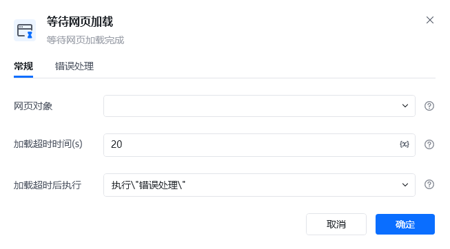
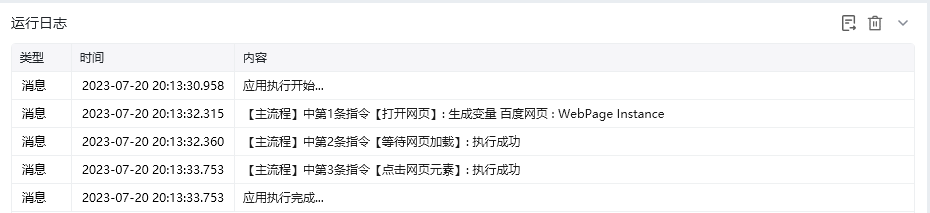

## 指令说明

**描述：** 在指定的时间内，等待网页加载完成。

## 参数说明

<Tabs>
<Tab title="常规">
    

    | 参数 | 说明 |
    | --- | --- |
    | **网页对象** | 选择一个通过【打开网页】或【获取已打开的网页对象】指令创建的网页对象 |
    | **超时时间（s）** | 设置网页加载的最大超时时间，单位为秒 |
    | **加载超时后执行** | 加载超时后，可选择「错误处理」或「停止加载」 |
  </Tab>
  <Tab title="高级">
    本指令暂无高级参数。
  </Tab>
</Tabs>

## 使用示例

**该流程执行逻辑：**

使用【打开网页】指令打开目标网页

使用【等待网页加载】指令等待网页完全加载完成

加载完成后，使用【点击网页元素】指令点击目标元素

### 效果展示

网页在指定时间内加载完成，流程继续执行后续操作。

<Info>
  使用指令过程中遇到问题？前往 [八爪鱼RPA 开发者社区问答板块](https://rpa.bazhuayu.com/community/questions) 提问，获取官方与社区帮助。
</Info>
