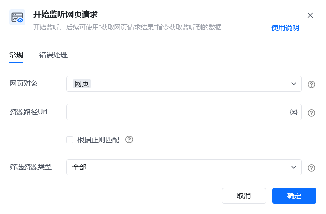
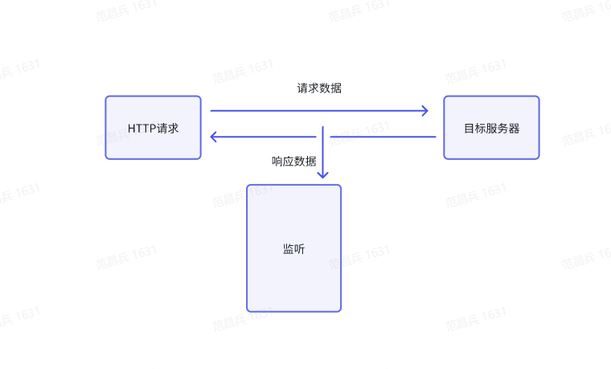
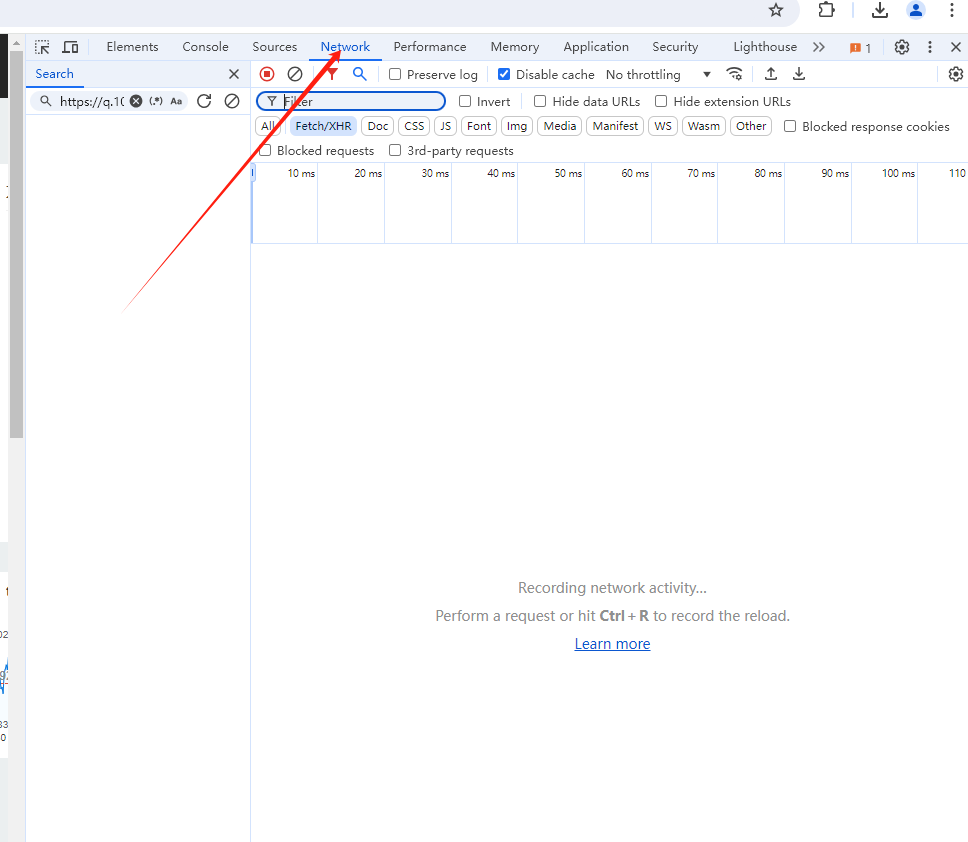
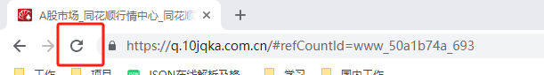
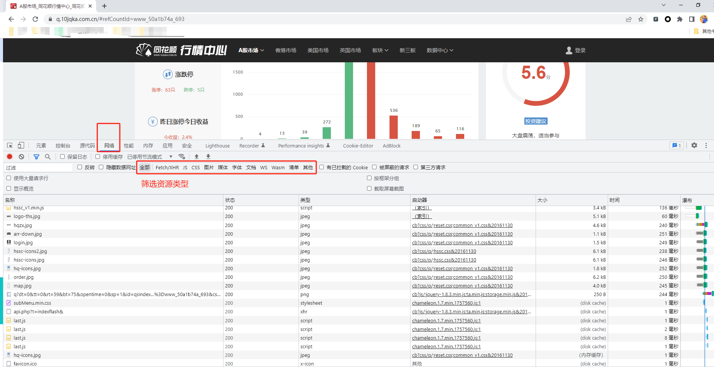
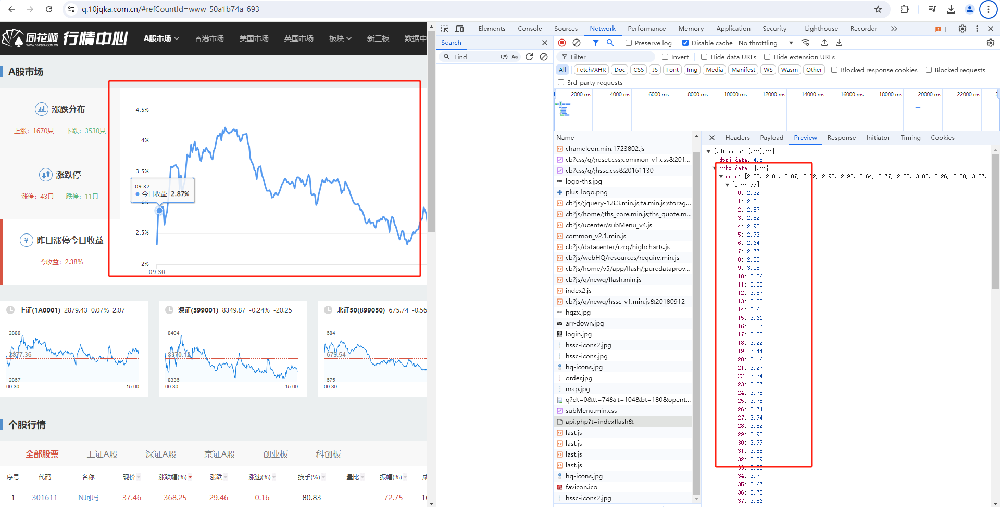
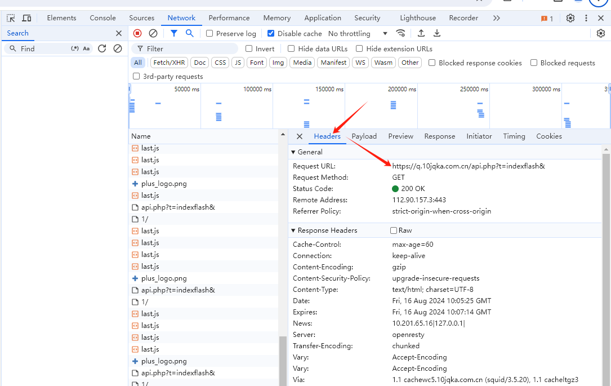
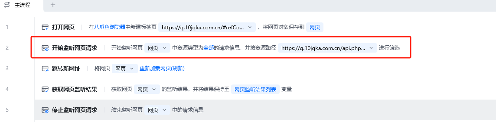
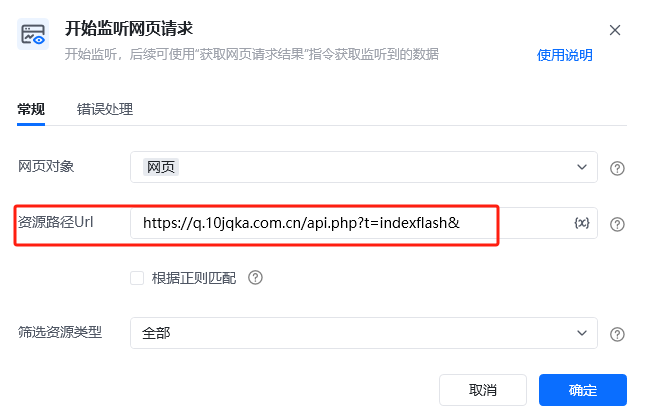
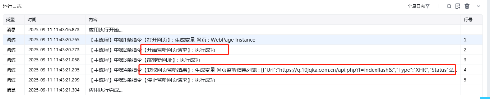

## 指令说明

**描述：** 开始监听，后续可使用"获取网页请求结果"指令获取监听到的数据。

## 参数说明

<Tabs>
<Tab title="常规">
    

    | 参数 | 说明 |
    | --- | --- |
    | **网页对象** | 选择要监听的网页对象 |
    | **监听范围** | 选择要监听的请求范围 |
  </Tab>
  <Tab title="高级">
    本指令暂无高级参数。
  </Tab>
</Tabs>

## 使用示例

**该流程执行逻辑：**

使用【打开网页】指令打开目标网页

使用【开始监听网页请求】指令开启网络监听

执行触发网络请求的操作（如点击、搜索等）

使用【获取网页监听结果】指令获取监听数据

使用【停止监听网页请求】指令结束监听

### 运行结果

成功开启网络请求监听，可捕获网页中发起的网络请求数据。

<Info>
  使用指令过程中遇到问题？前往 [八爪鱼RPA 开发者社区问答板块](https://rpa.bazhuayu.com/community/questions) 提问，获取官方与社区帮助。
</Info>
