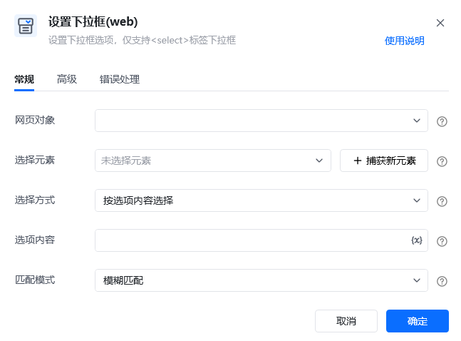
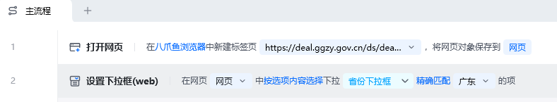
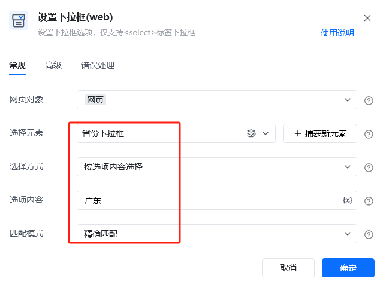
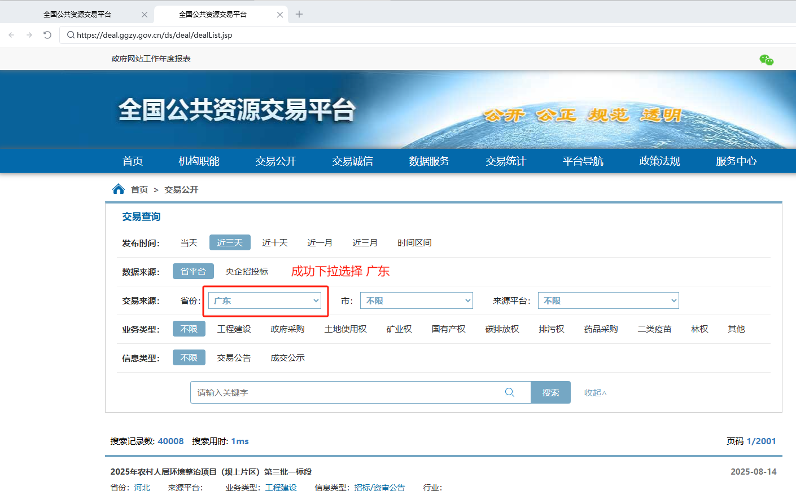
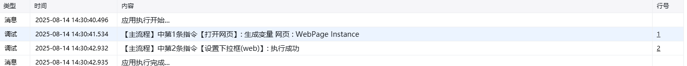
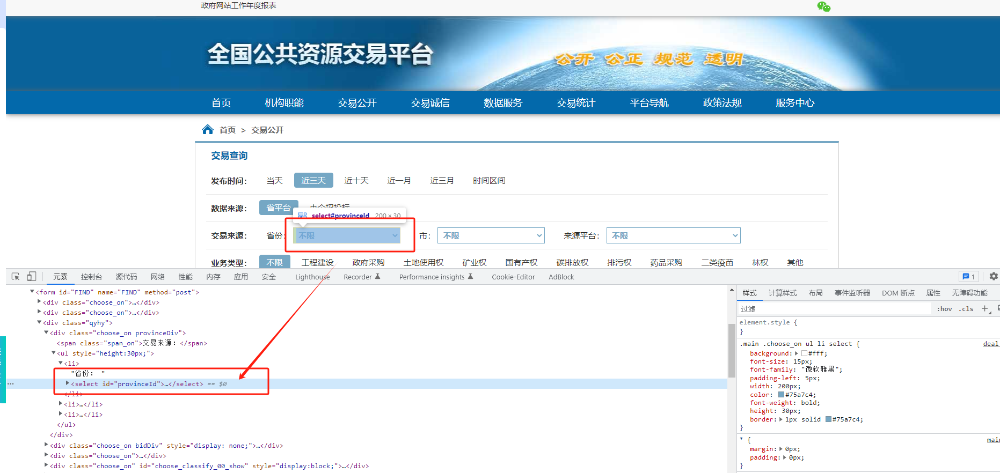

## 指令说明

**描述：** 设置下拉框选项，**仅支持HTML源码中<select>标签的下拉框**。

## 参数说明

<Tabs>
  <Tab title="常规">
    

    | 参数 | 说明 |
    | --- | --- |
    | **网页对象** | 选择要操作的目标元素所在的网页对象 |
    | **选择元素** | 选择要操作的目标元素，可从已有的元素库中选择，或者通过「捕获新元素」来捕获 |
    | **选择方式** | 选择设置选中项的依据：按选项内容选择（选项的文本内容）、按选项位置选择（选项的顺序位置，从1开始） |
    | **选项内容** | 「按选项内容选择」时出现，输入想要选择的选项内容 |
    | **选项位置** | 「按选项位置选择」时出现，输入想要选择的选项顺序位置，从1开始 |
    | **匹配模式** | 「按选项内容选择」时出现，可以选择：模糊匹配 / 精准匹配 / 正则匹配 |
  </Tab>
  <Tab title="高级">
    | 参数 | 说明 |
    | --- | --- |
    | **执行后延迟（s）** | 指令执行完成后的等待时间，建议1s |
    | **等待元素存在（s）** | 等待目标元素存在的超时时间 |
  </Tab>
</Tabs>

## 使用示例

**此流程执行逻辑：**

在八爪鱼浏览器中打开网页 https://deal.ggzy.gov.cn/ds/deal/dealList.jsp

使用【设置下拉框(web)】指令，选择"省份下拉框"的元素，选择「按选项内容选择」，「选项内容」填入"广东"，「匹配模式」选择"精准匹配"

### 运行结果

网页的下拉框选择结果：

### 使用 Tips

仅支持HTML源码中<select>标签的下拉框，如下图。

<Info>
  使用指令过程中遇到问题？前往 [八爪鱼RPA 开发者社区问答板块](https://rpa.bazhuayu.com/community/questions) 提问，获取官方与社区帮助。
</Info>
