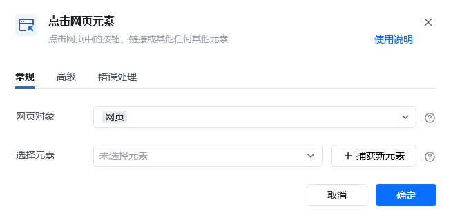
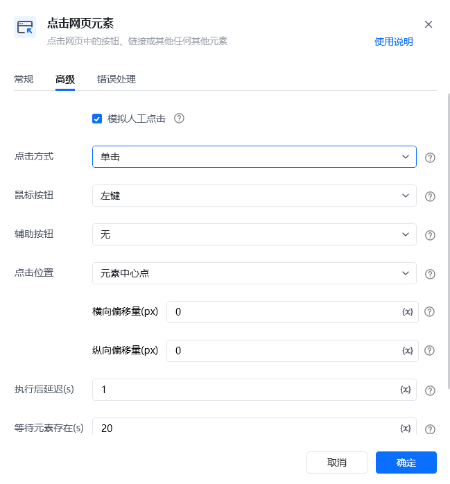
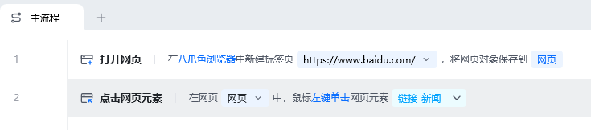
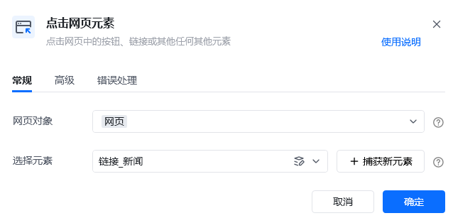

## 指令说明

**描述：** 点击网页中的按钮、链接或者其他任何网页元素。

## 参数说明

<Tabs>
<Tab title="常规">
    

    | 参数 | 说明 |
    | --- | --- |
    | **网页对象** | 选择要操作的目标元素所在的网页对象 |
    | **选择元素** | 选择要操作的目标元素，可从已有的元素库中选择，或者通过「捕获新元素」来捕获 |
  </Tab>
  <Tab title="高级">
    | 参数 | 说明 |
    | --- | --- |
    | **模拟人工点击** | 模拟人工的方式触发点击事件，待点击元素被遮挡时可取消勾选 |
    | **点击方式** | 下拉选择「单击」或者「双击」 |
    | **鼠标按钮** | 下拉选择「左键」或者「右键」 |
    | **辅助按钮** | 下拉选择「无」、「Ctrl」、「Shift」、「Alt」 |
    | **点击位置** | 下拉选择「元素中心点」、「元素左上角」、「元素左下角」、「元素右上角」、「元素右下角」 |
    | **横向偏移量（px）** | 基于点击位置，水平方向的额外偏移量(像素)。正值表示向右偏移，负值表示向左偏移 |
    | **纵向偏移量（px）** | 基于点击位置，垂直方向的额外偏移量(像素)。正值表示向下偏移，负值表示向上偏移 |
    | **执行后延迟（s）** | 指令执行完成后的等待时间 |
    | **等待元素存在（s）** | 等待目标元素存在的超时时间 |
  </Tab>
</Tabs>

## 使用示例

**该流程执行逻辑：**

使用【打开网页】指令在八爪鱼浏览器中打开目标网页

使用【点击网页元素】在网页中点击目标元素

### 运行结果

目标元素被成功点击，触发对应的页面响应或跳转。

<Info>
  使用指令过程中遇到问题？前往 [八爪鱼RPA 开发者社区问答板块](https://rpa.bazhuayu.com/community/questions) 提问，获取官方与社区帮助。
</Info>
