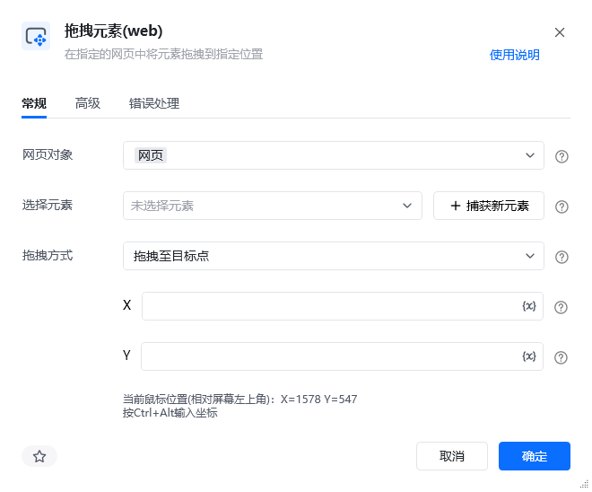
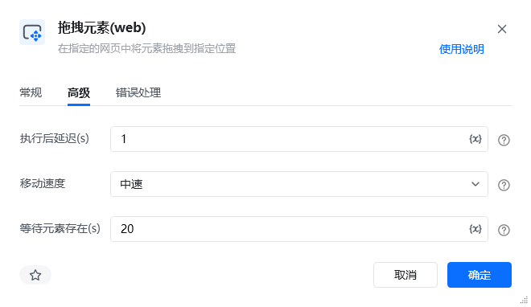
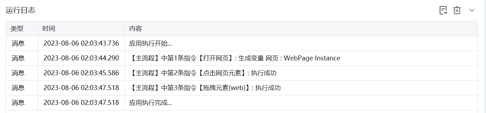

## 指令说明

**描述：** 在指定的网页中将元素拖拽到指定位置。

## 参数说明

<Tabs>
<Tab title="常规">
    

    | 参数 | 说明 |
    | --- | --- |
    | **网页对象** | 选择要操作的网页对象 |
    | **拖拽元素** | 选择要拖拽的源元素，可通过「捕获新元素」来捕获 |
    | **目标元素** | 选择拖拽到的目标元素，可通过「捕获新元素」来捕获 |
  </Tab>
  <Tab title="高级">
    | 参数 | 说明 |
    | --- | --- |
    | **拖拽方式** | 下拉选择：拖拽到目标元素、拖拽指定偏移距离 |
    | **横向偏移量（px）** | 拖拽方式为偏移时，水平方向的偏移量 |
    | **纵向偏移量（px）** | 拖拽方式为偏移时，垂直方向的偏移量 |
  </Tab>
</Tabs>

## 使用示例

**该流程执行逻辑：**

使用【打开网页】指令打开目标网页

使用【拖拽元素(web)】指令选择源元素和目标元素

执行拖拽操作，将源元素移动到目标位置

### 运行结果

元素被成功拖拽到目标位置。

<Info>
  使用指令过程中遇到问题？前往 [八爪鱼RPA 开发者社区问答板块](https://rpa.bazhuayu.com/community/questions) 提问，获取官方与社区帮助。
</Info>
