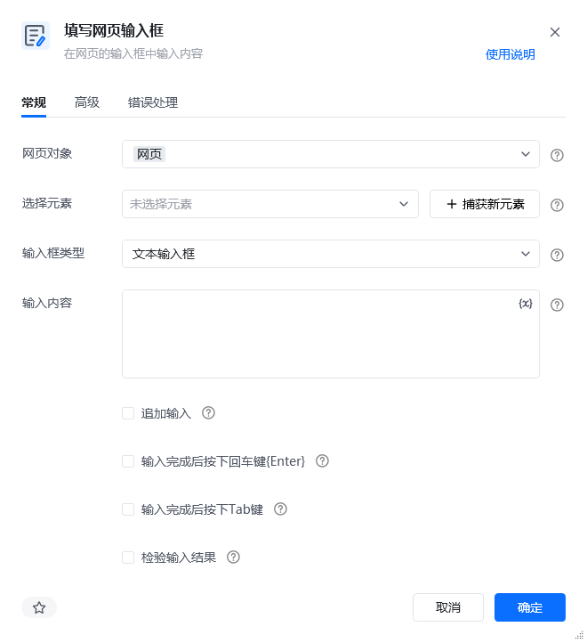
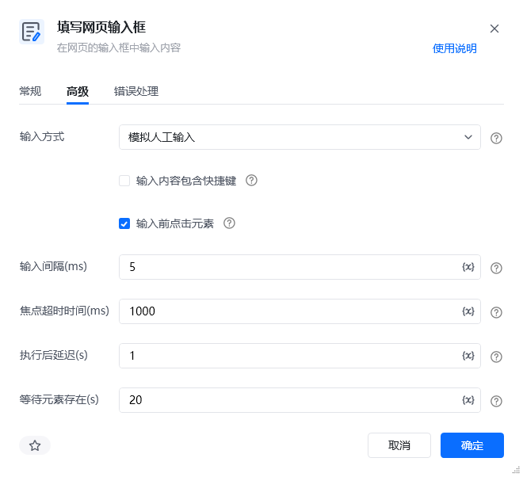
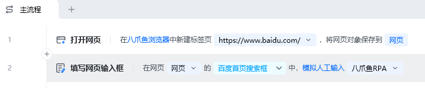
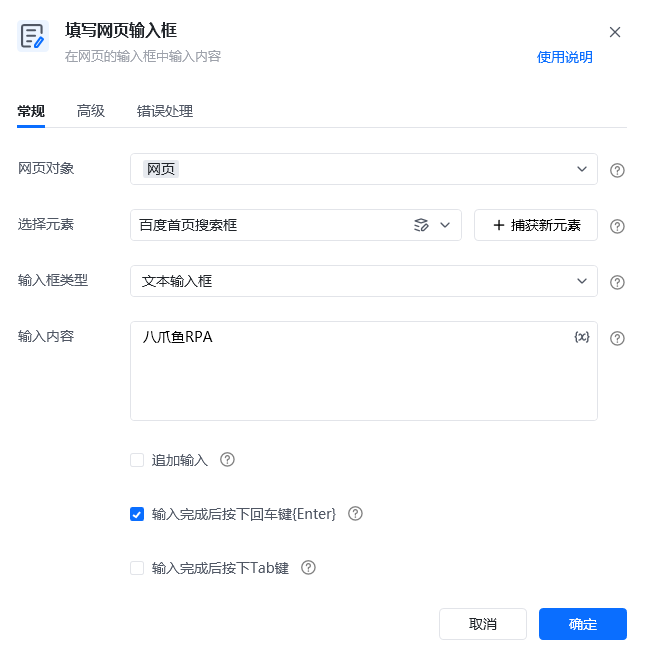
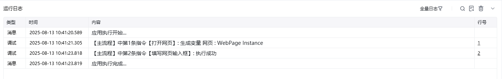

## 指令说明

**描述：** 在网页的输入框中输入内容。

## 参数说明

<Tabs>
<Tab title="常规">
    

    | 参数 | 说明 |
    | --- | --- |
    | **网页对象** | 选择要操作的目标元素所在的网页对象 |
    | **选择元素** | 选择要输入的目标输入框元素，可通过「捕获新元素」来捕获 |
    | **输入内容** | 填写需要输入的文本内容，支持变量 |
    | **输入方式** | 下拉选择：直接输入、模拟人工输入 |
  </Tab>
  <Tab title="高级">
    | 参数 | 说明 |
    | --- | --- |
    | **输入前清空** | 输入前是否先清空输入框的已有内容 |
    | **输入后按回车** | 输入完成后是否按下回车键 |
    | **执行后延迟（s）** | 指令执行完成后的等待时间 |
  </Tab>
</Tabs>

## 使用示例

**该流程执行逻辑：**

使用【打开网页】指令打开目标网页

使用【填写网页输入框】指令捕获目标输入框元素

在输入框中输入指定内容，完成表单填写

### 运行结果

文本内容成功输入到目标输入框中。

<Info>
  使用指令过程中遇到问题？前往 [八爪鱼RPA 开发者社区问答板块](https://rpa.bazhuayu.com/community/questions) 提问，获取官方与社区帮助。
</Info>
