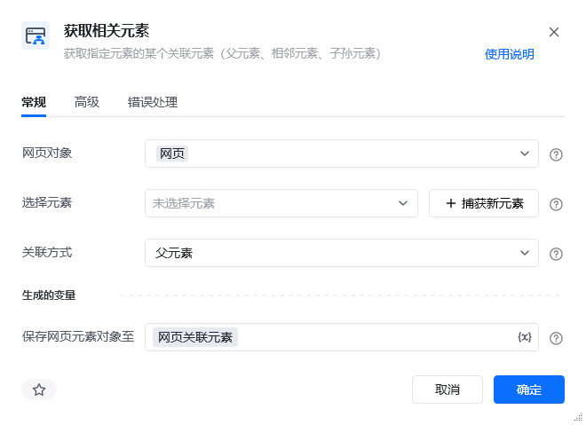
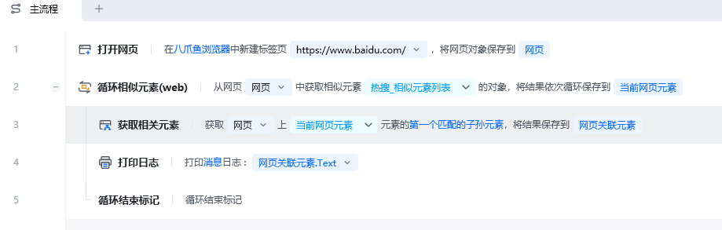
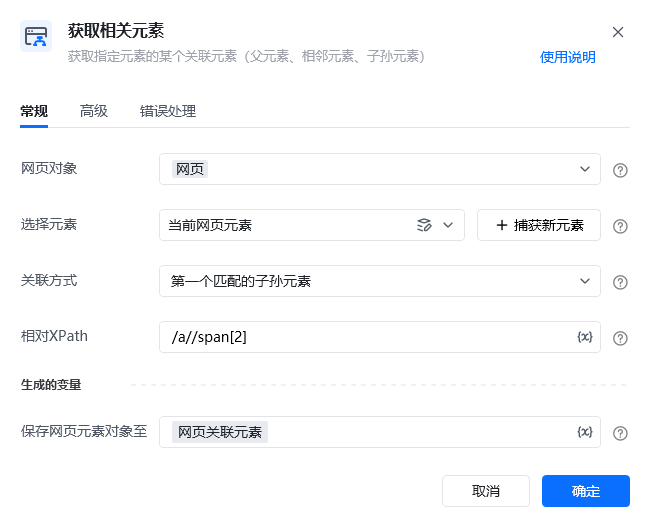
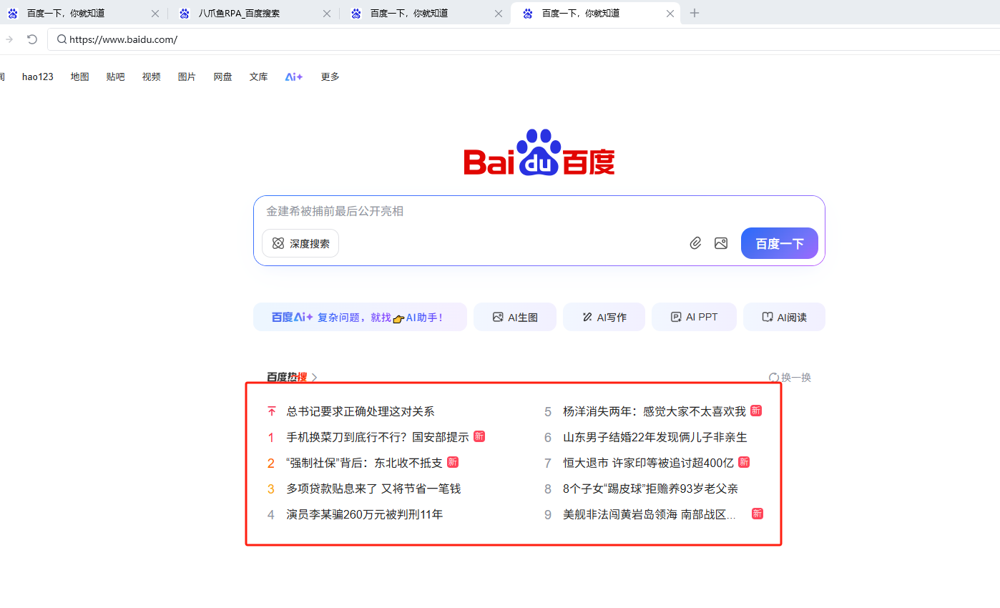
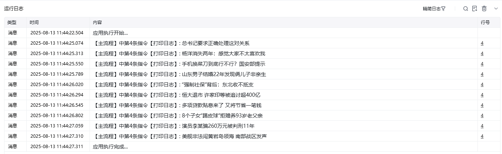

## 指令说明

**描述：** 主要用于少数无法直接捕获到的网页元素，可通过捕获其父元素、子元素、相邻元素来关联获取。

## 参数说明

<Tabs>
<Tab title="常规">
    

    | 参数 | 说明 |
    | --- | --- |
    | **网页对象** | 选择要操作的目标元素所在的网页对象 |
    | **参考元素** | 选择一个已捕获的元素作为参考 |
    | **关联方式** | 下拉选择：父元素、子元素、前一个兄弟元素、后一个兄弟元素 |
  </Tab>
  <Tab title="高级">
    | 参数 | 说明 |
    | --- | --- |
    | **筛选条件** | 可选，通过CSS选择器筛选关联元素，如按标签名、class等筛选 |
  </Tab>
</Tabs>

## 使用示例

**该流程执行逻辑：**

使用【打开网页】指令打开目标网页

捕获一个可定位的参考元素

使用【获取相关元素】指令选择关联方式，获取无法直接捕获的目标元素

一般和【循环相似元素】一起配合使用

### 效果展示

成功通过参考元素获取关联的目标元素（父/子/相邻元素）。

<Info>
  使用指令过程中遇到问题？前往 [八爪鱼RPA 开发者社区问答板块](https://rpa.bazhuayu.com/community/questions) 提问，获取官方与社区帮助。
</Info>
