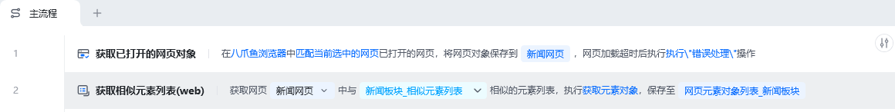
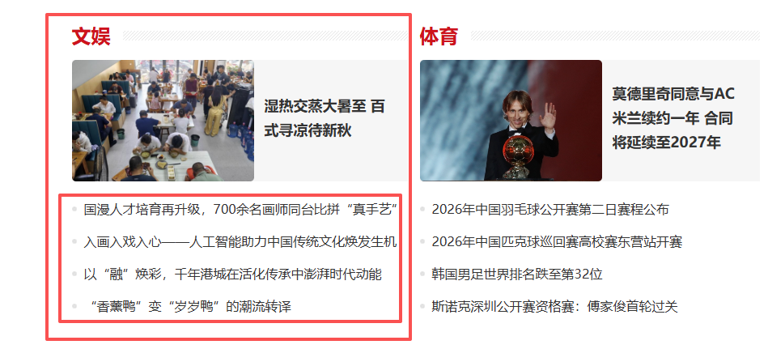
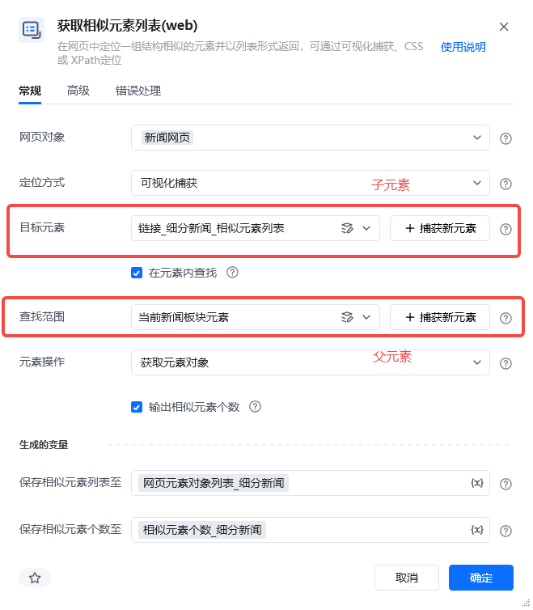
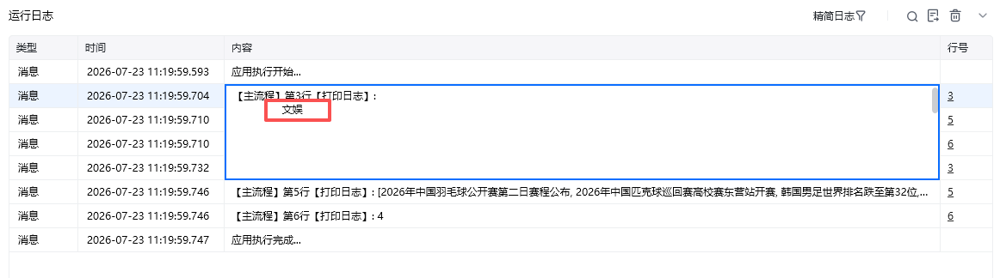
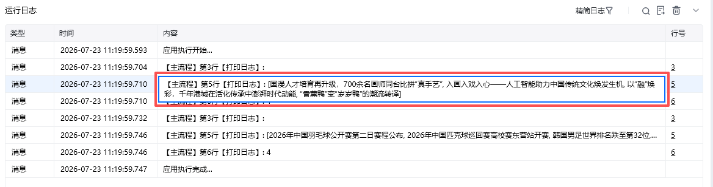

## 指令说明

**描述：** 在网页中定位一组结构相似的元素并以列表形式返回，可通过可视化捕获、CSS或XPath定位。

## 参数说明

<Tabs>
<Tab title="常规">
    

    | 参数 | 说明 |
    | --- | --- |
    | **网页对象** | 输入一个获取到的或者通过"打开网页"创建的网页对象 |
    | **定位方式** | 选择定位相似元素的方式： 可视化捕获 CSS选择器 XPath选择器 |
    | **目标元素** | 选择用于匹配相似元素的网页元素 |
    | **在元素内查找** | 勾选框，是否只在指定父元素内部匹配相似元素。如有多级评论时，可只匹配指定一级评论下的二级评论，在这种情况下一级评论是父元素，二级评论是它内部的相似元素。 |
    | **元素操作** | 选择对匹配到的相似元素执行的操作 |
    | **输出相似元素个数** | 勾选框，是否同时输出匹配到的相似元素个数 |
    | **保存相似元素列表至** | 指定一个变量名称，该变量用于保存获取到的相似元素对象列表，不填写则不输出 |
  </Tab>
  <Tab title="高级">
    | 参数 | 说明 |
    | --- | --- |
    | **等待元素存在（s）** | 等待目标元素存在的超时时间 |
    | **倒序** | 勾选框，勾选则将匹配到的相似元素倒序后返回至列表 |
  </Tab>
</Tabs>

## 使用示例

### 不勾选“在元素内查找”

示例网页 [https://www.chinanews.com.cn/](https://www.chinanews.com.cn/)，相似元素列表：文娱板块+体育板块。

**此流程执行逻辑：**

获取八爪鱼浏览器中已打开的网页对象“新闻网页”

获取当前网页的部分新闻板块，选中文娱和体育板块

#### 效果展示

### 勾选“在元素内查找”

示例网页 [https://www.chinanews.com.cn/](https://www.chinanews.com.cn/)，相似元素列表：文娱、体育板块下的细分新闻。

**此流程执行逻辑：**

获取八爪鱼浏览器中已打开的网页对象“新闻网页”

循环新闻网页中的文娱板块和体育板块

首先循环文娱板块，获取文娱板块下的细分新闻，打印出细分新闻相似元素列表和对应的个数

再循环体育板块，获取体育板块下的细分新闻，打印出细分新闻相似元素列表和对应的个数

#### 效果展示

<Info>
  使用指令过程中遇到问题？前往 [八爪鱼RPA 开发者社区问答板块](https://rpa.bazhuayu.com/community/questions) 提问，获取官方与社区帮助。
</Info>
