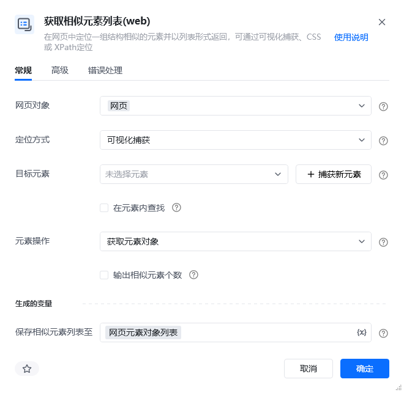
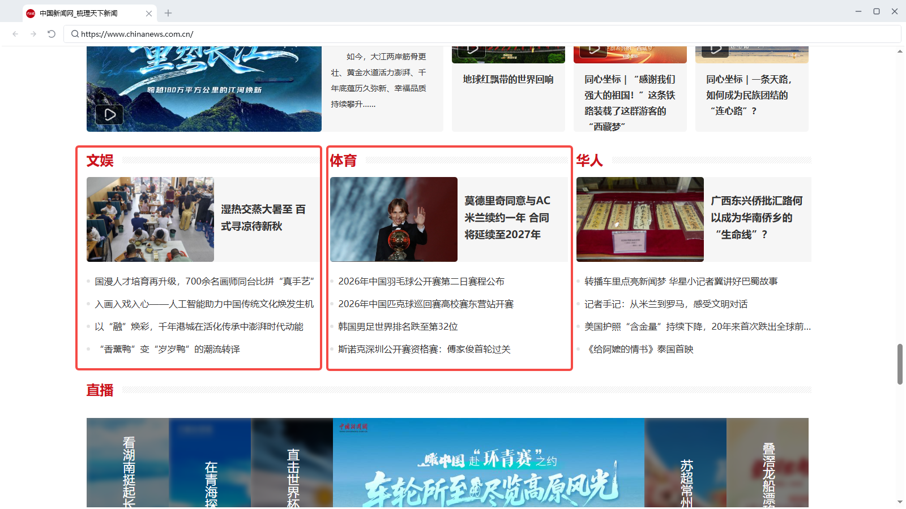
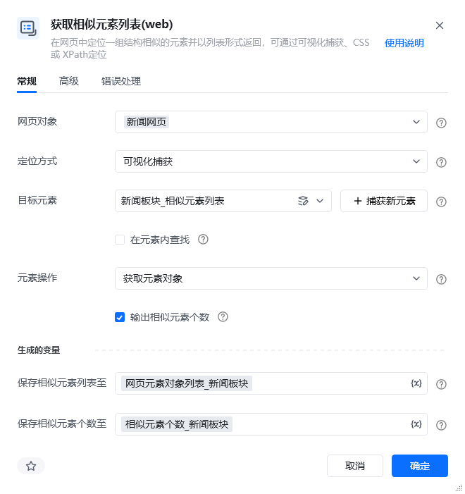
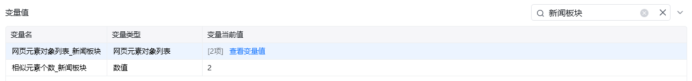
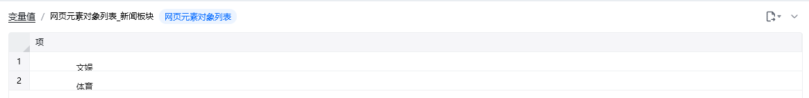
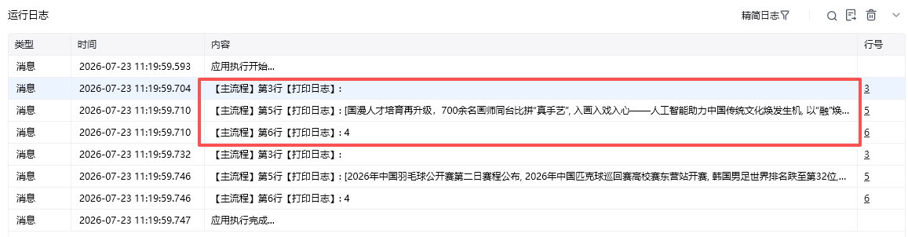

## 指令说明

**描述：** 在网页中定位一组结构相似的元素并以列表形式返回，可通过可视化捕获、CSS或XPath定位。

## 参数说明

<Tabs>
<Tab title="常规">
    

    | 参数 | 说明 |
    | --- | --- |
    | **网页对象** | 选择要操作的网页对象 |
    | **定位方式** | 下拉选择：可视化捕获、CSS选择器、XPath |
    | **CSS选择器** | 当定位方式为CSS选择器时，输入CSS选择器表达式 |
    | **XPath** | 当定位方式为XPath时，输入XPath表达式 |
  </Tab>
  <Tab title="高级">
    | 参数 | 说明 |
    | --- | --- |
    | **等待元素存在（s）** | 等待目标元素存在的超时时间 |
  </Tab>
</Tabs>

## 使用示例

**该流程执行逻辑：**

使用【打开网页】指令打开目标网页

使用【获取相似元素列表(web)】指令通过捕获/CSS/XPath定位相似元素

获取一组结构相似的元素列表，交给后续循环指令逐个处理

### 运行结果

成功获取相似元素列表，可用于商品列表采集、表格行读取、文章链接提取等场景。

<Info>
  使用指令过程中遇到问题？前往 [八爪鱼RPA 开发者社区问答板块](https://rpa.bazhuayu.com/community/questions) 提问，获取官方与社区帮助。
</Info>
