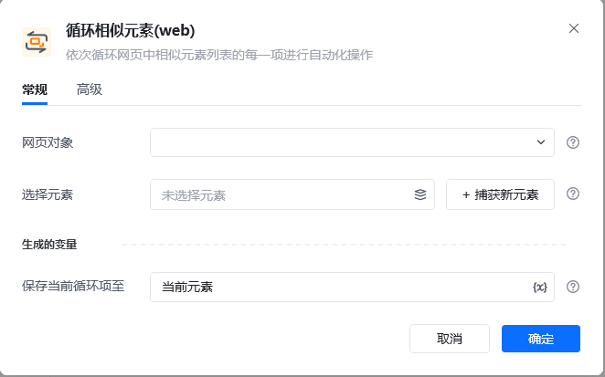
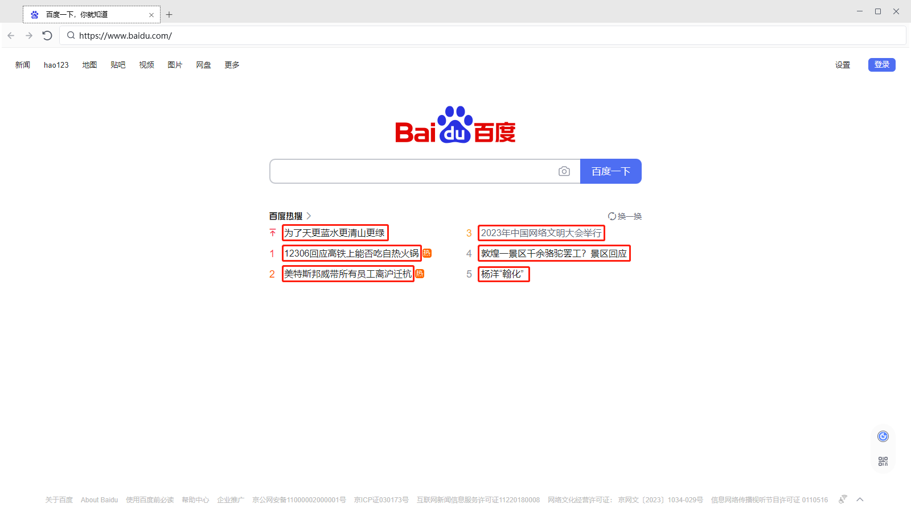
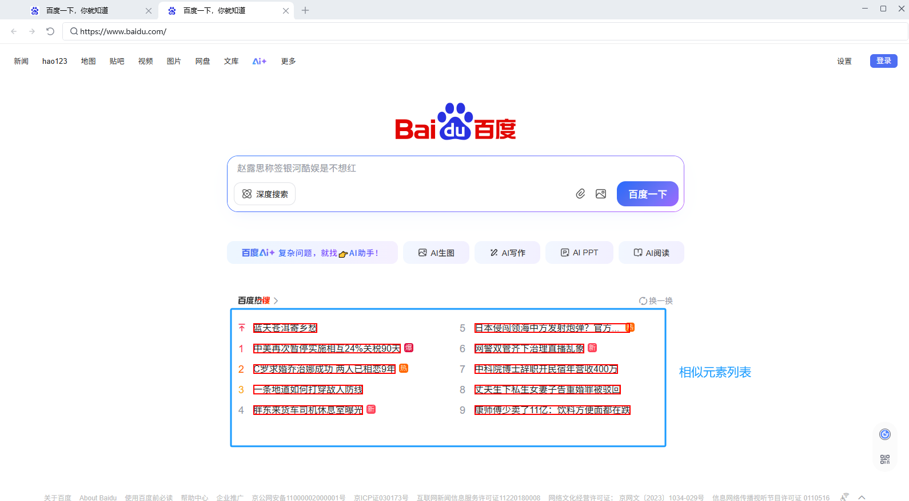
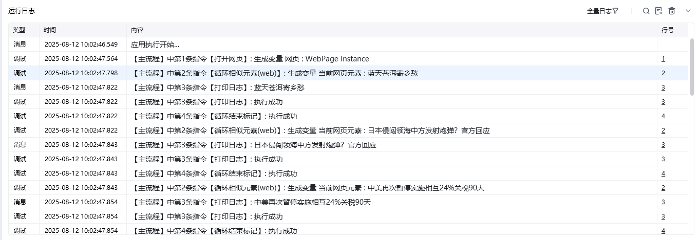

## 指令说明

**描述：** 循环迭代一个网页元素列表，并把当前的迭代元素作为流程变量输出。适合需要对一个网页元素列表挨个进行处理的场景。

## 参数说明

<Tabs>
<Tab title="常规">
    

    | 参数 | 说明 |
    | --- | --- |
    | **网页对象** | 选择要操作的网页对象 |
    | **元素列表** | 选择一个相似元素列表或通过捕获获取 |
    | **保存循环项至** | 将当前迭代元素保存到指定变量名 |
  </Tab>
  <Tab title="高级">
    本指令暂无高级参数。
  </Tab>
</Tabs>

## 使用示例

**该流程执行逻辑：**

使用【打开网页】指令打开目标网页

使用【循环相似元素(web)】指令选择元素列表

在循环体内对每个迭代元素执行操作（如提取文本、点击等）

使用【循环结束标记】结束循环

### 效果展示

循环遍历相似元素列表，对每个元素依次执行循环体内的操作。

<Info>
  使用指令过程中遇到问题？前往 [八爪鱼RPA 开发者社区问答板块](https://rpa.bazhuayu.com/community/questions) 提问，获取官方与社区帮助。
</Info>
