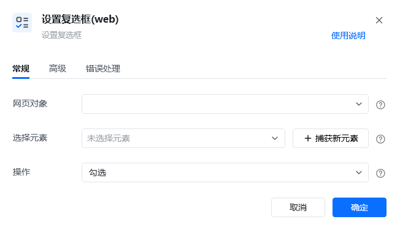
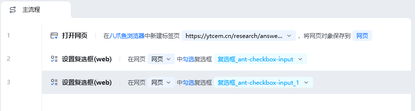
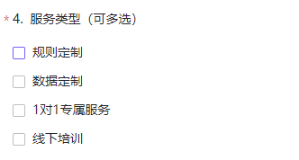
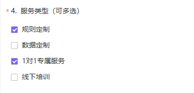
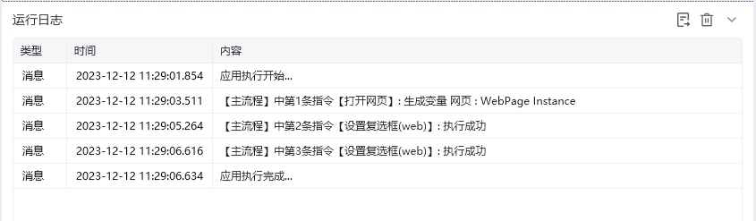

## 指令说明

**描述：** 将网页中的复选框状态设置为勾选或不勾选。

## 参数说明

<Tabs>
<Tab title="常规">
    

    | 参数 | 说明 |
    | --- | --- |
    | **网页对象** | 选择要操作的目标元素所在的网页对象 |
    | **选择元素** | 选择目标复选框元素，可通过「捕获新元素」来捕获 |
    | **勾选状态** | 选择：勾选或不勾选 |
  </Tab>
  <Tab title="高级">
    本指令暂无高级参数。
  </Tab>
</Tabs>

## 使用示例

**该流程执行逻辑：**

使用【打开网页】指令打开指定网页

使用【设置复选框(web)】指令勾选复选框“规则定制”

使用【设置复选框(web)】指令勾选复选框“1对1专属服务”

### 效果展示

复选框状态被成功设置为指定状态。

<Info>
  使用指令过程中遇到问题？前往 [八爪鱼RPA 开发者社区问答板块](https://rpa.bazhuayu.com/community/questions) 提问，获取官方与社区帮助。
</Info>
