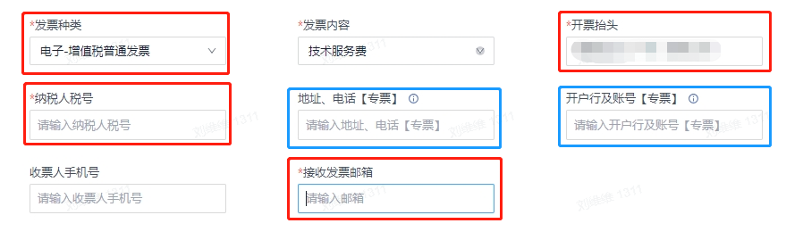

## 开票方式

八爪鱼 RPA 仅提供联系官方工作人员的人工购买方式。购买后，请直接联系与您对接的官方工作人员，由其为您开具发票。

## 需要提交的开票信息

| 信息项 | 说明 |
| --- | --- |
| **发票种类** | 增值税普通发票或增值税专用发票 |
| **发票内容** | 默认：技术服务费；可申请：数据服务费（建议优先选择技术服务费） |
| **开票抬头** | 公司或单位的完整名称 |
| **纳税人税号** | 纳税人识别号 |
| **接收发票邮箱** | 默认开具电子发票；如需纸质发票，请提供收票人姓名、地址和手机号 |
| **增值税专用发票额外信息** | 公司地址、电话、开户行及账号 |

## 发票税点

发票税点为 **6%**。
