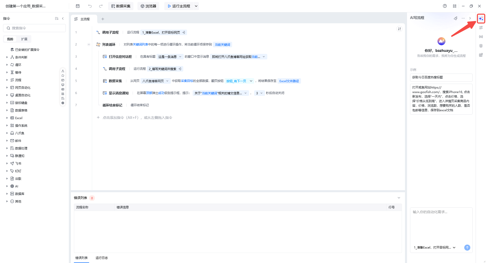

## 功能概述

右侧菜单栏（右侧参数栏）是流程编辑器中用于管理应用级资源与辅助开发的面板，包含 AI 写流程、子流程、变量、元素与 Python 包管理等模块。

## 入口

进入任意应用的流程编辑界面，右侧边栏即为右侧菜单栏。

## 主要功能

### AI 写流程

通过自然语言描述业务需求，AI 自动生成可执行的 RPA 流程搭建步骤与指令，降低开发门槛，提升搭建效率。

### 流程管理

用于管理主流程与子流程。子流程可将相对独立的功能模块化，被主流程或其他子流程调用，降低维护成本。

- **新建子流程**：点击「新建可视化流程」创建子流程。
- **子流程右键操作**：支持重命名、查找应用、创建副本、删除。

### 变量管理

- **输入变量**：管理应用运行前需要传入的变量（名称、类型、默认值、控件类型）。
- **普通变量**：管理当前应用中所有流程生成的变量。

### 元素库

用于捕获、存放与管理网页元素。捕获后的元素可被【网页自动化】指令集引用和操作。

### Python 包管理

若流程中使用了【执行 Python 代码】指令，可在此处可视化安装、删除、升级 Python 包。在此处安装完 Python 包后，如果将应用分享给其他用户，会自动装包，用户不用再次手动导包。

## 使用流程

1. 在右侧菜单栏选择需要管理的模块（变量、元素、子流程等）。
2. 点击「新建」或「捕获」添加资源。
3. 在流程编辑区使用这些资源配置指令参数。
4. 通过「AI 写流程」快速生成复杂流程骨架，再手动精调。

<Info>
  使用过程中遇到问题？前往 [八爪鱼RPA 开发者社区问答板块](https://rpa.bazhuayu.com/community/questions) 提问，获取官方与社区帮助。
</Info>
