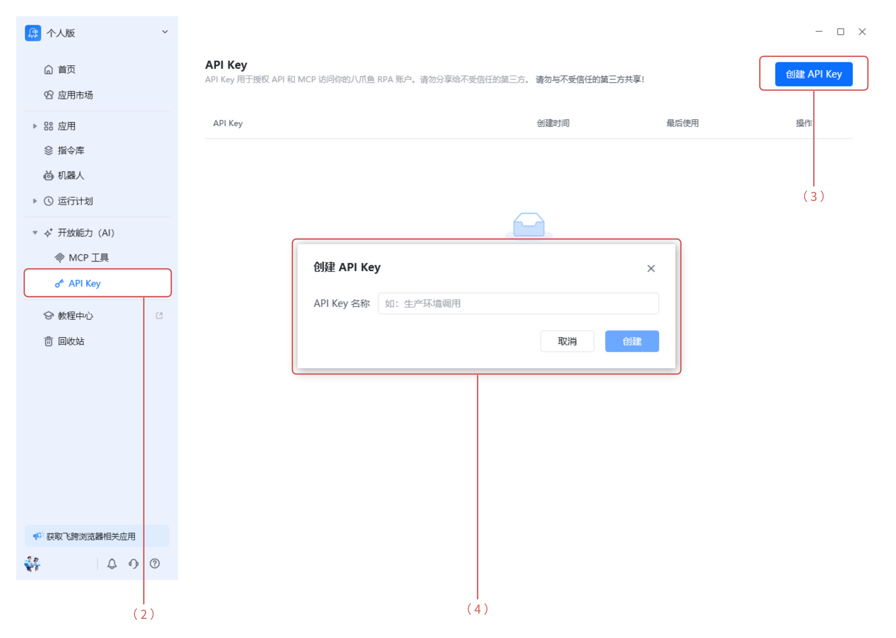
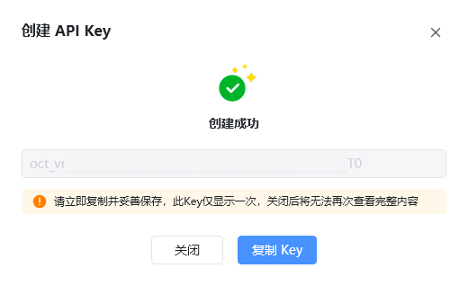
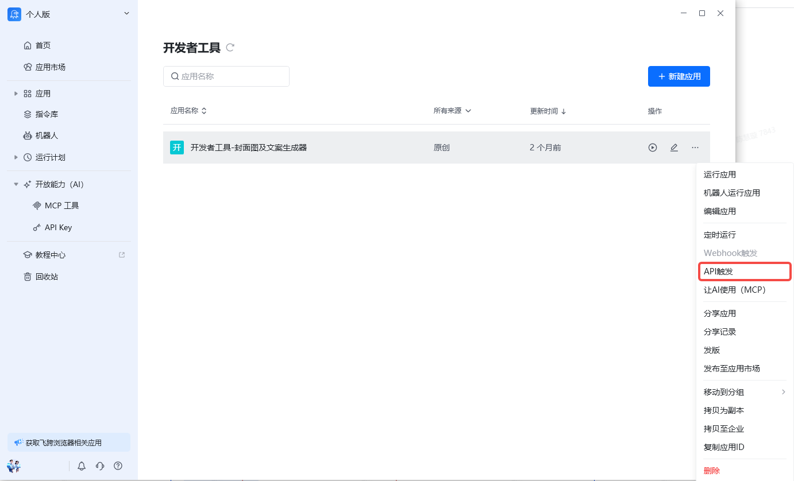
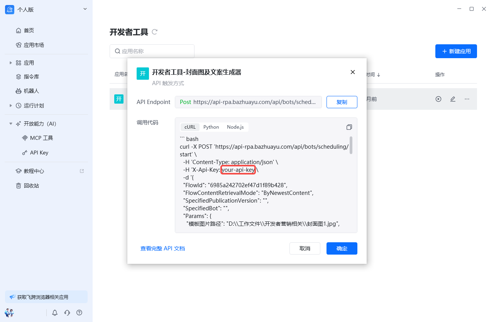

八爪鱼 RPA 的开放接口现在支持 API Key 鉴权 了。（API接口合集）

> 💡 用大白话说：以前调用接口得先「登录」拿[临时令牌](https://rpa.bazhuayu.com/helpcenter/docs/396rAlZt)，比较麻烦。现在你可以生成一把专属的**永久钥匙（API Key）**，每次请求时带上它就能证明身份，跟刷门禁卡一样简单。

## 一、这个功能有什么用？

### 1. 第三方系统集成

你的业务系统或内部平台需要对接八爪鱼 RPA 的能力？

用 API Key 就能直接打通，不用折腾登录流程。

### 2. 服务端 / 脚本调用

在服务器上跑自动化脚本、定时任务？

API Key 是最稳定的调用方式——不会因为登录过期而中断。

### 3. 配合 MCP 使用

如果你在用 MCP（Model Context Protocol）来调用八爪鱼的接口，API Key 可以直接作为鉴权凭证使用。

## 二、怎么用？

### 第 1 步：生成你的 API Key

（1）打开八爪鱼 RPA 客户端

（2）在左侧菜单找到 「开放能力（AI）」→「API Key」

（3）点击右上角 「创建 API Key」 按钮

（4）填写密钥名称，并点击“创建”，系统会生成一串类似 oct_wsqGD3**** 的密钥字符串

（5）⚠️ 务必第一时间复制保存！ 关闭窗口后无法再次查看完整密钥

> 页面上只会显示密钥的前几位加 `****`，这是安全设计。如果忘了，只能重新创建。

### 第 2 步：调用接口时带上这把「钥匙」

（1）在你的请求头（Header）中添加 API Key 即可。常用的两种写法：

| Header 名称 | 示例值 | 说明 |
| --- | --- | --- |
| X-API-Key | oct_wsqGD3xxxx | 推荐方式 |
| Authorization | Bearer oct_wsqGD3xxxx | 标准方式 |

（2）可以在客户端的 「我的应用」 页面查看自动生成的调用代码示例（支持 cURL / Python / Node.js 等多种格式），直接复制就能用。

|  |  |
| --- | --- |

### 第 3 步：服务端校验通过 → 正常调用

服务端收到请求后，会校验你携带的 API Key 是否有效。校验通过后，就可以正常调用接口了。

## 三、注意事项

### 🔑 API Key = 身份凭证

- API Key 等同于你的账号身份，**请像保管密码一样保管它**

- 不要把它写在公开的代码仓库里（GitHub、GitLab 等）

- 不要通过聊天工具、邮件明文发送

### 🔄 支持吊销

- 如果怀疑 Key 泄露，可以立即在客户端 **吊销** 该 Key

- 建议定期更换，降低风险

### 📊 建议结合权限与用量管理

- 可以为不同的应用 / 场景创建不同的 API Key

- 这样即使某个 Key 出问题，影响范围也有限

- 同时便于统计每个 Key 的调用情况

## 四、常见问题

Q1：API Key 会过期吗？

A：不会过期，除非你主动吊销它。

Q2：可以创建多个 API Key 吗？

A：可以，建议为不同用途分别创建，方便管理和排查问题。

Q3：和原来的登录态 / Token 方式有什么区别？

A：原来的方式需要先登录获取临时 Token，有有效期限制；API Key 是长期有效的静态凭证，更适合程序化调用场景。两者目前并存，你可以按需选择。

Q4：忘记了 API Key 怎么办？

A：由于安全原因，完整密钥只显示一次。如果忘记，只能在管理页面重新创建新的 Key。

<Info>
  使用过程中遇到问题？前往 [八爪鱼RPA 开发者社区问答板块](https://rpa.bazhuayu.com/community/questions) 提问，获取官方与社区帮助。
</Info>
