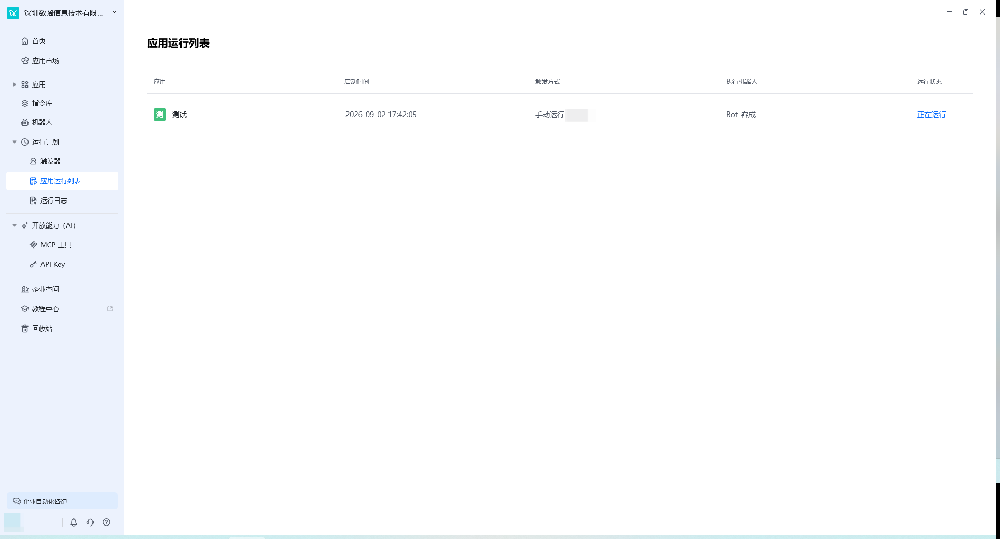
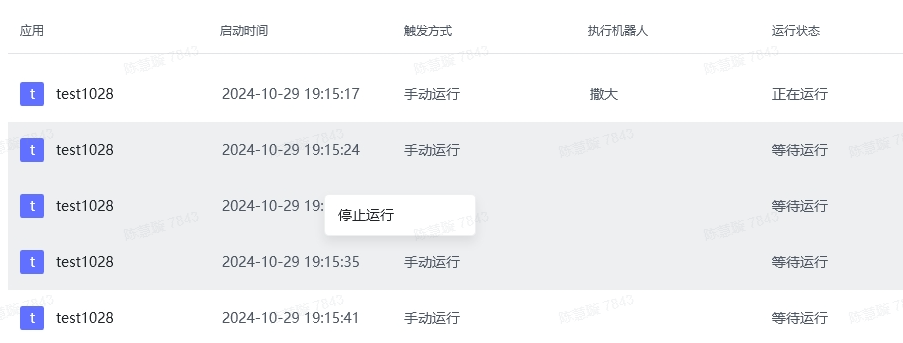

## 功能概述

应用运行列表集中展示当前账号下所有应用运行任务的状态与历史记录。无论是手动启动、定时触发还是 Webhook 触发的任务，都可以在这里查看其执行状态、开始时间、触发方式与运行结果。

## 入口

在八爪鱼RPA 客户端左侧导航栏点击 **运行计划** → **应用运行列表** 即可进入。

## 页面结构

| 区域 | 说明 |
| --- | --- |
| 任务列表 | 展示应用名称、开始时间、触发方式、运行状态 |
| 筛选条件 | 按应用名称、触发方式、运行结果等筛选 |
| 操作入口 | 查看详情、停止运行、重新运行等 |

## 主要功能

### 查看运行状态

任务状态通常包括：运行中、成功、失败、已取消等。通过状态标识可以快速识别需要关注的任务。

### 排序规则

列表默认按启动时间**正序**排列，让将要执行的任务排在前面，便于优先关注即将运行或排队中的任务。

### 多选停止任务

当队列中的多个任务不再需要执行时，可以一次性选中并停止，避免逐一操作。

**使用场景**

- 当排队中的任务不再需要执行时，需要停止掉所有的排队中的任务，就可以多选停止。

**使用方式**

- 通过 `Ctrl` 或 `Shift` 完成多选后，右键即可停止运行。

### 重新运行

对于失败或已结束的任务，可直接点击「重新运行」再次执行，无需返回应用管理界面。

## 使用流程

1. 进入「应用运行列表」。
2. 查看任务列表，关注运行中、等待运行或已结束的任务。
3. 对于失败任务，点击进入详情或日志排查原因。
4. 根据需要进行重新运行、停止或多选停止操作。

<Info>
  使用过程中遇到问题？前往 [八爪鱼RPA 开发者社区问答板块](https://rpa.bazhuayu.com/community/questions) 提问，获取官方与社区帮助。
</Info>
