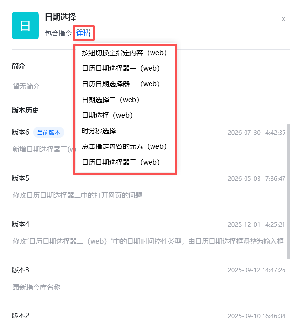
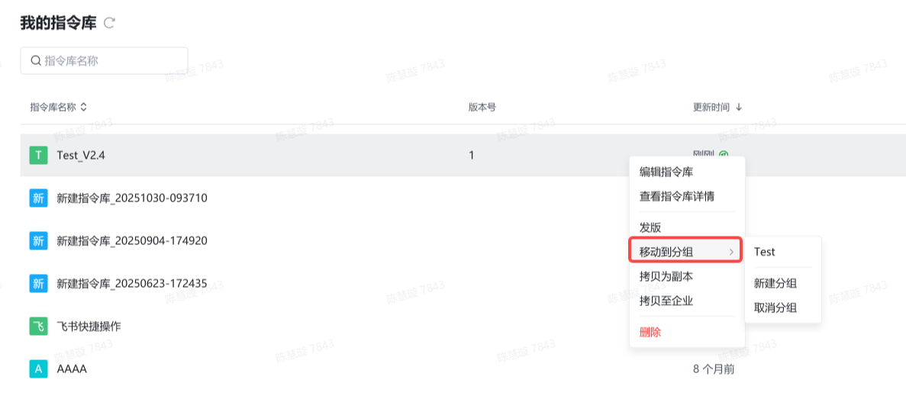

## 功能概述

- **自定义指令**：开发者可以自行封装一些八爪鱼RPA 官方未支持的指令，将自己常用的功能模块封装成一个指令，例如某网站的数据获取。
- **指令库**：集中管理自定义指令的区域，是八爪鱼RPA 中自定义指令的集中入口。

<Info>
  自定义指令详细讲解可查看 [自定义指令](https://bazhuayu-rpa-docs.mintlify.site/guides/custom-instructions)。
</Info>

## 入口

在八爪鱼RPA 客户端左侧导航栏点击 **指令库** 即可进入。

## 页面结构

| 区域 | 说明 |
| --- | --- |
| 指令分类 | 按功能维度划分或场景维度划分，如多平台自动登录、多平台自动发布、B站自定义指令合集、微博自定义指令合集 |
| 搜索框 | 输入自定义指令名称或关键词，快速定位待查找自定义指令 |
| 自定义指令列表 | 展示自定义指令名称与简要说明 |

## 主要功能

### 指令库管理界面

- 新建/编辑指令库
- 查看指令库详情：可看到指令库中包含哪些指令

- 拷贝为副本
- 删除：删除指令库后会进入回收站，可以在回收站找回

### 指令库分组

当指令库比较多时，可以对指令库进行分组存放。

- 新建分组

<table>
  <tbody>
    <tr>
      <td style={{ verticalAlign: 'top', textAlign: 'center' }}>
        
      </td>
      <td style={{ verticalAlign: 'top', textAlign: 'center' }}>
        
      </td>
    </tr>
  </tbody>
</table>

- 将指令库移动到分组

### 直接发版

v2.4 以下版本需在指令库内部（即编辑页面）发版，v2.4 及以上版本支持直接在指令库列表页发版。

### 复制到企业

当从个人版升级到企业版时，可以将个人版开发的指令库一键迁移到企业版。

## 使用流程

1. 在八爪鱼RPA 客户端左侧导航栏进入指令库，按分类浏览或通过搜索框定位自定义指令。
2. 将目标自定义指令拖拽至流程编辑区，或在流程栏当前行点击「添加指令」后选择。
3. 在右侧参数栏填写自定义指令所需的输入参数。
4. 保存并运行应用，验证自定义指令执行效果。

<Info>
  使用过程中遇到问题？前往 [八爪鱼RPA 开发者社区问答板块](https://rpa.bazhuayu.com/community/questions) 提问，获取官方与社区帮助。
</Info>
