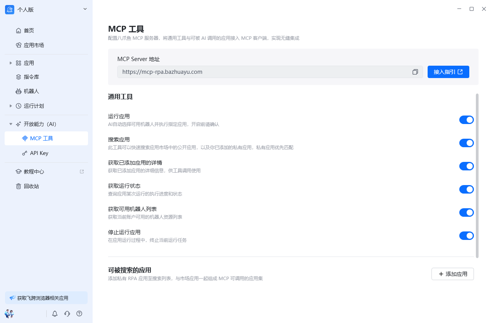
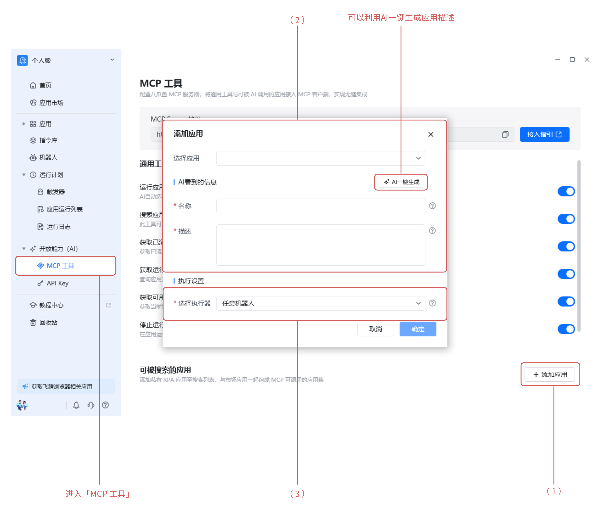
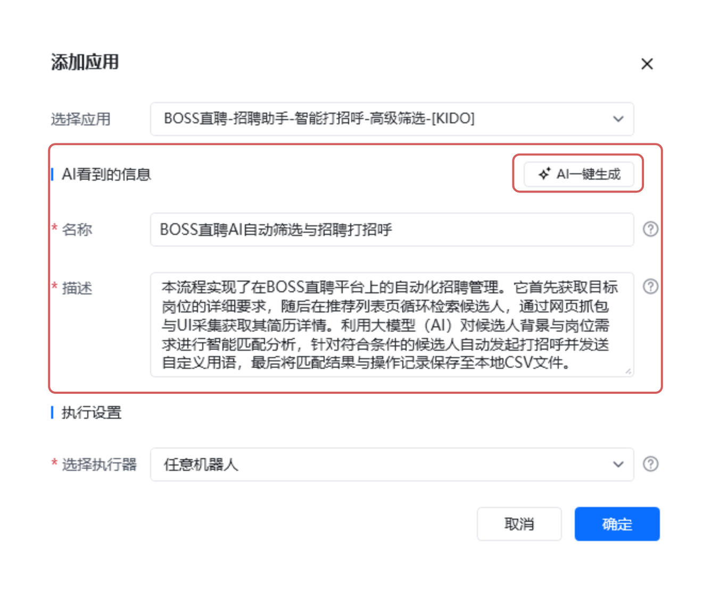
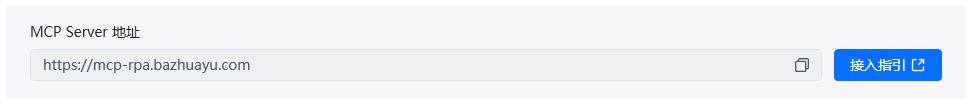
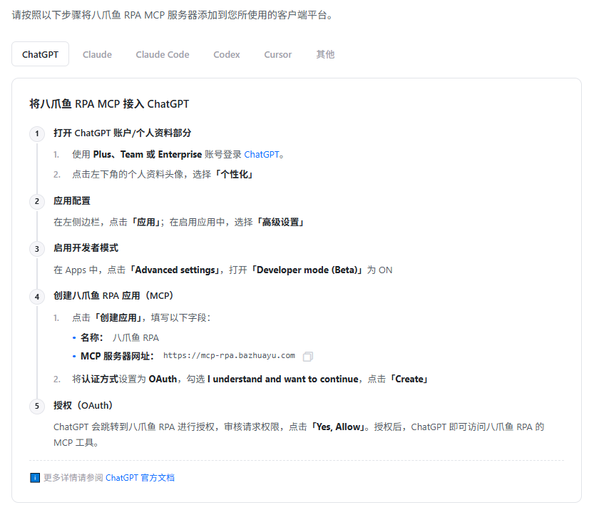
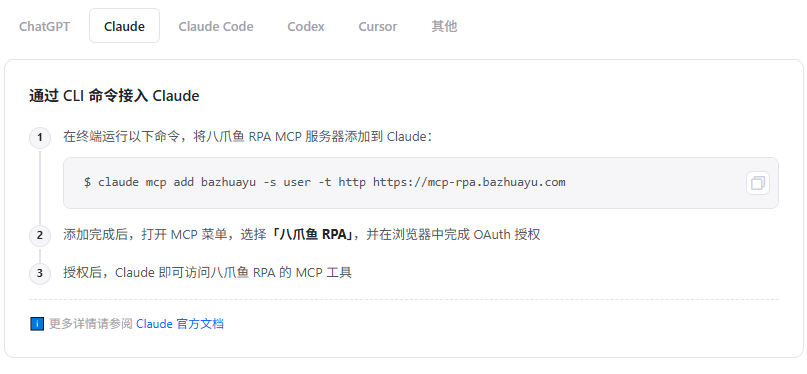
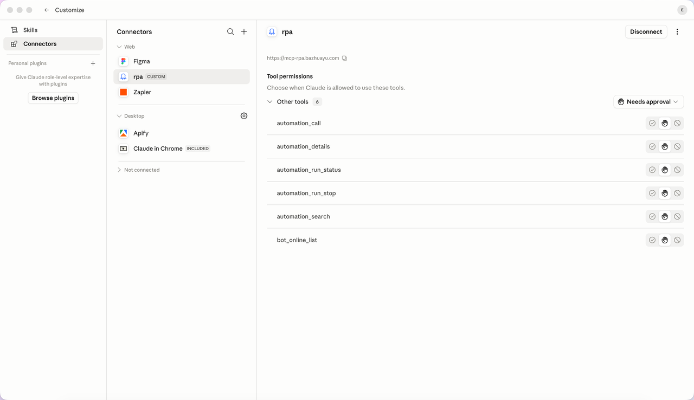
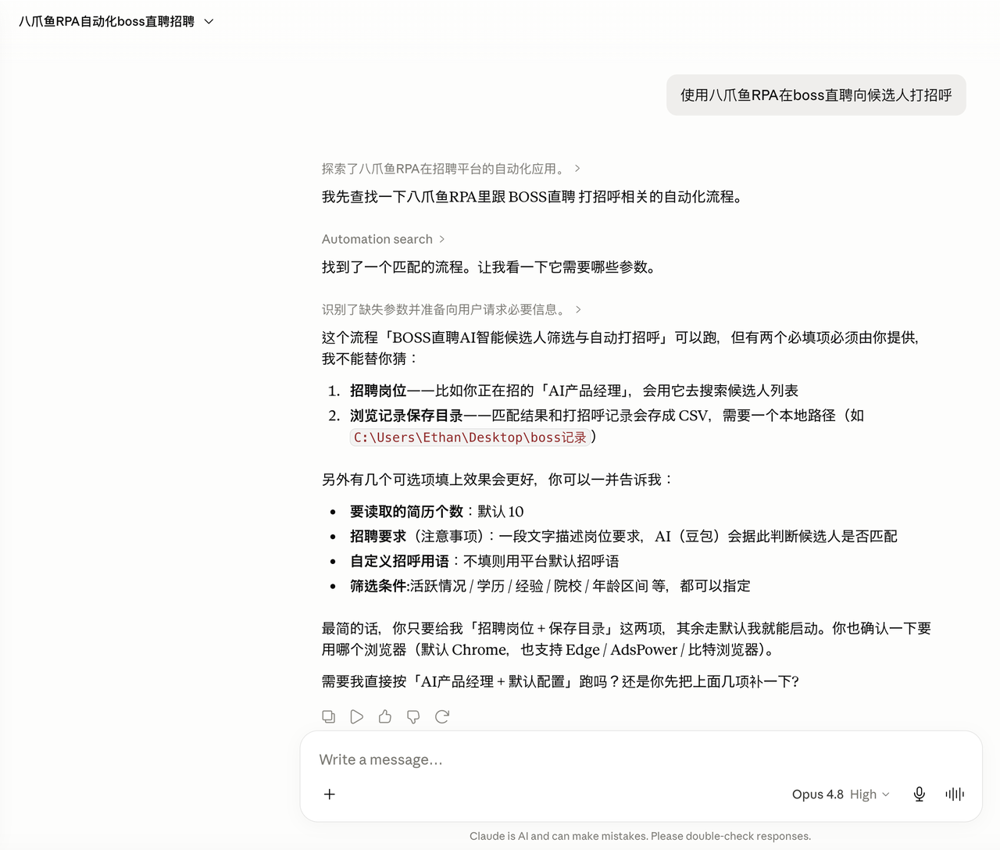

> **让 AI 拥有"双手"，用自然语言就能指挥自动化流程。**

> 八爪鱼 RPA 现已支持 MCP（Model Context Protocol）协议。简单来说，就是把你的 RPA 流程变成 AI 可以调用的"工具"，让 AI 不仅能"想"，还能"做"。

---


## 一、什么是 MCP？

想象你请了一位非常聪明的助手（AI），但它只能动嘴不能动手。而你有许多重复性的电脑操作需要完成——比如每天登录系统导出报表、在招聘网站筛选简历、批量处理文件等。

MCP 就像是给这位助手配了一双手（RPA）。现在你只需要说：“帮我导出昨天的销售报表”，AI 就能理解你的意图，并指挥 RPA 自动完成登录、点击、下载等一系列操作。

简短版：AI 是大脑，RPA 是双手，MCP 是连接大脑和双手的神经系统。


## 二、核心功能



八爪鱼 RPA MCP 提供了以下通用工具，供 AI 客户端调用：

| 工具名称 | 功能说明 |
| --- | --- |
| 运行应用 | AI 自动选择合适的机器人，执行指定的 RPA 应用 |
| 搜索应用 | 快速搜索应用市场中的公开应用，以及你的私有应用 |
| 获取应用详情 | 查看某个应用的具体信息，了解它需要哪些参数 |
| 获取运行状态 | 查询正在运行的任务进度和状态 |
| 获取可用机器人列表 | 查看当前账户下有哪些机器人资源可用 |
| 停止运行应用 | 在应用运行过程中，终止当前任务 |


## 三、适用场景

#### 场景一：AI 操作没有 API 的老系统

很多企业的内部系统（如 ERP、CRM）没有开放接口，或者一些政府网站、旧版网页无法直接对接。以前需要人工一步步操作，现在可以让 AI 通过 RPA 来"操作"这些系统——就像有个看不见的助手在帮你点点点。

#### 场景二：一句话触发自动化

在 AI 对话中直接说：“帮我筛选本周的简历并发送面试邀请”，AI 就能自动调用对应的 RPA 流程，无需你手动打开八爪鱼客户端。

#### 场景三：给企业 AI 助手"升级"

如果你公司有企业微信机器人、钉钉智能助手或自研的 AI 平台，可以把 RPA 能力接入进去。员工在群里 @机器人说"导出上月的考勤数据"，机器人就能自动完成。


## 四、如何使用

### 方式一：自建应用（推荐）

适合：有自己开发的 RPA 流程，想开放给 AI 使用

#### 步骤 1：配置要开放的应用



登录八爪鱼客户端，进入「开放能力 (AI)」→「MCP 工具」：

（1）点击「添加应用」，选择你要开放的 RPA 流程

（2）给这个工具起个清晰的名字，写一段描述（这很重要，AI 靠这个理解这个工具是干嘛的）

（3）选择执行机器人（可以指定特定机器人，也可以选"任意机器人"）

> 💡 **小贴士**：描述要写清楚这个应用是做什么的、需要什么参数。比如：“BOSS直聘自动打招呼——根据招聘岗位筛选候选人并自动发送打招呼消息，需要传入：岗位名称、保存路径”



#### 步骤 2：获取 MCP Server 连接信息

在 MCP 工具页面，你会看到：



```
MCP Server 地址：https://mcp-rpa.bazhuayu.com
```

点击「接入指引」，可以查看详细的配置教程，支持 Claude、ChatGPT、Codex、Cursor 等多种 AI 客户端。



#### 步骤 3：在 AI 客户端中添加 MCP Server

以 Claude 为例：





#### 步骤 4：开始使用

连接成功后，AI 即可自动发现可用流程,直接对 AI 说：

> 使用八爪鱼RPA在boss直聘向候选人打招呼

AI 会自动搜索可用工具，确认参数后调用 RPA 执行。



### 方式二：应用市场应用

适合：想直接使用官方的现成应用

#### 步骤 1：让 AI 读取目前八爪鱼 RPA 公开可调用的应用清单或直接查看帮助中心应用清单

#### 步骤 2：用户接入 MCP

用户按上述方式接入八爪鱼 RPA MCP 后，AI 就能在完成任务时自动搜索并调用这些市场应用。

---


## 五、重要注意事项

### 1. 写好工具描述很关键

AI 是靠工具名称和描述来判断该用哪个工具的。描述要：

- 说清楚这个工具是做什么的

- 列出每个参数的含义和示例

- 说明返回的结果是什么

### 2. 建议配合 API Key 使用

为了保证调用安全，建议开启 API Key 鉴权。这样只有持有正确密钥的 AI 客户端才能调用你的 RPA 流程。

### 3. 长流程注意异步获取结果

如果 RPA 流程运行时间较长（比如需要等待网页加载、处理大量数据），建议：

- 先启动任务，返回任务 ID

- 通过「获取运行状态」接口定期查询进度

- 避免 AI 客户端长时间等待超时


## 六、相关链接

- 详细接入指南：[https://rpa.bazhuayu.com/mcp-guide](https://rpa.bazhuayu.com/mcp-guide)

- 支持客户端：Claude、Claude Code、ChatGPT、Cursor、Codex 等任何兼容 MCP 的客户端


## 七、总结

八爪鱼 RPA MCP 让 AI 从"能说"变成"能做"。你不需要懂编程，不需要写代码，只需要：

1. **配置好要开放的 RPA 流程**

2. **把 MCP Server 接入你的 AI 客户端**

3. **用自然语言指挥 AI 干活**

从此告别重复性劳动，让 AI 和 RPA 成为你的智能办公搭档！

<Info>
  使用过程中遇到问题？前往 [八爪鱼RPA 开发者社区问答板块](https://rpa.bazhuayu.com/community/questions) 提问，获取官方与社区帮助。
</Info>
