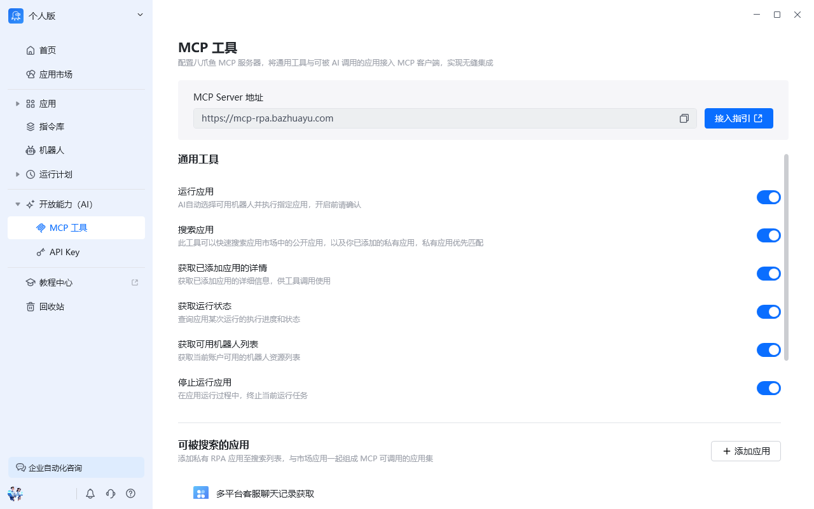
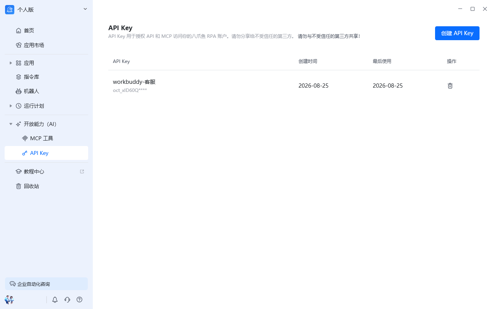
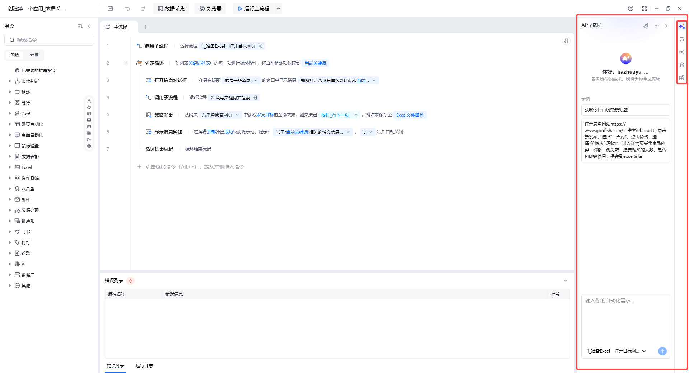

## 功能概述

开放能力（AI）模块集中管理八爪鱼RPA 的对外开放能力，包括 API Key、MCP 工具等。通过 API Key，第三方系统、服务端脚本或 MCP 客户端可以直接调用八爪鱼RPA 接口，无需复杂的登录态管理，实现自动化能力的灵活集成。

## 入口

在八爪鱼RPA 客户端左侧导航栏点击 **开放能力（AI）** 即可进入。

## 页面结构

| 区域 | 说明 |
| --- | --- |
| API Key 管理 | 创建、查看、吊销用于接口鉴权的 API Key |
| 接口文档入口 | 跳转至开放 API 接口合集 |
| MCP 相关 | 配置与使用 MCP（Model Context Protocol）工具 |

## 主要功能

### API Key 鉴权

API Key 是一把长期有效的身份凭证，调用八爪鱼RPA 开放接口时，在请求头中携带 API Key 即可完成鉴权。常用请求头格式：

| Header 名称 | 示例值 | 说明 |
| --- | --- | --- |
| X-API-Key | `oct_wsqGD3xxxx` | 推荐方式 |
| Authorization | `Bearer oct_wsqGD3xxxx` | 标准方式 |

### 适用场景

- **第三方系统集成**：业务系统或内部平台对接八爪鱼RPA 能力。
- **服务端 / 脚本调用**：服务器上运行自动化脚本、定时任务，不受登录态过期影响。
- **配合 MCP 使用**：在支持 MCP 的客户端中直接调用八爪鱼工具。

## 界面示例

## AI 写流程（应用编辑界面右侧参数栏）

在应用编辑界面的右侧参数栏中，包含 [AI写流程](/guides/ai-write-flow)、流程管理区、变量管理区、元素管理区、Python 管理区。

**AI写流程**

AI写流程是一项革命性的 RPA 开发功能，允许用户通过自然语言描述来生成完整的 RPA 自动化流程。无需复杂的拖拽操作和编程知识，只需用简单的中文描述您的业务需求，AI 即可智能生成可执行的 RPA 流程。

（变量管理、元素库、Python 包管理等更多内容详见对应专题文档。）

## 使用流程

1. 进入「开放能力（AI）」→「API Key」。
2. 点击「创建 API Key」，填写密钥名称并生成。
3. **立即复制保存**完整密钥（关闭窗口后无法再次查看）。
4. 在调用接口的请求头中携带 API Key。
5. 如需停用，可在管理页面吊销该 Key。

<Info>
  API Key 等同于账号身份，请妥善保管，不要写入公开代码仓库或通过聊天工具明文发送。如怀疑泄露，请立即吊销并重新创建。
</Info>

<Info>
  使用过程中遇到问题？前往 [八爪鱼RPA 开发者社区问答板块](https://rpa.bazhuayu.com/community/questions) 提问，获取官方与社区帮助。
</Info>
