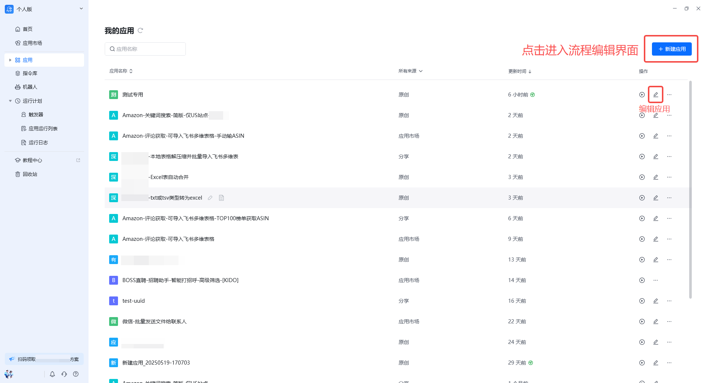
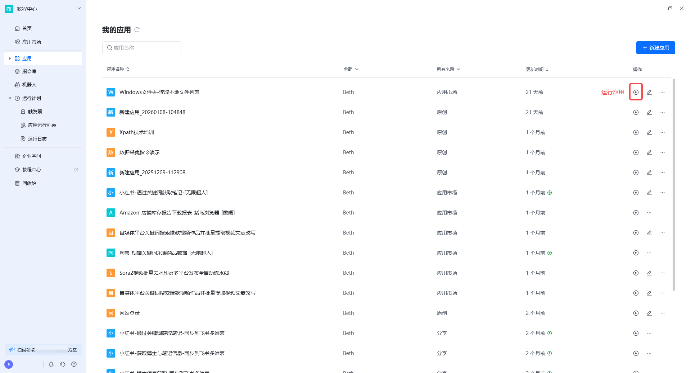
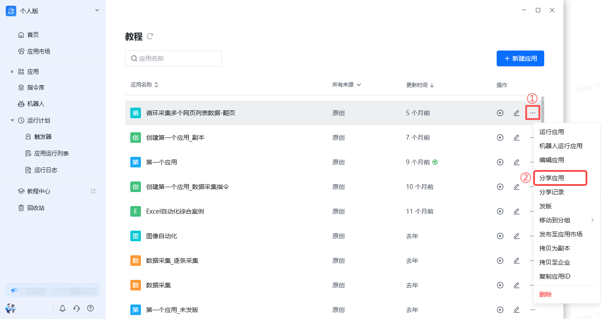
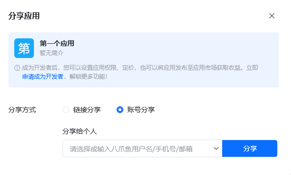
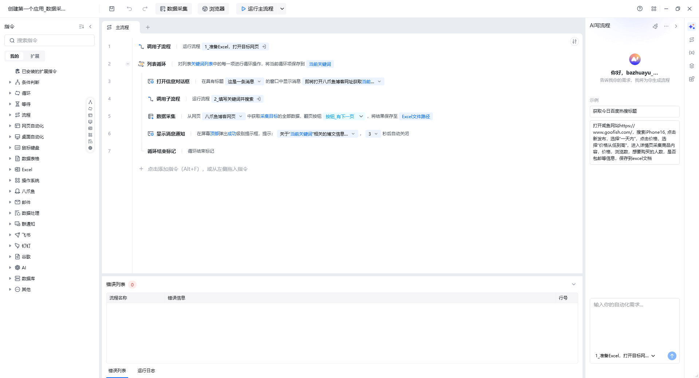

## 功能概述

应用管理界面是查看与管理所有已开发应用的入口。在这里可以新建应用、编辑已有流程、运行应用、分享给他人，以及查看应用的基本信息与版本状态。

## 入口

在八爪鱼RPA 客户端左侧导航栏点击 **应用** → **我的应用** 即可进入应用管理界面。

## 页面结构

| 区域 | 说明 |
| --- | --- |
| 应用列表 | 以卡片或列表形式展示当前账号/企业空间下的所有应用 |
| 新建应用 | 创建空白应用并进入流程编辑界面 |
| 搜索/筛选 | 按名称、标签或分类快速定位应用 |
| 操作入口 | 每个应用卡片提供编辑、运行、分享、删除等快捷操作 |

## 主要功能

### 新建或编辑应用

- **新建应用**：点击「新建应用」按钮，即可新建一个应用流程并进入流程搭建界面。
- **编辑应用**：点击已有应用的编辑按钮，或双击应用，即可进入该应用的开发界面。

### 运行应用

点击当前应用的运行按钮，即可启动当前应用。如果开发者设定了输入参数，需要填写完必填参数后应用才会进入运行状态。

### 分享应用

点击当前应用的分享按钮，即可分享当前应用。

①普通用户：可通过链接分享 / 账号分享的方式将应用分享给他人（无法分享给企业账号），仅分享，无分享时长、运行、编辑权限等控制权限。

②开发者：应用发版后，可通过链接分享 / 账号分享的方式将应用分享给他人（可分享给企业账号）。

- **权限设置**
  - 可使用：接收者可运行此应用，并收到应用版本更新提醒
  - 可编辑：接收者可以运行和编辑此应用，并收到应用版本更新提醒
  - 分享副本：接收者将获得流程的独立副本，可编辑或分享给其他人

- **设置可用时长** 永久 / x月 / x日（若「权限设置」选择分享副本，则无此设置）

- **分享方式**
  - 链接分享：获取链接的人即可获得当前应用（链接不会失效；可用时长设置为 7 天，并不等同于 7 天后链接会失效）
  - 账号分享：将当前应用分享到指定个人用户应用列表下或企业空间内（分享给企业用户需要用[协作码](https://bazhuayu-rpa-docs.mintlify.site/features/enterprise/join-by-invite)）

开发者社区：[了解开发者社区](https://rpa.bazhuayu.com/community/questions)

## 应用编辑界面

进入流程搭建界面后，即可对应用进行可视化编辑。应用编辑界面主要由顶部导航栏、指令栏、流程栏、底部菜单栏与右侧参数栏组成。

### 顶部导航栏

- **应用详情**：应用名称、应用简介和使用说明设置
- **保存**：保存应用至本地（默认路径）
- **后退 / 前进**：回到上一步 / 下一步
- **数据采集**：快速使用【数据采集】指令
- **浏览器**：八爪鱼RPA 内置浏览器，支持静默运行，不影响用户其他设备正常操作
- **运行主流程 / 运行当前流程**：运行主流程或某子流程
- **帮助中心**：八爪鱼RPA 帮助中心跳转按钮
- **工具箱**：浏览器拓展插件和正则工具

## 使用流程

1. 进入「我的应用」查看已有应用列表。
2. 点击「新建应用」或选择已有应用进行编辑。
3. 在流程编辑器中搭建、调试并保存流程。
4. 返回应用管理界面，点击「运行」验证效果。
5. 按需点击「分享」，将应用分发给团队成员或社区用户。

<Info>
  使用过程中遇到问题？前往 [八爪鱼RPA 开发者社区问答板块](https://rpa.bazhuayu.com/community/questions) 提问，获取官方与社区帮助。
</Info>
