## 功能概述

运行日志用于追踪应用的执行情况。八爪鱼RPA 客户端提供本地运行日志、机器人运行日志、调试运行日志与客户端日志四种类型，帮助用户了解任务何时运行、如何触发、是否成功，以及在失败时快速定位问题。

## 入口

在八爪鱼RPA 客户端左侧导航栏点击 **运行计划** → **运行日志** 即可进入。

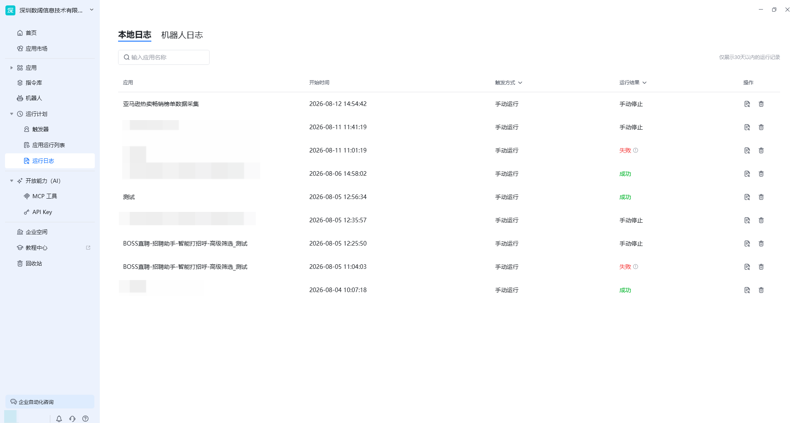

## 日志类型

| 类型 | 说明 |
| --- | --- |
| 本地运行日志 | 记录本地客户端运行应用的日志，保留近 30 天 |
| 机器人运行日志 | 展示机器人在触发器定时执行时的运行记录，仅保留记录，不展示详情 |
| 调试运行日志 | 编辑界面调试时实时输出每条指令的执行结果，关闭编辑界面后自动清除 |
| 客户端日志 | 客户端运行本身的日志，用于技术人员排查客户端异常 |

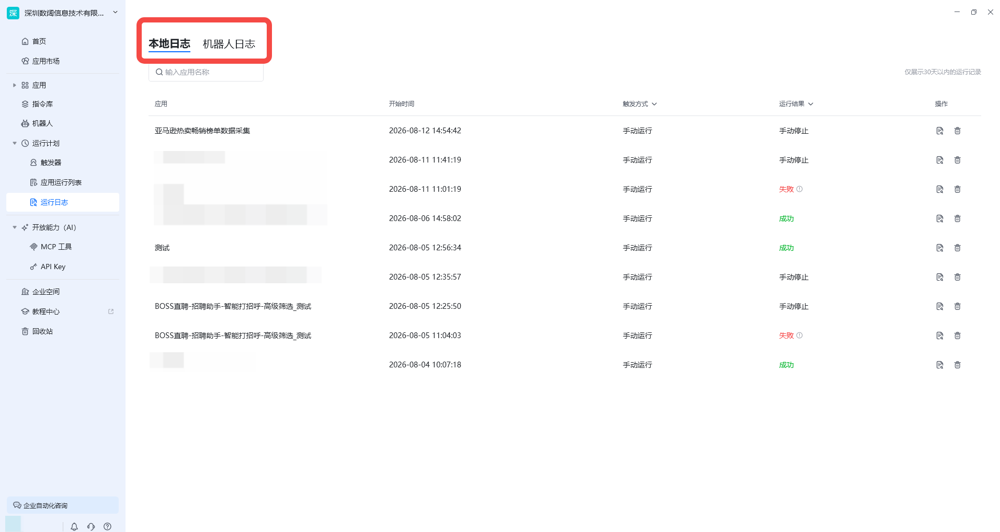

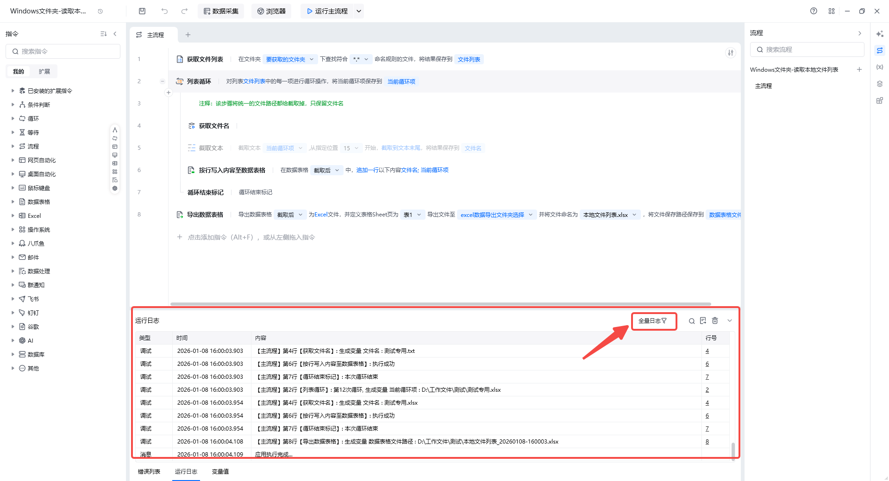

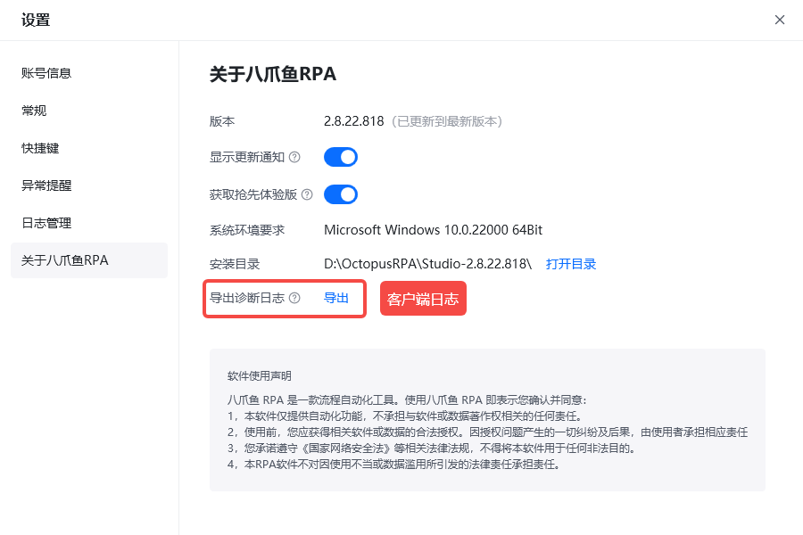

## 本地运行日志可进行的操作

- **查看日志**：查看所选应用某次运行的完整日志。

  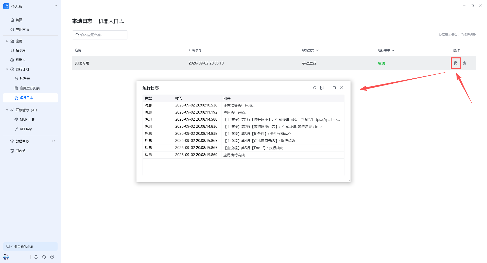

- **查找**：在完整日志上下文中高亮显示命中内容，不改变原始日志结构。

  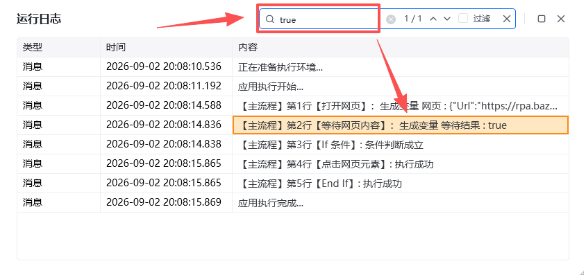

- **导出日志**：将日志导出到本地指定路径，便于存档或发给技术支持。

  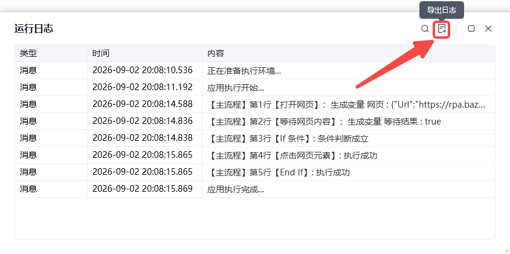

- **删除**：删除选中的执行记录。

  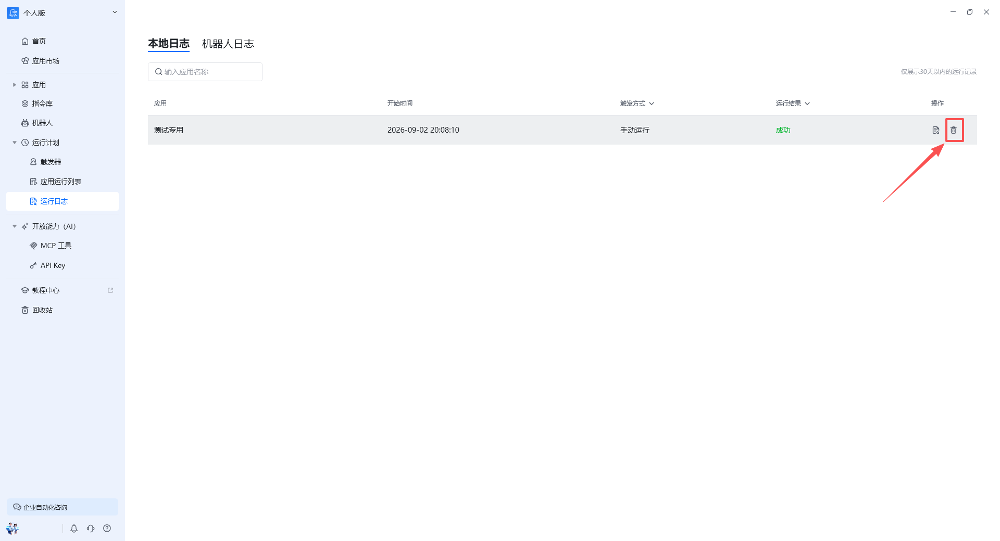

## 筛选方式

本地运行日志支持按运行结果与触发方式筛选，帮助用户快速找到成功、失败或特定触发方式的任务。

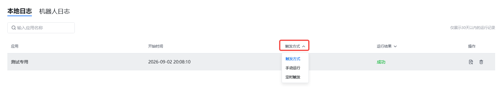

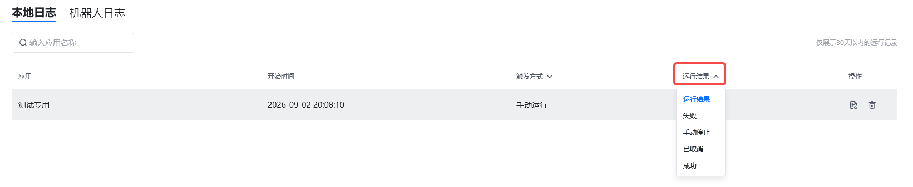

## 机器人日志

机器人运行日志当前仅显示机器人的运行记录，无法查看运行日志详情，只可删除记录。

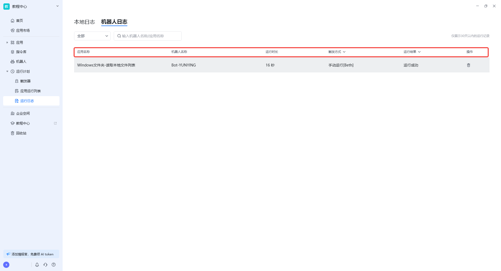

> 注：八爪鱼RPA 客户端未记录机器人运行日志详情内容，如果需要查看详情日志，请前往「八爪鱼RPA 机器人」所在设备上查看。常用帮助文档：[RPA 客户端](https://rpa.bazhuayu.com/helpcenter/docs/OuUQb2) 和 [RPA 机器人](https://rpa.bazhuayu.com/helpcenter/docs/TwEcUb)。

## 调试运行日志

编辑界面的调试运行日志用于查看每条指令的运行结果，是流程排查问题的重要窗口，辅助流程编写的重要工具。实时记录调试运行过程中每条指令的执行情况。在编辑界面关闭后日志会自动清除。

## 客户端日志

客户端日志主要用于给技术人员排查客户端情况，如您遇到客户端异常可发送这个日志给八爪鱼RPA 官方工作人员。

日志默认位于 `C:\Users\<用户名>\AppData\Local\OctopusRPA\Log` 路径下。

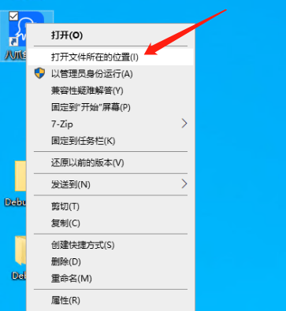

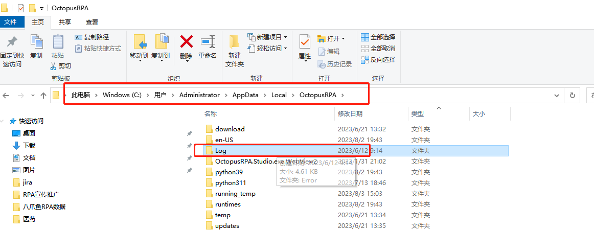

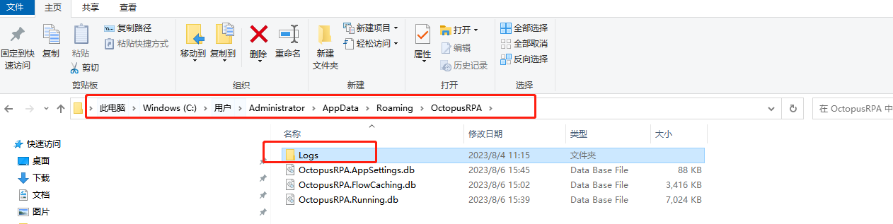

> 如果在上述路径没有找到 Log 文件夹，请再访问 `C:\Users\<用户名>\AppData\Roaming\OctopusRPA`。

## 编辑界面中的底部菜单栏

在应用编辑界面的底部菜单栏中，可直接查看本次运行的日志与错误提示：

- **错误列表**：指令编排中不合规指令的错误信息会显示在此处。
- **运行日志**：本次运行的日志，可查看精简日志 / 全量日志。

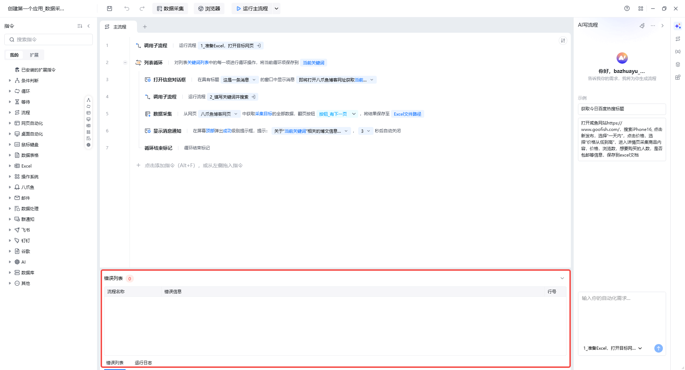

## 使用流程

1. 进入「运行日志」模块，默认展示本地运行日志。
2. 通过筛选条件定位到目标任务。
3. 选中任务后，点击「查看日志」分析执行过程与报错。
4. 如需存档，点击「导出日志」保存到本地。

<Info>
  机器人运行日志详情需在「八爪鱼RPA 机器人」所在设备上查看；客户端日志默认位于 `C:\Users\<用户名>\AppData\Local\OctopusRPA\Log` 路径下。
</Info>

<Info>
  使用过程中遇到问题？前往 [八爪鱼RPA 开发者社区问答板块](https://rpa.bazhuayu.com/community/questions) 提问，获取官方与社区帮助。
</Info>
