## 功能概述

触发器用于在满足特定条件时自动启动八爪鱼RPA 应用，无需人工手动点击运行。目前支持定时触发与 Webhook 触发两种方式，适用于周期性任务、事件驱动集成等场景。

## 入口

在八爪鱼RPA 客户端左侧导航栏点击 **运行计划** → **触发器** 即可进入触发器管理界面。

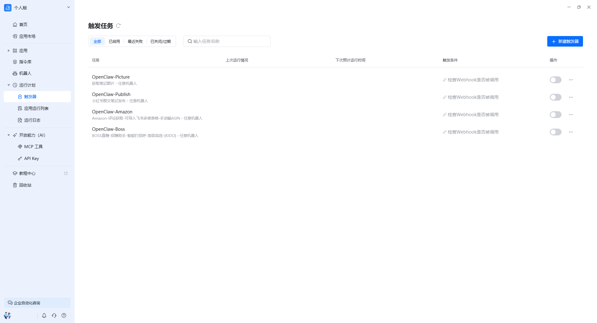

## 页面结构

| 区域 | 说明 |
| --- | --- |
| 触发器列表 | 展示当前账号下所有已创建的触发器 |
| 新建触发器 | 创建定时触发器或 Webhook 触发器 |
| 启用/停用开关 | 控制触发器是否生效 |
| 操作入口 | 编辑、删除、查看触发器详情 |

## 触发器类型

### 定时触发器

按照设定的时间频率自动启动应用，无需每次都手动触发，实现真正的自动化。适合周期性数据采集、报表生成等场景。

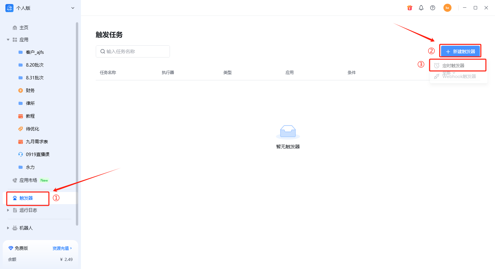

#### 使用示例

示例：我们希望每天晚上九点都能重新获取指定关键词相关的博客信息。也就是说“第一个应用”每晚九点都会自动运行，把最新的博客信息都获取下来。

配置步骤如下：

1. **新建触发器**：点击「新建触发器」→ 选择「定时触发器」。

    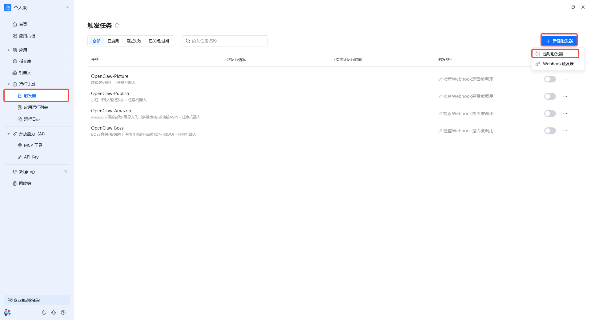

2. **任务名称**：创建一个新触发器，例如命名为「八爪鱼博客信息定时获取」。

    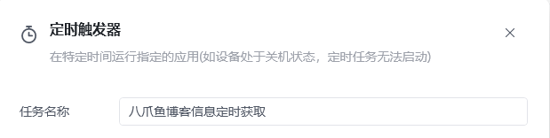

3. **选择执行器**：选择通过本地客户端执行，或指定某个机器人执行，或选择「任意机器人」（即哪个机器人空闲就用哪个）。若当前账号没有购买机器人，则只有本地客户端一个选项。

    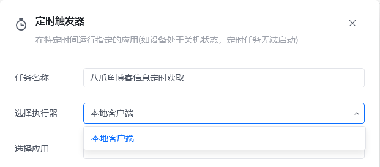

4. **选择应用**：
   - 若应用未发版，直接选中该应用即可。
   - 若应用已发版，支持选择版本：
     - **当前最新版本**：使用最后一次发版时的应用配置。
     - **当前最新内容**：使用当前编辑保存后、尚未发版的应用配置。建议使用该选项，以便实时保持最新。

    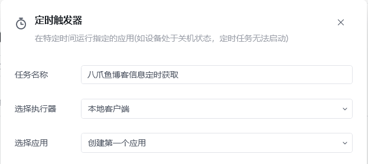

    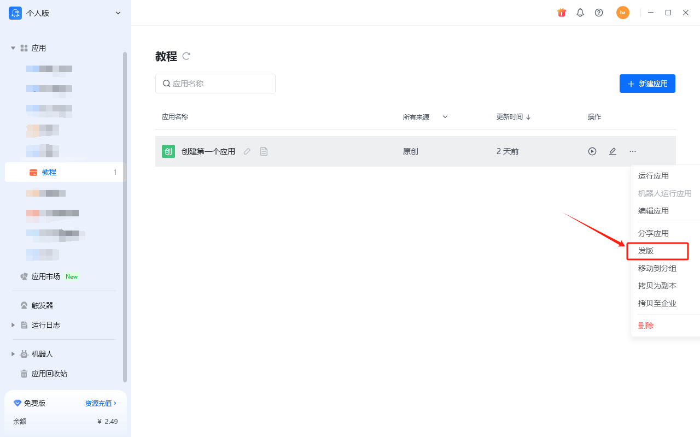

    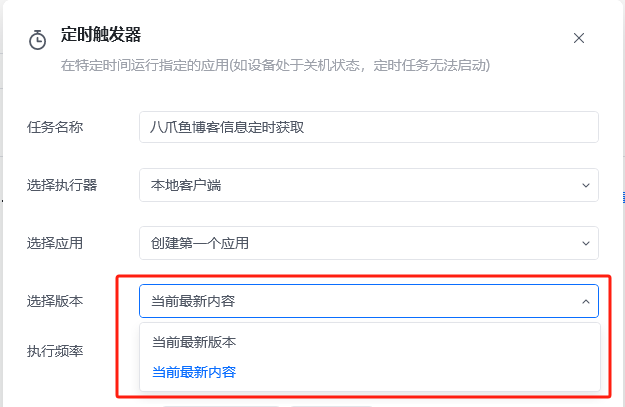

5. **执行频率**：根据需求选择执行周期。例如每晚九点，可选择「每天」，再在指定时间中选中 21:00。下方有整点时间的快捷按钮；若需精确到分钟，可单击「添加时间」后按需设置。

    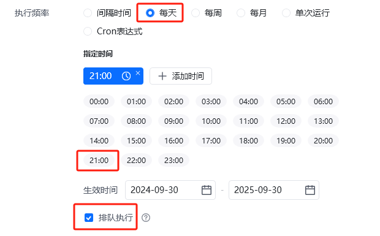

6. **生效时间**：设置整个定时计划的有效时间段，超出该时间段后触发器不再执行。

    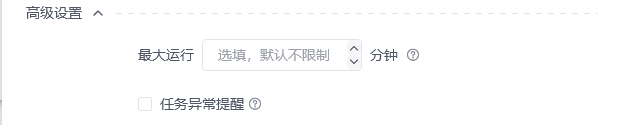

7. **排队执行**：建议勾选。当启动了多个应用而没有空闲的机器人或客户端时，勾选后新启动的应用会进入排队等待；每个机器人最多支持排队等待 20 个应用，客户端排队等待的应用无限制，但为软件稳定建议不要超过 10 个。多余的应用启动后会被自动停止，若您有较多应用要执行，建议联系官方工作人员购买机器人。
8. **最大运行时间**：设置该任务每次运行时的最大运行时长。开启后，当任务运行时长超出设置值，将会强制结束运行；留空则表示不限制。

    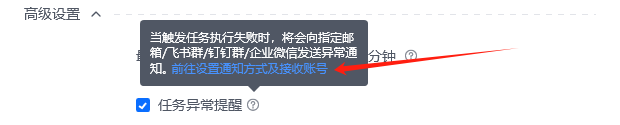

9. **任务异常提醒**：按需勾选。勾选后，当触发任务执行失败时，将会向指定邮箱/飞书群/钉钉群/企业微信发送异常通知。可前往【设置】→【异常提醒】配置通知方式及接收账号。

    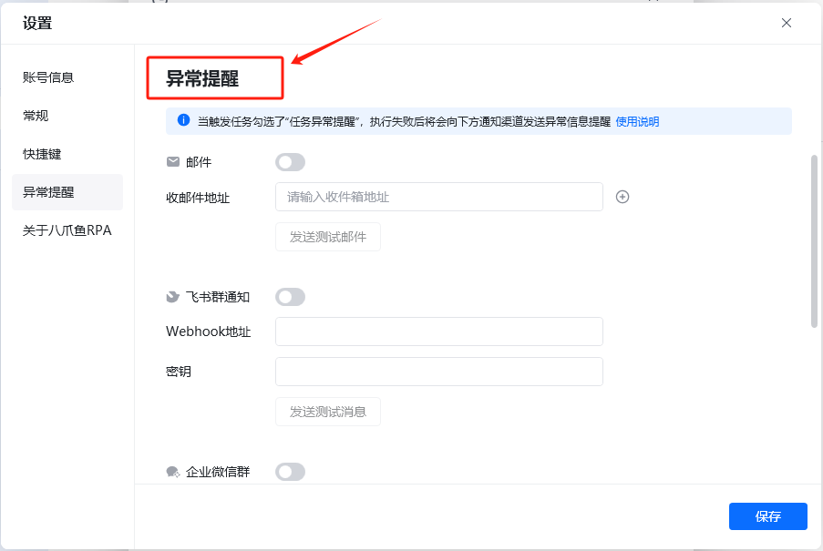

10. **设置启动参数**：若应用有需要输入的参数（如关键词），可在下一步中设置，例如每天固定获取与「AI」「运营」相关的博客信息。

    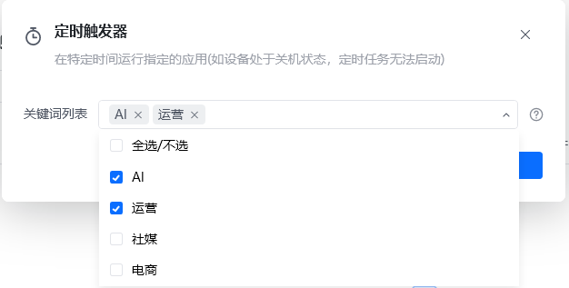

11. **完成并启动**：点击「完成」后，可在触发器列表中启用该触发器。

#### 启动方式

- 方式 1：在定时触发器设置页面最下方勾选「启动触发器」。

  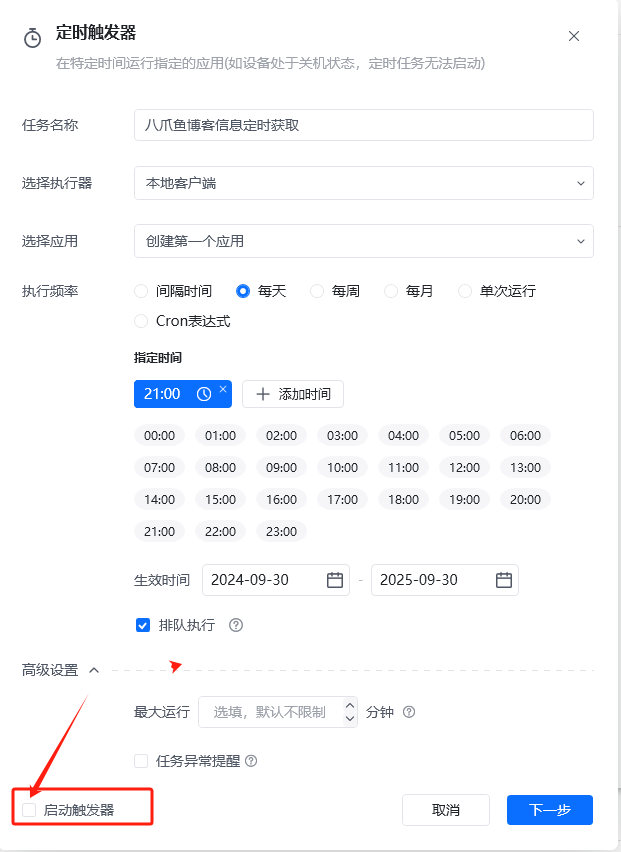

- 方式 2：在触发任务列表中点击开关按钮，实现对触发器的快速开启或关闭。

  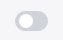

  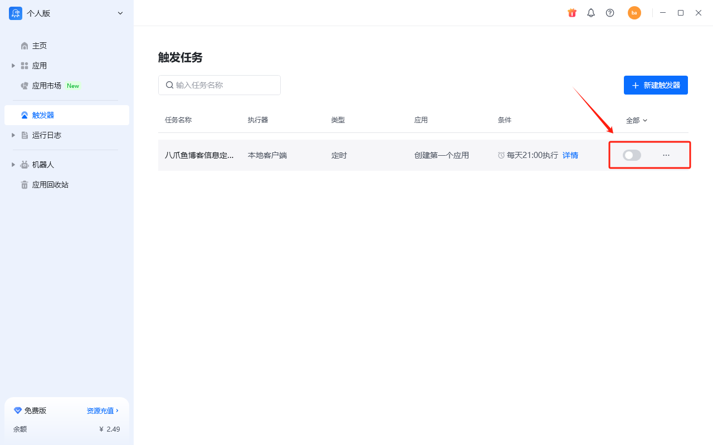

<Info>
  如需进一步了解定时触发器设置细节，请参考文档：[本地触发任务](https://rpa.bazhuayu.com/helpcenter/docs/timingtrigger)。
</Info>

### Webhook 触发器

为每个 RPA 应用生成唯一的 Webhook 接口地址。外部业务系统可通过 HTTP 请求调用该地址，触发指定应用在指定机器人上运行，同时支持传递输入参数。适用于订单处理、审批回调、消息推送等事件驱动场景。

<Info>
  需要有机器人才能使用 Webhook 触发器，属于企业版功能，可查看 [Webhook 触发器](https://bazhuayu-rpa-docs.mintlify.site/features/enterprise/webhook-trigger)。
</Info>

## 使用流程

1. 进入「触发器」模块，点击「新建触发器」。
2. 选择触发器类型：定时触发或 Webhook 触发。
3. 填写触发器名称、选择要运行的应用与机器人。
4. 配置定时规则或复制 Webhook 地址到业务系统。
5. 启用触发器，系统即按规则自动触发应用运行。

## 界面示例

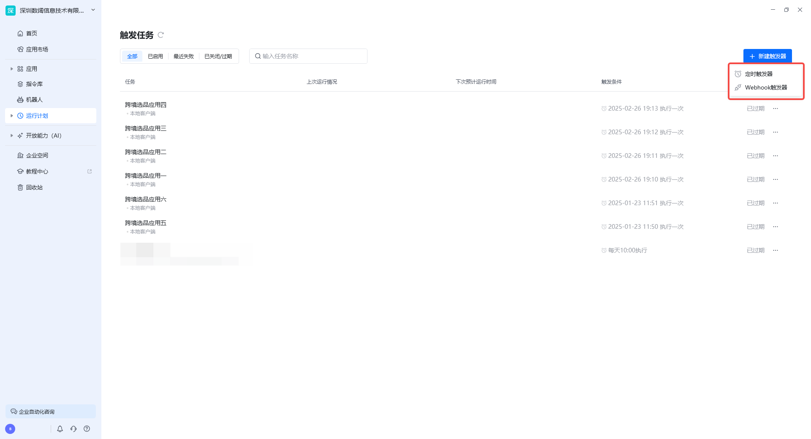

<Info>
  Webhook 触发器需要当前账号下拥有机器人；若触发器为置灰状态，请检查账号套餐或机器人数量。
</Info>

<Info>
  使用过程中遇到问题？前往 [八爪鱼RPA 开发者社区问答板块](https://rpa.bazhuayu.com/community/questions) 提问，获取官方与社区帮助。
</Info>
